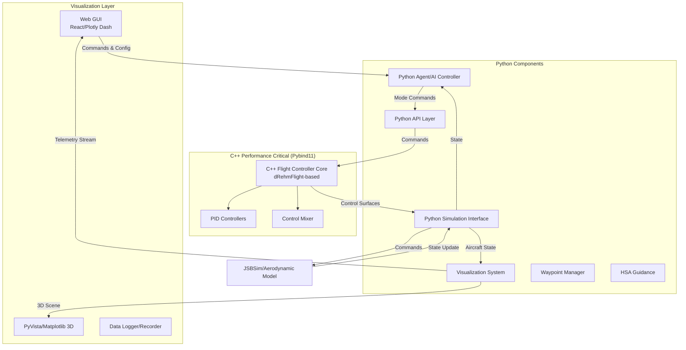
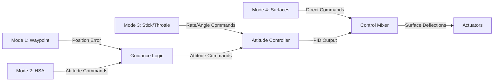

# Aircraft Control Algorithms Demo - Design Document

## Overview

This repository demonstrates various aircraft control algorithms using a hybrid Python/C++ architecture. The system is built around a flexible flight controller that can be commanded through multiple modes, integrated with aerodynamic simulation, and monitored through real-time visualization.

## System Architecture



## Flight Controller Modes

The flight controller supports four command modes, providing different levels of abstraction:

### Mode 1: Waypoint Navigation
- **Input**: 3D waypoint coordinates (North, East, Down) or (Lat, Lon, Alt)
- **Controller**: Computes heading, speed, and altitude commands to reach waypoints
- **Use Case**: Autonomous navigation, mission planning, AI agents
- **Implementation**: Python waypoint manager + guidance logic

### Mode 2: HSA (Heading, Speed, Altitude)
- **Input**: Desired heading (deg), airspeed (m/s), altitude (m)
- **Controller**: Tracks these commanded states using PID control
- **Use Case**: High-level autonomous control, formation flight
- **Implementation**: Python coordination layer + C++ inner loops

### Mode 3: Stick & Throttle
- **Input**: RC-style commands (roll, pitch, yaw rate, throttle)
- **Controller**: Stabilizes attitude angles or rates based on stick input
- **Use Case**: Manual control, teleoperation, human-in-the-loop
- **Implementation**: Direct pass-through to C++ PID controllers

### Mode 4: Control Surface Deflection
- **Input**: Direct surface commands (elevator, aileron, rudder, throttle %)
- **Controller**: Minimal processing, direct actuator commands
- **Use Case**: Low-level control, research, manual override
- **Implementation**: Pass-through to control mixer



## Component Details

### 1. C++ Flight Controller Core (Performance Critical)

Adapted from the dRehmFlight project, these components run at high rates (100-500 Hz):

#### PID Controllers
- **Attitude Control**: `controlANGLE()` - PID on roll/pitch angles
- **Rate Control**: `controlRATE()` - PID on angular rates
- **Cascaded Control**: `controlANGLE2()` - Outer loop (angle) + inner loop (rate)

#### Control Mixer
- Converts PID outputs to actuator commands
- Supports multiple vehicle configurations (quad, fixed-wing, VTOL)
- Scales commands to appropriate PWM/servo ranges

#### Implementation Details
- Source: `core/pid_controller.cpp`, `core/control_mixer.cpp`
- Exposed to Python via Pybind11 bindings
- Maintains state (integral terms, previous errors) internally

### 2. Python Flight Controller Modes

High-level control logic implemented in Python:

#### Waypoint Mode (`controllers/modes/waypoint_mode.py`)
- Waypoint queue management
- Path planning (straight-line, curved)
- Guidance law: Proportional navigation or line-of-sight
- Outputs: Heading, speed, altitude commands to Mode 2

#### HSA Mode (`controllers/modes/hsa_mode.py`)
- Tracks commanded heading using yaw control
- Altitude hold using throttle/elevator
- Airspeed regulation
- Outputs: Roll, pitch, yaw commands to C++ controllers

#### Stick & Throttle Mode (`controllers/modes/stick_throttle_mode.py`)
- Maps stick inputs to desired angles or rates
- Throttle pass-through
- Optional expo curves and dead zones
- Outputs: Angle/rate setpoints to C++ PID

#### Surface Deflection Mode (`controllers/modes/surface_mode.py`)
- Minimal processing layer
- Safety limits and saturation
- Direct actuator commanding
- Outputs: Surface deflections to mixer

### 3. Interfaces

#### Agent Interface (`interfaces/agent_interface.py`)
Provides a clean API for agents/AI to command the flight controller:

```python
class AgentInterface:
    def set_mode(self, mode: ControlMode)
    def send_waypoint(self, waypoint: Waypoint)
    def send_hsa_command(self, heading: float, speed: float, altitude: float)
    def send_stick_command(self, roll: float, pitch: float, yaw: float, throttle: float)
    def send_surface_command(self, elevator: float, aileron: float, rudder: float, throttle: float)
    def get_state(self) -> AircraftState
    def get_telemetry(self) -> Telemetry
```

#### Aircraft Interface (`interfaces/aircraft_interface.py`)
Abstracts the aerodynamic simulation backend:

```python
class AircraftInterface:
    def set_controls(self, elevator: float, aileron: float, rudder: float, throttle: float)
    def step(self, dt: float) -> AircraftState
    def reset(self, initial_state: AircraftState)
    def get_state(self) -> AircraftState
```

### 4. Simulation Layer

#### JSBSim Adapter (`simulation/jsbsim_adapter.py`)
- Integrates JSBSim aerodynamic simulation
- Handles coordinate transformations
- Provides standardized state vector
- Configurable aircraft models

### 5. Visualization System

#### Real-time Plotter (`visualization/realtime_plotter.py`)
- Live plots of state variables (roll, pitch, yaw, altitude, airspeed)
- Control surface deflections
- Performance metrics (tracking error, control effort)
- Uses Matplotlib animation or Plotly for interactive plots

#### 3D Aircraft Viewer (`visualization/aircraft_3d.py`)
- 3D rendering of aircraft with correct orientation
- Trajectory visualization (past path + planned waypoints)
- Attitude indicators (virtual horizon, heading rose)
- PyVista or Matplotlib 3D backend

#### Telemetry Logger (`visualization/telemetry_logger.py`)
- Records all states, commands, timestamps
- Exports to CSV, HDF5, or custom format
- Playback functionality for post-flight analysis
- Synchronized with visualization

#### Dashboard Coordinator (`visualization/dashboard.py`)
- Manages multiple visualization components
- Synchronizes data streams
- Handles real-time updates at visualization rate (10-60 Hz)

### 6. GUI Dashboard

#### Web Interface (`gui/app.py`)
Built with Plotly Dash or Streamlit:
- **Control Panel**: Mode selection, parameter tuning, waypoint entry
- **Telemetry Display**: Live plots of all state variables
- **3D Viewer**: Interactive 3D aircraft visualization
- **Controls**: Start/stop/reset simulation, record data
- **Configuration**: PID gains, aircraft model selection

## Data Flow

### Control Loop (High-Rate: 100-500 Hz)
1. Agent sends high-level command via `AgentInterface`
2. Python mode logic processes command
3. C++ PID controllers compute control outputs
4. Control mixer converts to surface deflections
5. `AircraftInterface` sends commands to JSBSim
6. JSBSim updates aircraft state
7. State returned to agent

### Visualization Loop (Low-Rate: 10-60 Hz)
1. Telemetry logger samples current state
2. Data pushed to visualization components
3. Plots and 3D view updated
4. GUI refreshes display

## Data Types

### AircraftState
```python
@dataclass
class AircraftState:
    time: float
    position: np.ndarray  # [N, E, D] or [lat, lon, alt]
    velocity: np.ndarray  # [u, v, w] body frame
    attitude: np.ndarray  # [roll, pitch, yaw] Euler angles
    angular_rate: np.ndarray  # [p, q, r] body rates
    airspeed: float
    altitude: float
```

### ControlCommand
```python
@dataclass
class ControlCommand:
    mode: ControlMode
    # Mode 1: Waypoint
    waypoint: Optional[Waypoint]
    # Mode 2: HSA
    heading: Optional[float]
    speed: Optional[float]
    altitude: Optional[float]
    # Mode 3: Stick & Throttle
    roll_cmd: Optional[float]
    pitch_cmd: Optional[float]
    yaw_cmd: Optional[float]
    throttle: Optional[float]
    # Mode 4: Surfaces
    elevator: Optional[float]
    aileron: Optional[float]
    rudder: Optional[float]
```

## Technology Stack

### Languages
- **C++17**: Performance-critical controllers
- **Python 3.8+**: High-level logic, interfaces, visualization

### Core Libraries
- **Pybind11**: C++/Python bindings
- **NumPy**: Numerical operations
- **SciPy**: Control system utilities

### Simulation
- **JSBSim**: Aerodynamic simulation (primary)
- **Alternative**: Custom 6-DOF model for simple demos

### Visualization
- **Matplotlib**: 2D plots, 3D visualization
- **Plotly**: Interactive plots
- **PyVista**: Advanced 3D visualization (optional)

### GUI
- **Plotly Dash**: Web dashboard (primary option)
- **Streamlit**: Alternative rapid prototyping option

### Data & Logging
- **Pandas**: Data manipulation
- **HDF5/h5py**: Efficient data storage
- **JSON**: Configuration files

### Build System
- **CMake**: C++ compilation
- **setuptools**: Python package
- **pytest**: Testing framework

## Directory Structure

```
controls/
├── README.md                       # Quick start guide
├── DESIGN.md                       # This document
├── setup.py                        # Python package setup
├── requirements.txt                # Python dependencies
├── CMakeLists.txt                  # C++ build configuration
│
├── controllers/                    # Python flight controller modes
│   ├── __init__.py
│   ├── flight_controller.py        # Main controller coordinator
│   ├── modes/
│   │   ├── __init__.py
│   │   ├── waypoint_mode.py        # Mode 1: Waypoint navigation
│   │   ├── hsa_mode.py             # Mode 2: HSA control
│   │   ├── stick_throttle_mode.py  # Mode 3: RC-style control
│   │   └── surface_mode.py         # Mode 4: Direct surfaces
│   └── types.py                    # Python data types
│
├── core/                           # C++ performance-critical code
│   ├── pid_controller.cpp/.h       # PID implementations from dRehmFlight
│   ├── control_mixer.cpp/.h        # Control mixing logic
│   ├── attitude_control.cpp/.h     # Attitude control wrapper
│   ├── bindings.cpp                # Pybind11 interface
│   └── types.h                     # C++ data structures
│
├── interfaces/                     # System interfaces
│   ├── __init__.py
│   ├── agent_interface.py          # Agent → Flight Controller API
│   └── aircraft_interface.py       # Flight Controller → Simulation API
│
├── simulation/                     # Aerodynamic simulation
│   ├── __init__.py
│   ├── base_simulator.py           # Abstract simulator interface
│   └── jsbsim_adapter.py           # JSBSim integration
│
├── visualization/                  # Visualization and logging
│   ├── __init__.py
│   ├── realtime_plotter.py         # Live telemetry plots
│   ├── aircraft_3d.py              # 3D aircraft visualization
│   ├── trajectory_viewer.py        # Path/waypoint display
│   ├── telemetry_logger.py         # Data recording/playback
│   └── dashboard.py                # Visualization coordinator
│
├── gui/                            # Web GUI dashboard
│   ├── app.py                      # Main Dash/Streamlit app
│   ├── components/
│   │   ├── control_panel.py        # Mode selection, parameters
│   │   ├── telemetry_display.py    # Real-time plots component
│   │   └── 3d_viewer.py            # 3D scene component
│   └── static/
│       └── styles.css              # Custom styling
│
├── examples/                       # Demonstration scripts
│   ├── waypoint_demo.py            # Mode 1 demo
│   ├── hsa_demo.py                 # Mode 2 demo
│   ├── stick_control_demo.py       # Mode 3 demo
│   ├── surface_control_demo.py     # Mode 4 demo
│   ├── visualization_demo.py       # Visualization system demo
│   ├── full_gui_demo.py            # Complete GUI demo
│   └── agent_demo.py               # AI agent example
│
├── tests/                          # Test suite
│   ├── test_cpp_controllers.py     # C++ controller tests
│   ├── test_modes.py               # Python mode tests
│   ├── test_interfaces.py          # Interface tests
│   ├── test_visualization.py       # Visualization tests
│   └── test_integration.py         # Full system integration tests
│
└── dRehmFlight/                    # Original dRehmFlight source (reference)
```

## Build and Setup

### Prerequisites
```bash
# System dependencies
sudo apt-get install cmake build-essential python3-dev

# Python dependencies
pip install -r requirements.txt
```

### Building C++ Components
```bash
mkdir build
cd build
cmake ..
make
cd ..
```

### Installing Python Package
```bash
pip install -e .
```

### Running Examples
```bash
# Basic mode demonstrations
python examples/waypoint_demo.py
python examples/hsa_demo.py
python examples/stick_control_demo.py

# Visualization demo
python examples/visualization_demo.py

# Full GUI
python gui/app.py
```

## Testing
```bash
# Run all tests
pytest tests/

# Run specific test suite
pytest tests/test_modes.py -v

# Test C++ bindings
pytest tests/test_cpp_controllers.py -v
```

## Development Workflow

### Adding a New Control Mode
1. Create mode class in `controllers/modes/`
2. Implement required interface methods
3. Register mode in `flight_controller.py`
4. Add tests in `tests/test_modes.py`
5. Create example in `examples/`

### Modifying C++ Controllers
1. Edit source in `core/`
2. Update bindings in `core/bindings.cpp` if needed
3. Rebuild: `cd build && make`
4. Test with `pytest tests/test_cpp_controllers.py`

### Adding Visualization
1. Create component in `visualization/`
2. Register with dashboard coordinator
3. Add GUI component if needed in `gui/components/`
4. Test with visualization demo

## Performance Considerations

### C++ Controller Loop
- Target rate: 100-500 Hz
- Computation budget: < 2ms per iteration
- Memory: Static allocation preferred

### Python Mode Logic
- Target rate: 10-100 Hz (mode dependent)
- Computation budget: < 10ms per iteration
- Can use dynamic allocation

### Visualization
- Target rate: 10-60 Hz (30 Hz typical)
- Decoupled from control loop
- Uses separate thread/process if needed

## Future Enhancements

1. **Additional Control Modes**
   - Velocity vector control
   - Trajectory tracking (not just waypoints)
   - Formation flight

2. **Advanced Algorithms**
   - Model Predictive Control (MPC)
   - Adaptive control
   - Learning-based controllers

3. **Simulation Improvements**
   - Wind/turbulence modeling
   - Sensor noise/delays
   - Hardware-in-the-loop (HIL)

4. **Visualization Features**
   - VR/AR support
   - Multi-aircraft visualization
   - Replay with variable speed

5. **AI/Agent Integration**
   - Reinforcement learning interface
   - Autonomous mission planning
   - Collision avoidance

## References

- **dRehmFlight**: https://github.com/nickrehm/dRehmFlight
- **JSBSim**: https://jsbsim.sourceforge.net/
- **Pybind11**: https://pybind11.readthedocs.io/
- **Plotly Dash**: https://dash.plotly.com/

## Credits

This project is built upon the excellent work of:
- Nicholas Rehm (dRehmFlight flight controller)
- JSBSim development team
- Pybind11 contributors

## License

See LICENSE file for details. Note that dRehmFlight components retain their original license.
