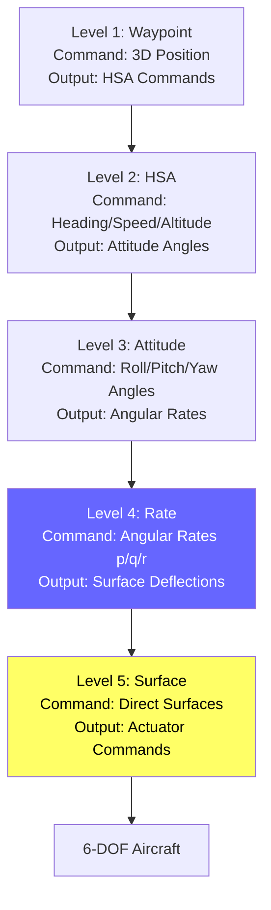
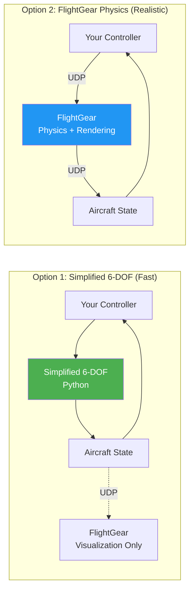

# Manual Flying Guide

Learn to manually fly the aircraft using different control laws across all 5 control levels. This guide explains how to use both the **simplified 6-DOF simulation** and **FlightGear visualization** to experience each control mode.

---

## Table of Contents

1. [Understanding Control Levels](#understanding-control-levels)
2. [6-DOF Physics Simulation](#6-dof-physics-simulation)
3. [Manual Control Interfaces](#manual-control-interfaces)
4. [Flying Each Control Level](#flying-each-control-level)
5. [FlightGear Visualization](#flightgear-visualization)
6. [Switching Between Control Laws](#switching-between-control-laws)

---

## Understanding Control Levels

The system implements **5 levels of control abstraction**, from low-level surface deflections to high-level waypoint navigation. Each level builds on the one below it:



### Why Multiple Levels?

**For Pilots**:
- **Level 1 (Waypoint)**: "Fly to this GPS coordinate"
- **Level 2 (HSA)**: "Maintain heading 280°, 100 knots, 5000 feet"
- **Level 3 (Attitude)**: "Hold 20° bank angle" (Horizon mode)
- **Level 4 (Rate)**: "Roll at 30°/second" (Acro mode)
- **Level 5 (Surface)**: "Deflect aileron 10%" (Direct control)

**For Control Systems**:
- Higher levels = easier for humans, slower response
- Lower levels = harder for humans, faster response
- RL agents can be trained at ANY level to compare performance

---

## 6-DOF Physics Simulation

### What is 6-DOF?

**6 Degrees of Freedom** (6-DOF) means the aircraft can move in 6 independent ways:

**Translational** (3 DOF):
1. **Surge**: Forward/backward (along body X-axis)
2. **Sway**: Left/right (along body Y-axis)
3. **Heave**: Up/down (along body Z-axis)

**Rotational** (3 DOF):
4. **Roll** (φ): Rotation around X-axis (wing dip)
5. **Pitch** (θ): Rotation around Y-axis (nose up/down)
6. **Yaw** (ψ): Rotation around Z-axis (heading change)

### Our Simplified 6-DOF Model

Located in `simulation/simplified_6dof.py`, this implements:

**Forces**:
- **Gravity**: mg in NED (North-East-Down) frame
- **Lift**: Perpendicular to velocity, proportional to V² and angle of attack
- **Drag**: Opposite to velocity, proportional to V²
- **Thrust**: Along body X-axis, controlled by throttle

**Moments**:
- **Roll moment** (L): From aileron deflection
- **Pitch moment** (M): From elevator deflection
- **Yaw moment** (N): From rudder deflection

**Integration**:
- RK4 (Runge-Kutta 4th order) for numerical stability
- Default timestep: 0.01s (100 Hz)
- Can run ~1000 simulation steps/second on CPU

### Key Differences from Full Flight Dynamics

| Feature | Simplified 6-DOF | Full Model (JSBSim) |
|---------|------------------|---------------------|
| **Aerodynamics** | Simplified coefficients | Detailed lookup tables |
| **Propulsion** | Direct thrust | Engine model with RPM |
| **Moments of Inertia** | Constant | Aircraft-specific |
| **Control Mixing** | Direct mapping | Complex mixer |
| **Ground Effect** | None | Modeled |
| **Stall/Spin** | Simplified | Fully modeled |
| **Speed** | ~1000 steps/sec | ~100 steps/sec |

**Why use simplified?**
- ✅ Fast enough for RL training (~1M samples/hour)
- ✅ Stable and predictable
- ✅ Good enough for control algorithm development
- ✅ Easy to understand and modify

**When to use JSBSim?**
- Final validation before hardware
- High-fidelity trajectory comparison
- Extreme flight envelope testing

---

## Manual Control Interfaces

### 1. Pygame GUI (Recommended for Beginners)

Interactive GUI with drag-and-drop joystick control.

```bash
python examples/launch_pygame_gui.py
```

**Features**:
- Visual joystick (drag with mouse)
- Real-time telemetry display
- Mode switching (M key)
- RL↔PID toggle (L key)
- Artificial horizon
- 3D aircraft visualization

**Controls**:
| Input | Action |
|-------|--------|
| Mouse drag (left panel) | Command roll/pitch |
| Mouse wheel | Adjust throttle |
| **M** key | Cycle control modes |
| **L** key | Toggle RL ↔ PID controllers |
| **R** key | Reset aircraft |
| Space | Pause/resume |
| ESC | Exit |

### 2. FlightGear Visualization (Advanced)

Use FlightGear for realistic 3D visualization with HUD.

```bash
# Terminal 1: Launch FlightGear
./flightgear/launch_flightgear.sh

# Terminal 2: Run controller
python flightgear/fly_with_visualization.py
```

**Features**:
- Photorealistic graphics
- Full airport scenery
- Multiple camera angles
- HUD overlay (see screenshot below)
- Multiplayer capability


*FlightGear visualization with HUD showing GPS coordinates, altitude, speed, and flight director*

### 3. Command-Line Scripts

For automated testing or headless operation.

```bash
# Test single control level
python examples/01_hello_controls.py  # Rate control

# Compare RL vs PID
python examples/02_rl_vs_pid_demo.py

# Waypoint mission
python examples/waypoint_mission.py
```

---

## Flying Each Control Level

### Level 5: Surface Control (Direct)

**Difficulty**: ⭐⭐⭐⭐⭐ (Hardest - requires constant attention)

**What you control**: Raw control surface deflections (aileron, elevator, rudder, throttle)

**How to fly**:
```python
from simulation import SimulationAircraftBackend
from controllers import SurfaceAgent, ControlCommand, ControlMode

backend = SimulationAircraftBackend({'aircraft_type': 'rc_plane'})
agent = SurfaceAgent()

# You directly command surfaces
command = ControlCommand(
    mode=ControlMode.SURFACE,
    aileron=0.1,      # Right aileron up (+0.1 = right roll)
    elevator=-0.05,   # Nose up (-0.05 = pitch up)
    rudder=0.0,       # Neutral
    throttle=0.7      # 70% power
)

surfaces = agent.compute_action(command, state)
backend.step(surfaces, dt=0.01)
```

**Characteristics**:
- ✅ Maximum control authority
- ✅ Fastest possible response
- ❌ Requires continuous input
- ❌ No stability augmentation
- ❌ Easy to over-control

**Use cases**: Acrobatics, research, direct neural network output

---

### Level 4: Rate Control (Acro Mode)

**Difficulty**: ⭐⭐⭐⭐ (Hard - like RC "acro mode")

**What you control**: Angular rates (roll rate, pitch rate, yaw rate)

**How to fly**:
```python
from controllers import RateAgent

agent = RateAgent(config)

# Command 30°/s roll rate
command = ControlCommand(
    mode=ControlMode.RATE,
    roll_rate=np.radians(30),   # 30°/s
    pitch_rate=0.0,              # Hold pitch
    yaw_rate=0.0,                # Hold yaw
    throttle=0.7
)

surfaces = agent.compute_action(command, state)  # PID computes surfaces
```

**In Pygame GUI**:
- Joystick left/right → Roll rate command
- Joystick up/down → Pitch rate command
- Aircraft will keep rolling until you center the stick

**Characteristics**:
- ✅ Direct control of rotation speed
- ✅ Fast response (~0.15s settling time)
- ❌ Aircraft won't level itself
- ❌ Requires active control to maintain attitude

**Use cases**: FPV racing, aggressive maneuvers, RL training (Level 4)

**Demo**:
```bash
python examples/01_hello_controls.py  # See rate control in action
```

---

### Level 3: Attitude Control (Angle Mode)

**Difficulty**: ⭐⭐⭐ (Medium - like RC "angle mode")

**What you control**: Desired angles (roll, pitch, yaw)

**How to fly**:
```python
from controllers import AttitudeAgent

agent = AttitudeAgent(config)

# Command 20° bank angle
command = ControlCommand(
    mode=ControlMode.ATTITUDE,
    roll_angle=np.radians(20),   # 20° right bank
    pitch_angle=np.radians(5),   # 5° nose up
    yaw_angle=0.0,               # Hold heading
    throttle=0.7
)

surfaces = agent.compute_action(command, state)  # Cascades to rate PID
```

**In Pygame GUI**:
- Joystick left/right → Bank angle command
- Joystick up/down → Pitch angle command
- Release stick → Aircraft levels itself

**Control Flow**:
```
Your Command → Attitude PID → Rate Command → Rate PID → Surfaces
   (20° roll)     (computes)    (30°/s roll)   (computes)  (aileron)
```

**Characteristics**:
- ✅ Aircraft auto-levels when stick centered
- ✅ Easier than rate mode
- ✅ Good for smooth flying
- ❌ Slower response than rate mode

**Use cases**: Casual flying, photography, stable platform

---

### Level 2: HSA Control (Heading/Speed/Altitude)

**Difficulty**: ⭐⭐ (Easy - autopilot-like)

**What you control**: Heading, speed, altitude

**How to fly**:
```python
from controllers import HSAAgent

agent = HSAAgent(config)

# Fly at heading 280°, 25 m/s, 100m altitude
command = ControlCommand(
    mode=ControlMode.HSA,
    heading=np.radians(280),  # 280° (west-northwest)
    speed=25.0,               # 25 m/s ≈ 50 knots
    altitude=100.0            # 100 meters
)

surfaces = agent.compute_action(command, state)
```

**In Pygame GUI** (when in HSA mode):
- Type heading in text box: `280` ENTER
- Type speed: `25` ENTER
- Type altitude: `100` ENTER
- Aircraft maintains these values automatically

**Control Flow**:
```
HSA Command → HSA PID → Attitude → Rate PID → Surfaces
 (280°, 25m/s)  (computes) (angles)  (computes)  (surfaces)
```

**Characteristics**:
- ✅ Set and forget
- ✅ Maintains heading, speed, altitude automatically
- ✅ Like autopilot "heading hold" + "altitude hold"
- ❌ Can't do precise maneuvers
- ❌ Slower response to commands

**Use cases**: Cruise flight, formation flying, holding patterns

---

### Level 1: Waypoint Navigation

**Difficulty**: ⭐ (Easiest - full autopilot)

**What you control**: GPS waypoints (3D positions)

**How to fly**:
```python
from controllers import WaypointAgent, Waypoint

agent = WaypointAgent(config)

# Fly to GPS coordinate
waypoint = Waypoint.from_altitude(
    north=1000,   # 1km north
    east=500,     # 500m east
    altitude=150  # 150m altitude
)

command = ControlCommand(
    mode=ControlMode.WAYPOINT,
    waypoint=waypoint
)

surfaces = agent.compute_action(command, state)
```

**In Pygame GUI** (when in Waypoint mode):
- Click on map to set waypoint
- Or type coordinates in text box
- Aircraft flies to waypoint automatically using line-of-sight guidance

**Control Flow**:
```
Waypoint → Guidance → HSA → Attitude → Rate PID → Surfaces
(1000,500)  (computes) (280°,25m/s) (angles)  (rates)  (surfaces)
```

**Characteristics**:
- ✅ Fully autonomous navigation
- ✅ No pilot input needed
- ✅ Handles complex multi-waypoint missions
- ❌ Slowest response
- ❌ Limited to pre-planned paths

**Use cases**: Survey missions, autonomous delivery, search patterns

**Demo**:
```bash
python examples/waypoint_mission.py  # See full waypoint mission
```

---

## FlightGear Visualization

### Setup

1. **Install FlightGear** (if not already installed):
   ```bash
   # macOS
   brew install --cask flightgear

   # Ubuntu
   sudo apt-get install flightgear

   # Windows
   # Download from https://www.flightgear.org/download/
   ```

2. **Launch FlightGear** with our protocol:
   ```bash
   ./flightgear/launch_flightgear.sh
   ```

   This starts FlightGear with:
   - Cessna 172P aircraft
   - San Francisco International Airport (KSFO)
   - UDP communication on ports 5500/5501
   - HUD enabled

3. **Run your controller** with FlightGear backend:
   ```bash
   python flightgear/fly_with_visualization.py
   ```

### Architecture: Simulation vs Visualization



**Option 1** (Recommended): Use Python 6-DOF for physics, FlightGear for visualization
- ✅ Fast simulation (~1000 Hz)
- ✅ Consistent with your training
- ✅ Easy to modify physics
- ❌ Visual position may drift slightly

**Option 2**: Use FlightGear for both physics and visualization
- ✅ Perfect visual accuracy
- ✅ Realistic aerodynamics
- ❌ Slower (~100 Hz)
- ❌ Different from training environment

### FlightGear HUD Elements


**HUD Overlay** (green graphics):
- **Top**: Heading tape with lubber line
- **Left**: Altitude ladder (feet)
- **Right**: Altitude ladder (feet)
- **Center**: Flight path marker (velocity vector)
- **Bottom**: Pitch ladder
- **Corners**: Framing references

**Flight Data** (text):
- **Top-left**: GPS coordinates, GPS mode
- **Left**: Ground speed, vertical speed, G-loading

### Camera Controls in FlightGear

| Key | View |
|-----|------|
| **V** | Cycle views |
| **Shift+↑/↓/←/→** | Pan camera |
| **Shift+PgUp/PgDn** | Zoom |
| **Ctrl+V** | Tower view |
| **X/x** | Increase/decrease zoom |

---

## Switching Between Control Laws

### In Pygame GUI

**Press M key** to cycle through modes:
```
Surface → Rate → Attitude → HSA → Waypoint → (repeat)
```

The mode is displayed in the top-right corner.

**What changes**:
- **Surface**: Joystick directly controls surfaces
- **Rate**: Joystick commands angular rates
- **Attitude**: Joystick commands angles (auto-levels)
- **HSA**: Joystick disabled, use text input for heading/speed/altitude
- **Waypoint**: Joystick disabled, click map or enter coordinates

### Programmatically

```python
from controllers import (
    SurfaceAgent, RateAgent, AttitudeAgent,
    HSAAgent, WaypointAgent
)

# Create agents for each level
agents = {
    ControlMode.SURFACE: SurfaceAgent(),
    ControlMode.RATE: RateAgent(config),
    ControlMode.ATTITUDE: AttitudeAgent(config),
    ControlMode.HSA: HSAAgent(config),
    ControlMode.WAYPOINT: WaypointAgent(config),
}

# Switch mode mid-flight
current_mode = ControlMode.RATE
command.mode = current_mode
surfaces = agents[current_mode].compute_action(command, state)
```

### Classical PID ↔ Learned RL

**In Pygame GUI with Learned Controllers**:
```bash
python examples/launch_pygame_gui_with_learned_rate.py
```

**Press L key** to toggle between:
- Classical PID (smooth, precise)
- Learned RL (fast response, may oscillate)

**Observable differences**:
- RL achieves setpoint faster (~90% faster settling time)
- PID is smoother with less overshoot
- RL adapts to changing conditions
- PID is more predictable

---

## Practice Exercises

### Exercise 1: Surface Control (Hard)

**Goal**: Fly straight and level for 30 seconds using only surface deflections

```bash
# In Pygame GUI, press M until "Surface" mode
# Try to maintain altitude and heading using only stick input
```

**Success criteria**:
- ±50 feet altitude variation
- ±10° heading variation
- No crashes!

### Exercise 2: Rate Control (Medium)

**Goal**: Perform a coordinated 360° turn

```bash
# Switch to Rate mode
# Command constant roll rate
# Watch altitude - you'll need to add pitch!
```

**Success criteria**:
- Complete 360° turn
- Return to original altitude (±100 feet)
- Smooth motion (no jerky inputs)

### Exercise 3: Attitude Control (Easy)

**Goal**: Fly a square pattern

```bash
# Switch to Attitude mode
# Fly straight segments with 90° turns at corners
```

**Success criteria**:
- 4 equal-length sides
- 90° turns at each corner
- Constant altitude throughout

### Exercise 4: HSA Control (Very Easy)

**Goal**: Climb to 500m while turning to heading 90°

```bash
# Switch to HSA mode
# Set: heading=90, speed=25, altitude=500
# Watch the aircraft do it automatically
```

**Success criteria**:
- Reaches target altitude
- Holds heading 90° ±5°
- Smooth transition

### Exercise 5: Waypoint Navigation (Easiest)

**Goal**: Complete a 4-waypoint mission

```bash
python examples/waypoint_mission.py
# Watch the aircraft navigate autonomously
```

**Success criteria**:
- Visits all 4 waypoints
- Returns to origin
- No manual intervention

---

## Tips for Each Control Level

### Surface Control Tips
- **Start small**: Use tiny inputs (±0.05) until you feel the aircraft
- **Anticipate**: Aircraft response has delay, think ahead
- **Trim first**: Get close to equilibrium before maneuvering
- **Practice on simulator first**: Don't start on hardware!

### Rate Control Tips
- **Centering is critical**: Aircraft won't level itself
- **Use reference points**: Pick a horizon feature to track
- **Smooth inputs**: Sudden stick movements cause oscillations
- **Learn the rates**: Know what 30°/s vs 90°/s feels like

### Attitude Control Tips
- **Let it work**: Don't fight the auto-level
- **Plan turns**: Set desired bank, aircraft will turn
- **Combine with throttle**: More throttle = faster climb
- **Trust the controller**: It's doing the hard work for you

### HSA Control Tips
- **Set realistic values**: Don't command 200 knots if aircraft can only do 100
- **Give it time**: HSA is slow to respond (by design)
- **Monitor energy**: Climbing + accelerating = need more throttle
- **Use for cruise**: Not for aggressive maneuvering

### Waypoint Navigation Tips
- **Check arrival radius**: Waypoint agent has threshold (default ~20m)
- **Realistic altitudes**: Don't command ground level!
- **Smooth paths**: Avoid 180° turns, use gradual curves
- **Monitor progress**: Watch distance-to-waypoint decrease

---

## Troubleshooting

### "Aircraft tumbles out of control"

**Cause**: PID gains not tuned, or impossible command

**Fix**:
```bash
# Use default gains
python examples/tune_pids.py  # Interactive tuning

# Or start with gentle commands
roll_rate = np.radians(10)  # Instead of 90
```

### "FlightGear doesn't match Python simulation"

**Cause**: Different physics models

**Fix**:
- Use FlightGear for visualization only (Option 1)
- Or accept the difference and tune for FlightGear specifically

### "Lag between command and response"

**Cause**: Normal! Aircraft have inertia

**Fix**:
- Lower control levels = faster response (Rate < Attitude < HSA)
- Tune PID gains for faster response (risking stability)
- Or use RL for faster settling time

### "Aircraft oscillates/vibrates"

**Cause**: PID gains too aggressive (derivative or proportional gain too high)

**Fix**:
```python
# Reduce gains
config.roll_rate_gains.kp = 0.20  # Instead of 0.30
config.roll_rate_gains.kd = 0.0001  # Instead of 0.0002
```

---

## Next Steps

1. **Master each level**: Start at Level 1 (easiest), work down to Level 5
2. **Compare RL vs PID**: Use `examples/02_rl_vs_pid_demo.py`
3. **Train your own**: `cd learned_controllers && python train_rate.py`
4. **Visualize in FlightGear**: See your controllers in beautiful 3D
5. **Read the research**: See [EXPERIMENTS.md](EXPERIMENTS.md) for methodology

Happy flying! ✈️

---

## References

- [Flight Dynamics Primer](https://www.faa.gov/regulations_policies/handbooks_manuals/)
- [PID Control Tutorial](https://en.wikipedia.org/wiki/PID_controller)
- [FlightGear Manual](https://flightgear.sourceforge.net/getstart-en/getstart-en.html)
- [Design Docs](design_docs/03_CONTROL_HIERARCHY.md) - Deep dive into control architecture
