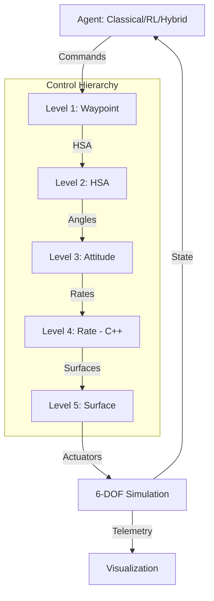

# Quick Start Guide

Get up and running with the Multi-Level Flight Control platform in under 10 minutes.

---

## Prerequisites

- **Python**: 3.8 or higher
- **C++ Compiler**: GCC, Clang, or MSVC (for C++ PID components)
- **CMake**: 3.15 or higher
- **Git**: For cloning the repository
- **Operating System**: Linux, macOS, or Windows

### System Requirements
- **RAM**: 4GB minimum (8GB recommended for RL training)
- **Disk Space**: 2GB for repository and dependencies
- **GPU**: Optional (CUDA support for faster RL training)

---

## Step 1: Clone the Repository

```bash
git clone https://github.com/lhwright13/Hybrid-Classical-and-Reinforcement-Learning-Aircraft-Controllers.git
cd controls
```

---

## Step 2: Set Up Python Environment

### Option A: Using venv (Recommended)

```bash
# Create virtual environment
python3 -m venv venv

# Activate it
source venv/bin/activate  # On Linux/macOS
# OR
venv\Scripts\activate  # On Windows
```

### Option B: Using conda

```bash
# Create conda environment
conda create -n flight-control python=3.8
conda activate flight-control
```

---

## Step 3: Install Python Dependencies

```bash
# Install all required packages
pip install -r requirements.txt

# Verify installation
python -c "import numpy, scipy, matplotlib, stable_baselines3; print('All packages installed successfully!')"
```

### Dependency Overview
- **NumPy, SciPy**: Scientific computing
- **Matplotlib, PyVista**: Visualization
- **Pygame**: Interactive GUI
- **Stable-Baselines3**: RL training
- **Gymnasium**: RL environment interface
- **HDF5, Pandas**: Data logging and analysis
- **PyYAML**: Configuration management
- **Pybind11**: C++/Python bindings

---

## Step 4: Build C++ Components

The C++ PID inner loop runs at 1000 Hz for performance. Build it with:

```bash
# Run the build script (handles CMake and compilation)
./build.sh

# Verify C++ bindings work
python -c "import aircraft_controls_bindings; print('C++ bindings loaded successfully!')"
```

### Manual Build (if build.sh fails)

```bash
# Create build directory
mkdir -p build
cd build

# Configure with CMake
cmake ..

# Build (use -j for parallel compilation)
make -j4

# Return to project root
cd ..
```

### Troubleshooting Build Issues

**Error: CMake not found**
```bash
# Ubuntu/Debian
sudo apt-get install cmake

# macOS
brew install cmake

# Windows
# Download from https://cmake.org/download/
```

**Error: Compiler not found**
```bash
# Ubuntu/Debian
sudo apt-get install build-essential

# macOS (install Xcode Command Line Tools)
xcode-select --install
```

---

## Step 5: Run Your First Simulation (2 minutes)

### Simple Rate Controller Test

The simplest example - command a rate and see the aircraft respond:

```bash
python examples/01_hello_controls.py
```

**Expected Output**:
- 5-second simulation of roll rate tracking
- Plot showing commanded vs actual roll rate
- Control surface deflections
- Should converge within ~1-2 seconds

---

## Step 6: Interactive Flight GUI (5 minutes)

Launch the Pygame-based interactive flight simulator:

```bash
python examples/launch_pygame_gui.py
```

### GUI Controls

| Control | Action |
|---------|--------|
| **Mouse drag** (left panel) | Command roll and pitch (joystick) |
| **Mouse wheel** | Adjust throttle |
| **L key** | Toggle RL ↔ PID controllers |
| **M key** | Cycle control modes (Rate → Attitude → HSA → Waypoint) |
| **R key** | Reset aircraft to initial state |
| **Space** | Pause/resume simulation |
| **ESC** | Exit |

### What to Try

1. **Drag the joystick** to command roll/pitch - watch the aircraft respond
2. **Press 'M'** to switch to Attitude mode - now joystick commands angles instead of rates
3. **Press 'L'** to toggle between RL and PID - compare the response characteristics
4. **Watch telemetry** on the right panel - see real-time state and control effort

---

## Step 7: Compare RL vs PID (5 minutes)

Run a side-by-side quantitative comparison:

```bash
python examples/02_rl_vs_pid_demo.py
```

**Output**: Generates comparison plots showing:
- Settling time (RL ~90% faster)
- Step response overlays
- Tracking error distribution
- Control effort comparison

Plots saved to `outputs/rl_vs_pid_comparison.png`

---

## Step 8: Waypoint Mission (5 minutes)

Run an autonomous waypoint navigation mission:

```bash
python examples/03_waypoint_square_demo.py
```

**What it does**:
- Commands aircraft through 4 waypoints in a rectangular pattern
- Uses full 5-level hierarchy: Waypoint → HSA → Attitude → Rate → Surfaces
- Generates 3D trajectory plot and telemetry time series

---

## Next Steps

### Learn More

1. **[examples/README.md](examples/README.md)** - All examples with detailed explanations
2. **[design_docs/README.md](design_docs/README.md)** - Full architecture documentation
3. **[learned_controllers/README.md](learned_controllers/README.md)** - RL training guide

### Train Your Own Controller

```bash
cd learned_controllers

# Train a rate controller from scratch (~30 minutes on CPU)
python train_rate.py

# Evaluate against PID
python eval_rate.py --model models/rate_controller_best.zip

# Visualize training in TensorBoard
tensorboard --logdir runs/
```

### Run Tests

```bash
# Run all 132 tests (~30 seconds)
pytest tests/

# Run with coverage report
pytest --cov=controllers --cov=interfaces --cov=simulation tests/

# Run specific test file
pytest tests/test_simulation.py -v
```

### Tune PID Controllers

```bash
# Systematic PID gain tuning
python examples/tune_pids.py

# Follow prompts to adjust gains and see results
```

---

## Common Issues & Solutions

### Issue: `ModuleNotFoundError: No module named 'aircraft_controls_bindings'`

**Solution**: C++ components not built. Run `./build.sh` again and check for errors.

### Issue: Pygame window doesn't open

**Solution**:
- Ensure display is available (not running headless)
- Try: `export SDL_VIDEODRIVER=x11` (Linux)
- Install Pygame with: `pip install pygame --upgrade`

### Issue: HDF5 errors on macOS

**Solution**:
```bash
brew install hdf5
export HDF5_DIR=/opt/homebrew/opt/hdf5  # or /usr/local/opt/hdf5
pip install h5py --no-binary=h5py
```

### Issue: Import errors for stable_baselines3

**Solution**:
```bash
pip install stable-baselines3[extra] sb3-contrib
```

### Issue: Tests fail with "fixture not found"

**Solution**: Install dev dependencies:
```bash
pip install pytest pytest-cov pytest-mock
```

---

## System Architecture Refresher



**Control Levels**:
1. **Waypoint**: Navigate to 3D coordinates
2. **HSA**: Heading, speed, altitude tracking
3. **Attitude**: Angle mode (outer loop)
4. **Rate**: Angular rate control (inner loop, 1000 Hz C++)
5. **Surface**: Direct actuator commands

---

## Performance Expectations

| Task | Expected Time | Hardware |
|------|---------------|----------|
| Install dependencies | 5-10 min | Any |
| Build C++ components | 1-3 min | Any |
| Run simple simulation | 5 sec | Any |
| Interactive GUI | Real-time | CPU only |
| RL vs PID comparison | 1 min | CPU only |
| Train rate controller | 20-40 min | CPU (5 min with GPU) |
| Run all 132 tests | 30 sec | CPU only |

---

## Getting Help

- **Documentation**: Check [design_docs/](design_docs/) for detailed architecture
- **Examples**: All demos in [examples/](examples/) with comments
- **FAQ**: See [FAQ.md](FAQ.md) for common questions
- **Issues**: Report bugs at [GitHub Issues](https://github.com/lhwright13/Hybrid-Classical-and-Reinforcement-Learning-Aircraft-Controllers/issues)

---

## What's Next?

Now that you have the basics running, explore:

1. **Research Use Cases** - See [README.md](README.md#-research-use-cases)
2. **Train Higher-Level Controllers** - Waypoint or HSA agents
3. **Experiment with Rewards** - Modify reward functions in `learned_controllers/envs/`
4. **Validate Physics** - Run JSBSim comparisons in `validation/`
5. **Add New Agents** - Implement custom controllers using `BaseAgent` interface

Happy flying!
