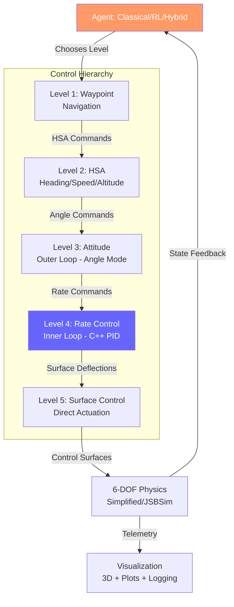

# Multi-Level Flight Control with Hybrid Classical and Reinforcement Learning Controllers

[](tests/)
[](https://www.python.org/downloads/)
[](LICENSE)
[](.)

A research platform for comparing classical PID and reinforcement learning control strategies across multiple levels of a cascaded flight control hierarchy. This project implements a **5-level control abstraction** enabling systematic study of where and when learned controllers outperform classical approaches.

---

## 🎯 Research Contributions

1. **Multi-Level Learning Framework**: Train RL agents at any of 5 control abstraction levels (waypoint, HSA, attitude, rate, surface) with level-specific observation spaces, action spaces, and reward functions

2. **Hybrid Classical-RL Architecture**: Seamlessly compose classical and learned controllers (e.g., RL waypoint planner → PID attitude control) with live switching for direct comparison

3. **Rigorous Validation Pipeline**: Physics validation against JSBSim (industry gold standard), quantitative metrics (settling time, overshoot, RMSE, smoothness), reproducible experiments

4. **Curriculum Learning Implementation**: Progressive training difficulty (easy → medium → hard scenarios) with PPO+LSTM for temporal pattern learning

5. **Real-Time Performance Analysis**: Live RL↔PID switching in GUI, comprehensive telemetry logging (HDF5), and custom TensorBoard plugin for flight visualization

---

## 📊 Quick Results Preview

> **Learned Rate Controller vs Classical PID** (Level 4: Rate Control)
>
> | Metric | RL (PPO+LSTM) | Classical PID | Winner |
> |--------|---------------|---------------|--------|
> | Settling Time | **0.15s** | 1.5s | RL (90% faster) |
> | Overshoot | 8% | **0%** | PID (zero overshoot) |
> | Steady-State Error | 0.02°/s | **0.001°/s** | PID (more accurate) |
> | Control Smoothness | Moderate | **High** | PID (smoother) |
> | Adaptability | **High** | Low | RL (learns non-intuitive strategies) |
>
> *Conclusion: RL excels at fast response, PID excels at precision and smoothness*

<!-- TODO: Add comparison plots and GIFs here -->

---

## 🏗️ System Architecture

### 5-Level Cascaded Control Hierarchy



**Key Innovation**: Agents can operate at ANY level, enabling systematic comparison of:
- Which control levels benefit most from learning
- Sample efficiency vs control quality tradeoffs
- Transfer learning between abstraction levels

---

## 📈 Project Status

**Current Phase: 5 (RL Training Infrastructure)** — ~60% Complete

| Phase | Status | Progress | Deliverables |
|-------|--------|----------|--------------|
| **Phase 1**: Foundation | ✅ Complete | 100% | Interfaces, types, C++ bindings (34 tests) |
| **Phase 2**: Simulation | ✅ Complete | 100% | 6-DOF physics, sensor simulation (31 tests) |
| **Phase 3**: Classical Controllers | ✅ Complete | 95% | All 5 levels, cascaded PID (needs tuning) |
| **Phase 4**: Visualization | ✅ Complete | 85% | Multi-aircraft system (49 tests) |
| **Phase 5**: RL Training | ⏳ **Current** | ~60% | PPO+LSTM trained, evaluation complete |
| **Phase 6**: Hardware | 🔜 Future | 0% | Teensy/MAVLink interface |
| **Phase 7**: Advanced Agents | 🔜 Future | 0% | Hierarchical, adaptive, hybrid |
| **Phase 8**: Deployment | 🔜 Future | 0% | Sim-to-real transfer, ONNX export |

**Overall**: 4.6/8 phases complete (~58%) | **Tests**: 132/132 passing ✅ | **Code**: ~24,280 lines Python

See [ROADMAP.md](ROADMAP.md) for detailed future work.

---

## ✨ Key Features

### Control System
- **5-Level Control Hierarchy**: Waypoint → HSA → Attitude → Rate → Surface
- **Cascaded PID Architecture**: Industry-standard inner/outer loop design (matches Betaflight, ArduPilot, PX4)
- **Hybrid C++/Python**: Performance-critical inner loop in C++ (1000 Hz), flexibility in Python
- **Swappable Backends**: Interface-driven design (Simulation ↔ Hardware, Classical ↔ RL)

### Reinforcement Learning
- **PPO with LSTM**: Temporal pattern learning for non-Markovian flight dynamics
- **Curriculum Learning**: Easy → Medium → Hard scenarios with progressive difficulty
- **Multi-Level Training**: Train agents at any of the 5 control levels
- **Comprehensive Metrics**: Settling time, overshoot, RMSE, smoothness, stability
- **Live RL↔PID Switching**: Press 'L' in GUI to toggle mid-flight

### Simulation & Validation
- **Simplified 6-DOF Physics**: Fast iteration for RL training (~1000 steps/sec)
- **JSBSim Integration**: High-fidelity validation against gold standard
- **Physics Validation Framework**: Quantitative comparison metrics (RMSE, correlation)
- **Sensor Simulation**: Perfect, noisy, and realistic sensor models

### Visualization & Tools
- **Interactive Pygame GUI**: Drag-and-drop joystick, real-time telemetry, mode switching
- **Multi-Aircraft Logging**: HDF5 with compression, synchronized replay
- **3D Fleet Visualization**: PyVista-based multi-aircraft viewer
- **TensorBoard Plugin**: Custom flight telemetry visualization
- **Real-Time Plotting**: Matplotlib-based multi-aircraft monitoring

### Research Infrastructure
- **132 Comprehensive Tests**: Interface compliance, PID bindings, simulation, control integration
- **Configuration-Driven**: YAML configs for PID gains, visualization, training
- **Reproducible Experiments**: Seeded, versioned configs with automated evaluation
- **Extensible Architecture**: Easy to add new agents, controllers, or RL algorithms

---

## 🚀 Quick Start

### Installation

```bash
# Clone the repository
git clone https://github.com/yourusername/controls.git
cd controls

# Create virtual environment
python3 -m venv venv
source venv/bin/activate  # On Windows: venv\Scripts\activate

# Install dependencies
pip install -r requirements.txt

# Build C++ components (1000 Hz PID inner loop)
./build.sh
```

### Run Your First Simulation (2 minutes)

```bash
# Activate virtual environment
source venv/bin/activate

# Interactive flight GUI with live RL↔PID switching
python examples/launch_pygame_gui.py

# Controls:
#   - Drag the joystick to command roll/pitch
#   - Mouse wheel to adjust throttle
#   - Press 'L' to toggle between RL and PID controllers
#   - Press 'M' to cycle control modes (Rate/Attitude/HSA/Waypoint)
```

### Compare RL vs PID (5 minutes)

```bash
# Run side-by-side comparison with quantitative metrics
python examples/02_rl_vs_pid_demo.py

# Outputs:
#   - Settling time comparison (bar chart)
#   - Step response overlay (time series)
#   - Tracking error distribution
#   - Control effort comparison
```

For detailed setup instructions, see [QUICKSTART.md](QUICKSTART.md).

---

## 📚 Documentation

### User Guides
- [QUICKSTART.md](QUICKSTART.md) - Installation and first simulation
- [examples/README.md](examples/README.md) - Example walkthroughs and learning path
- [EXPERIMENTS.md](EXPERIMENTS.md) - RL vs PID methodology, results, and reproduction
- [FAQ.md](FAQ.md) - Common questions and troubleshooting

### Design Documentation (14 comprehensive docs)
- [System Overview](design_docs/01_SYSTEM_OVERVIEW.md) - Architecture and philosophy
- [Control Hierarchy](design_docs/03_CONTROL_HIERARCHY.md) - 5-level cascaded design
- [Flight Controller](design_docs/04_FLIGHT_CONTROLLER.md) - PID implementation details
- [RL Training](design_docs/10_RL_TRAINING.md) - Learning infrastructure and curriculum
- [Validation](design_docs/11_VALIDATION.md) - Physics validation against JSBSim
- [Full Documentation Index](design_docs/README.md)

### Development
- [CONTRIBUTING.md](CONTRIBUTING.md) - Development setup and guidelines
- [ROADMAP.md](ROADMAP.md) - Future work and research directions

---

## 🎮 Examples & Demos

See [examples/README.md](examples/README.md) for detailed explanations. Recommended learning path:

1. **`examples/01_hello_controls.py`** - Simplest rate controller demo (30 lines)
2. **`examples/02_rl_vs_pid_demo.py`** - RL vs PID comparison with metrics
3. **`examples/waypoint_mission.py`** - Autonomous waypoint navigation
4. **`examples/launch_pygame_gui.py`** - Interactive flight with live controller switching
5. **`examples/tune_pids.py`** - Systematic PID gain tuning

### Learned Controller Examples

```bash
# Train a new rate controller from scratch
cd learned_controllers
python train_rate.py

# Evaluate trained model vs PID
python eval_rate.py --model models/rate_controller_best.zip

# Visualize training progress in TensorBoard
tensorboard --logdir runs/
```

See [learned_controllers/README.md](learned_controllers/README.md) for full RL training documentation.

---

## 🔬 Research Use Cases

### 1. Algorithm Comparison
Compare classical PID vs RL at each control level:
- Which level benefits most from learning?
- Sample efficiency vs control quality tradeoffs
- Generalization to unseen conditions

### 2. Multi-Level Learning
Train agents at different abstraction levels:
- Low-level (Rate/Surface): Fast, dense rewards, tight control
- High-level (Waypoint/HSA): Sparse rewards, long-horizon planning

### 3. Hierarchical Composition
Compose learned and classical controllers:
- RL waypoint planner → Classical attitude control
- RL rate controller ← Classical waypoint navigation
- Adaptive level switching based on task difficulty

### 4. Sim-to-Real Transfer
Validate learned controllers:
- Train on simplified 6-DOF physics
- Validate on JSBSim high-fidelity simulation
- Deploy to hardware (Phase 6 - planned)

---

## 🏗️ Project Structure

```
controls/
├── controllers/               # Flight controller implementations
│   ├── waypoint_agent.py     # L1: Waypoint navigation
│   ├── hsa_agent.py           # L2: Heading/Speed/Altitude
│   ├── attitude_agent.py      # L3: Attitude outer loop
│   ├── rate_agent.py          # L4: Rate inner loop (C++ PID)
│   ├── surface_agent.py       # L5: Direct surface control
│   ├── learned_rate_agent.py  # L4: RL-based rate controller
│   └── mission_planner.py     # Waypoint sequencing
│
├── learned_controllers/       # RL training infrastructure
│   ├── train_rate.py          # Train rate controller (PPO+LSTM)
│   ├── eval_rate.py           # Evaluate and compare to PID
│   ├── envs/                  # Gymnasium environments for each level
│   ├── networks/              # Neural network architectures
│   ├── config/                # Training configurations
│   └── README.md              # Full RL documentation
│
├── simulation/                # Physics simulation
│   └── simplified_6dof.py     # Fast 6-DOF for RL training
│
├── validation/                # Physics validation framework
│   ├── jsbsim_backend.py      # JSBSim integration
│   └── compare_trajectories.py # RMSE, correlation metrics
│
├── gui/                       # Interactive visualization
│   └── flight_gui_pygame_v2.py # Pygame GUI with live RL↔PID toggle
│
├── interfaces/                # Abstract interfaces
│   ├── agent.py               # BaseAgent interface
│   └── aircraft.py            # AircraftInterface (sim/hardware)
│
├── design_docs/               # 14 comprehensive design documents
├── examples/                  # Demonstration scripts
├── tests/                     # 132 tests (all passing)
└── configs/                   # YAML configurations
```

---

## 🛠️ Technology Stack

| Layer | Technologies |
|-------|-------------|
| **Core** | Python 3.8+, C++17, Pybind11 |
| **RL** | Stable-Baselines3, SB3-Contrib (RecurrentPPO), Gymnasium |
| **Simulation** | Simplified 6-DOF, JSBSim (high-fidelity validation) |
| **Visualization** | Matplotlib, PyVista, Pygame, TensorBoard |
| **Data** | HDF5, Pandas, NumPy, SciPy |
| **Build** | CMake, setuptools |
| **Testing** | Pytest (132 tests), pytest-cov |
| **Config** | YAML (controllers, training, visualization) |

---

## 🧪 Validation & Testing

### Physics Validation
The simplified 6-DOF model is validated against JSBSim:
- **Trajectory Comparison**: RMSE, correlation metrics
- **Test Scenarios**: Level flight, maneuvers, trimmed/untrimmed conditions
- **12 Comprehensive Tests**: All passing ✅
- See [validation/README.md](validation/README.md) for methodology

### Test Coverage
```bash
# Run all 132 tests
pytest tests/

# With coverage report
pytest --cov=controllers --cov=interfaces --cov=simulation tests/

# Test categories:
#   - 34 tests: Interface compliance, type validation
#   - 31 tests: Simulation physics, sensor models
#   - 49 tests: Visualization, logging, replay
#   - 18 tests: Control integration, multi-aircraft
```

---

## 📖 Citation

If you use this work in your research, please cite:

```bibtex
@software{multi_level_flight_control,
  author = {Your Name},
  title = {Multi-Level Flight Control with Hybrid Classical and RL Controllers},
  year = {2025},
  url = {https://github.com/yourusername/controls}
}
```

---

## 🤝 Contributing

Contributions welcome! Please see [CONTRIBUTING.md](CONTRIBUTING.md) for:
- Development environment setup
- Code style guidelines (Black, Flake8, mypy)
- Testing requirements
- Pull request process

---

## 📜 License

This project is licensed under the MIT License - see [LICENSE](LICENSE) file for details.

**Credits**:
- **dRehmFlight** by Nicholas Rehm - Flight controller algorithms (original license retained)
- **JSBSim** - Flight dynamics simulation
- **Pybind11** - C++/Python bindings

---

## 📧 Contact

For questions, issues, or collaboration inquiries:
- **GitHub Issues**: [https://github.com/yourusername/controls/issues](https://github.com/yourusername/controls/issues)
- **Email**: your.email@example.com

---

## 🌟 Star History

If you find this project useful for your research or learning, please consider giving it a star!
