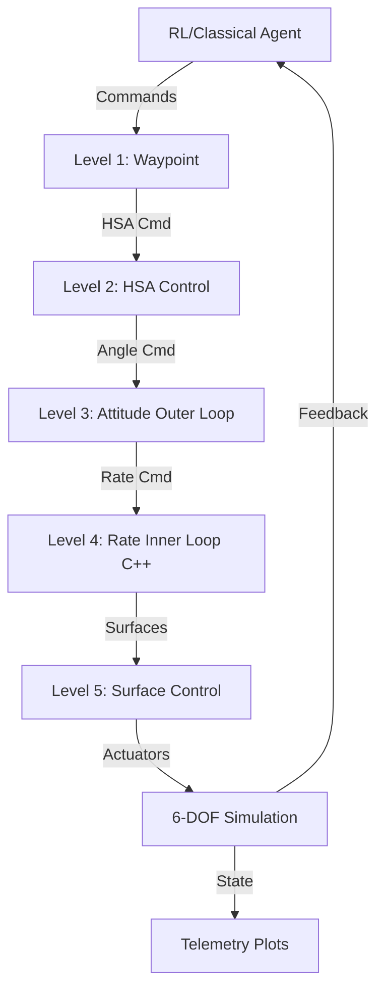

# Aircraft Control Algorithms Demo

A demonstration of various aircraft control algorithms using a hybrid Python/C++ architecture. This project implements a **5-level cascaded control hierarchy** with classical PID controllers and reinforcement learning agents, integrated with aerodynamic simulation and real-time visualization.



## Project Status

**Phase 4 Complete!** ✅ (2025-10-11)

- ✅ **Phase 1**: Foundation (interfaces, types, C++ bindings)
- ✅ **Phase 2**: Simulation Backend (simplified 6-DOF physics)
- ✅ **Phase 3**: Classical Controllers (5-level cascaded PID)
- ✅ **Phase 4**: Visualization & Monitoring (multi-aircraft)
- ⏳ **Phase 5**: RL Training Infrastructure (next)

**Progress**: 4/8 phases complete (50%) | **Tests**: 132/132 passing | **Code**: ~11,000 lines

## Features

- **5-Level Control Hierarchy**: Waypoint → HSA → Attitude → Rate → Surface
- **Cascaded PID Architecture**: Industry-standard inner/outer loop design
- **Hybrid C++/Python**: Performance-critical inner loop in C++ (1000 Hz), flexibility in Python
- **Multi-Aircraft Visualization**: HDF5 logging, real-time plotting, 3D fleet view
- **Aircraft Registry**: Track multiple aircraft with status, colors, metadata
- **Replay System**: Playback logged flights with synchronized multi-aircraft visualization
- **Simplified 6-DOF Physics**: Fast iteration for RL training
- **Configurable**: YAML configuration for controllers and visualization
- **Scalable Architecture**: Designed for 1 to 100+ aircraft
- **Modular Design**: Easy to extend with new control algorithms or RL agents

## Quick Start

### Installation

```bash
# Clone the repository
git clone https://github.com/yourusername/controls.git
cd controls

# Create virtual environment
python3 -m venv venv
source venv/bin/activate  # On Windows: venv\Scripts\activate

# Install Python dependencies
pip install -r requirements.txt
pip install pyyaml  # For config loading

# Build C++ components
./build.sh  # Or manually: cd build && cmake .. && make

# The C++ bindings are now available as aircraft_controls_bindings
```

### Run Examples

```bash
# Activate virtual environment
source venv/bin/activate

# Quick flight test (pre-programmed, Phase 2)
python examples/quick_flight_test.py

# Interactive flight (keyboard control, Phase 2)
python examples/interactive_flight_test.py

# Classical controller test (PID cascaded control, Phase 3)
python examples/classical_controller_test.py

# Multi-aircraft demo (3 aircraft, logging, visualization, Phase 4)
python examples/multi_aircraft_demo.py

# 🎮 Interactive flight control GUI with drag-and-drop joystick (NEW!)
python examples/launch_pygame_gui.py

# Simulation demo (original, Phase 2)
python examples/simple_simulation_demo.py
```

## 5-Level Control Hierarchy

The system implements a cascaded control architecture matching industry-standard flight controllers:

### Level 1: Waypoint Navigation
**Input**: 3D waypoint coordinates (north, east, altitude)
**Output**: HSA commands to Level 2
**Use Case**: Autonomous navigation, mission planning

```python
from controllers import WaypointAgent, ControlCommand, ControlMode, Waypoint

agent = WaypointAgent(config)
command = ControlCommand(
    mode=ControlMode.WAYPOINT,
    waypoint=Waypoint.from_altitude(north=100, east=200, altitude=50)
)
surfaces = agent.compute_action(command, state)
```

### Level 2: HSA (Heading, Speed, Altitude)
**Input**: Heading, speed, altitude setpoints
**Output**: Attitude angle commands to Level 3
**Use Case**: Formation flight, loitering, area coverage

```python
from controllers import HSAAgent

agent = HSAAgent(config)
command = ControlCommand(
    mode=ControlMode.HSA,
    heading=np.radians(90),  # 90° East
    speed=25.0,  # m/s
    altitude=100.0  # meters
)
surfaces = agent.compute_action(command, state)
```

### Level 3: Attitude Control (Angle Mode, Outer Loop)
**Input**: Desired roll, pitch, yaw angles
**Output**: Rate commands to Level 4
**Use Case**: Stabilized flight, smooth maneuvers

```python
from controllers import AttitudeAgent

agent = AttitudeAgent(config)
command = ControlCommand(
    mode=ControlMode.ATTITUDE,
    roll_angle=np.radians(30),  # 30° bank
    pitch_angle=np.radians(5),  # 5° pitch up
    yaw_angle=0.0,
    throttle=0.7
)
surfaces = agent.compute_action(command, state)  # Cascades to Level 4
```

### Level 4: Rate Control (Inner Loop, C++)
**Input**: Desired angular rates (p, q, r)
**Output**: Surface deflections
**Use Case**: Acrobatic flight, tight control, inner loop for Level 3

```python
from controllers import RateAgent

agent = RateAgent(config)
command = ControlCommand(
    mode=ControlMode.RATE,
    roll_rate=np.radians(90),  # 90°/s roll rate
    pitch_rate=0.0,
    yaw_rate=0.0,
    throttle=0.7
)
surfaces = agent.compute_action(command, state)  # C++ PID, 1000 Hz
```

### Level 5: Surface Control
**Input**: Direct surface deflections
**Output**: Saturated actuator commands
**Use Case**: Direct control, research, RL training

```python
from controllers import SurfaceAgent

agent = SurfaceAgent()
command = ControlCommand(
    mode=ControlMode.SURFACE,
    elevator=-0.1,
    aileron=0.05,
    rudder=0.0,
    throttle=0.7
)
surfaces = agent.compute_action(command, state)  # Pass-through + saturation
```

## Architecture

```
┌─────────────────────────────────────────────────────────────┐
│                     Agent / AI Controller                    │
│                         (Python)                             │
└─────────────────────┬───────────────────────────────────────┘
                      │
┌─────────────────────▼───────────────────────────────────────┐
│                  Flight Controller Modes                     │
│  Waypoint │ HSA │ Stick & Throttle │ Surface Deflection    │
│                         (Python)                             │
└─────────────────────┬───────────────────────────────────────┘
                      │
┌─────────────────────▼───────────────────────────────────────┐
│            C++ PID Controllers & Mixer                       │
│            (Performance Critical - 100-500 Hz)               │
│                   From dRehmFlight                           │
└─────────────────────┬───────────────────────────────────────┘
                      │
┌─────────────────────▼───────────────────────────────────────┐
│              Aerodynamic Simulation (JSBSim)                 │
│                         (Python)                             │
└─────────────────────┬───────────────────────────────────────┘
                      │
                      ▼
              ┌───────────────┐
              │ Visualization │
              │   & Logging   │
              └───────────────┘
```

## Project Structure

```
controls/
├── controllers/        # Python flight controller modes
├── core/              # C++ performance-critical code
├── interfaces/        # Agent and aircraft interfaces
├── simulation/        # JSBSim integration
├── visualization/     # Real-time plots and 3D viewer
├── gui/               # Web dashboard
├── examples/          # Demonstration scripts
└── tests/             # Test suite
```

## Documentation

See [DESIGN.md](DESIGN.md) for detailed architecture and design documentation.

## Technology Stack

- **Languages**: Python 3.8+, C++17
- **Core**: NumPy, SciPy, Pybind11
- **Simulation**: JSBSim
- **Visualization**: Matplotlib, Plotly, PyVista
- **GUI**: Plotly Dash
- **Build**: CMake, setuptools

## Development

### Running Tests

```bash
# Run all tests
pytest tests/

# Run with coverage
pytest --cov=controllers --cov=interfaces tests/

# Test specific module
pytest tests/test_modes.py -v
```

### Code Formatting

```bash
# Format Python code
black controllers/ interfaces/ visualization/ gui/

# Lint
flake8 controllers/ interfaces/

# Type checking
mypy controllers/ interfaces/
```

## Credits

This project builds upon:
- **dRehmFlight** by Nicholas Rehm - Flight controller algorithms
- **JSBSim** - Flight dynamics simulation
- **Pybind11** - C++/Python bindings

## License

MIT License - See LICENSE file for details.

Note: dRehmFlight components retain their original license.

## Contributing

Contributions welcome! Please see CONTRIBUTING.md for guidelines.

## Contact

For questions or issues, please open a GitHub issue.
