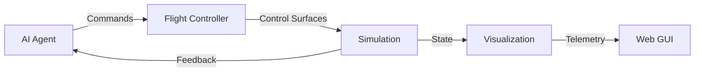

# Aircraft Control Algorithms Demo

A demonstration of various aircraft control algorithms using a hybrid Python/C++ architecture. This project showcases a flexible flight controller that can be commanded through multiple modes, integrated with aerodynamic simulation, and monitored through real-time visualization.



## Features

- **4 Control Modes**: Waypoint navigation, HSA (Heading/Speed/Altitude), Stick & Throttle, Direct surface control
- **Hybrid Architecture**: Performance-critical PID controllers in C++, high-level logic in Python
- **Real-time Visualization**: Live telemetry plots and 3D aircraft visualization
- **Web GUI Dashboard**: Interactive control panel and monitoring
- **JSBSim Integration**: High-fidelity aerodynamic simulation
- **Modular Design**: Easy to extend with new control algorithms

## Quick Start

### Installation

```bash
# Clone the repository
git clone https://github.com/yourusername/controls.git
cd controls

# Install Python dependencies
pip install -r requirements.txt

# Build C++ components
mkdir build && cd build
cmake ..
make
cd ..

# Install the package
pip install -e .
```

### Run Examples

```bash
# Waypoint navigation demo
python examples/waypoint_demo.py

# HSA control demo
python examples/hsa_demo.py

# Stick control demo
python examples/stick_control_demo.py

# Visualization demo
python examples/visualization_demo.py

# Full GUI dashboard
python gui/app.py
```

## Control Modes

### Mode 1: Waypoint Navigation
Command the aircraft to fly to 3D waypoints. The controller automatically computes heading, speed, and altitude commands.

```python
from interfaces.agent_interface import AgentInterface, ControlMode, Waypoint

agent = AgentInterface()
agent.set_mode(ControlMode.WAYPOINT)
agent.send_waypoint(Waypoint(north=100, east=200, down=-50))
```

### Mode 2: HSA (Heading, Speed, Altitude)
Directly command heading, airspeed, and altitude.

```python
agent.set_mode(ControlMode.HSA)
agent.send_hsa_command(heading=90, speed=25, altitude=100)
```

### Mode 3: Stick & Throttle
RC-style control with roll, pitch, yaw, and throttle inputs.

```python
agent.set_mode(ControlMode.STICK_THROTTLE)
agent.send_stick_command(roll=0.2, pitch=0.1, yaw=0.0, throttle=0.6)
```

### Mode 4: Control Surface Deflection
Direct control of elevator, aileron, rudder, and throttle.

```python
agent.set_mode(ControlMode.SURFACE)
agent.send_surface_command(elevator=-0.1, aileron=0.05, rudder=0.0, throttle=0.7)
```

## Architecture

```
┌─────────────────────────────────────────────────────────────┐
│                     Agent / AI Controller                    │
│                         (Python)                             │
└─────────────────────┬───────────────────────────────────────┘
                      │
┌─────────────────────▼───────────────────────────────────────┐
│                  Flight Controller Modes                     │
│  Waypoint │ HSA │ Stick & Throttle │ Surface Deflection    │
│                         (Python)                             │
└─────────────────────┬───────────────────────────────────────┘
                      │
┌─────────────────────▼───────────────────────────────────────┐
│            C++ PID Controllers & Mixer                       │
│            (Performance Critical - 100-500 Hz)               │
│                   From dRehmFlight                           │
└─────────────────────┬───────────────────────────────────────┘
                      │
┌─────────────────────▼───────────────────────────────────────┐
│              Aerodynamic Simulation (JSBSim)                 │
│                         (Python)                             │
└─────────────────────┬───────────────────────────────────────┘
                      │
                      ▼
              ┌───────────────┐
              │ Visualization │
              │   & Logging   │
              └───────────────┘
```

## Project Structure

```
controls/
├── controllers/        # Python flight controller modes
├── core/              # C++ performance-critical code
├── interfaces/        # Agent and aircraft interfaces
├── simulation/        # JSBSim integration
├── visualization/     # Real-time plots and 3D viewer
├── gui/               # Web dashboard
├── examples/          # Demonstration scripts
└── tests/             # Test suite
```

## Documentation

See [DESIGN.md](DESIGN.md) for detailed architecture and design documentation.

## Technology Stack

- **Languages**: Python 3.8+, C++17
- **Core**: NumPy, SciPy, Pybind11
- **Simulation**: JSBSim
- **Visualization**: Matplotlib, Plotly, PyVista
- **GUI**: Plotly Dash
- **Build**: CMake, setuptools

## Development

### Running Tests

```bash
# Run all tests
pytest tests/

# Run with coverage
pytest --cov=controllers --cov=interfaces tests/

# Test specific module
pytest tests/test_modes.py -v
```

### Code Formatting

```bash
# Format Python code
black controllers/ interfaces/ visualization/ gui/

# Lint
flake8 controllers/ interfaces/

# Type checking
mypy controllers/ interfaces/
```

## Credits

This project builds upon:
- **dRehmFlight** by Nicholas Rehm - Flight controller algorithms
- **JSBSim** - Flight dynamics simulation
- **Pybind11** - C++/Python bindings

## License

MIT License - See LICENSE file for details.

Note: dRehmFlight components retain their original license.

## Contributing

Contributions welcome! Please see CONTRIBUTING.md for guidelines.

## Contact

For questions or issues, please open a GitHub issue.
