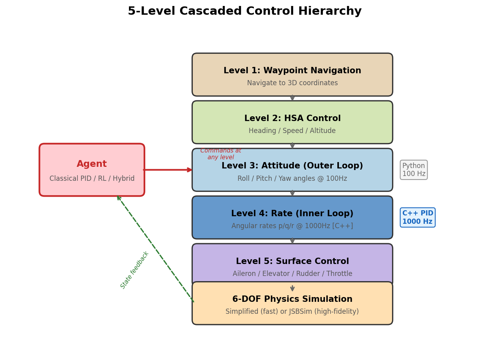
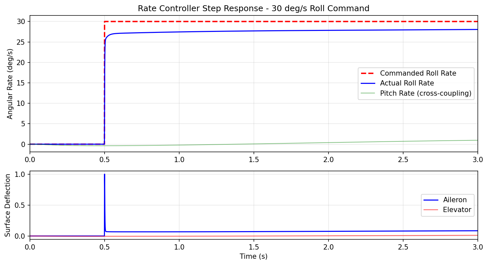
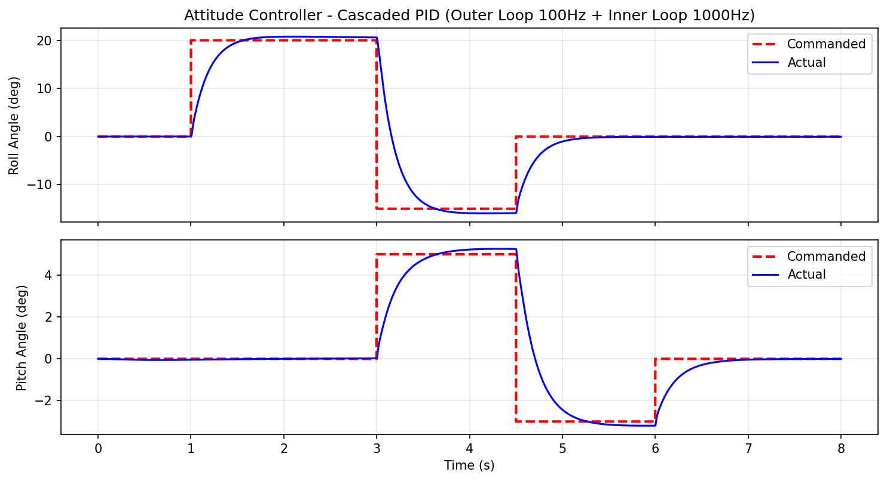
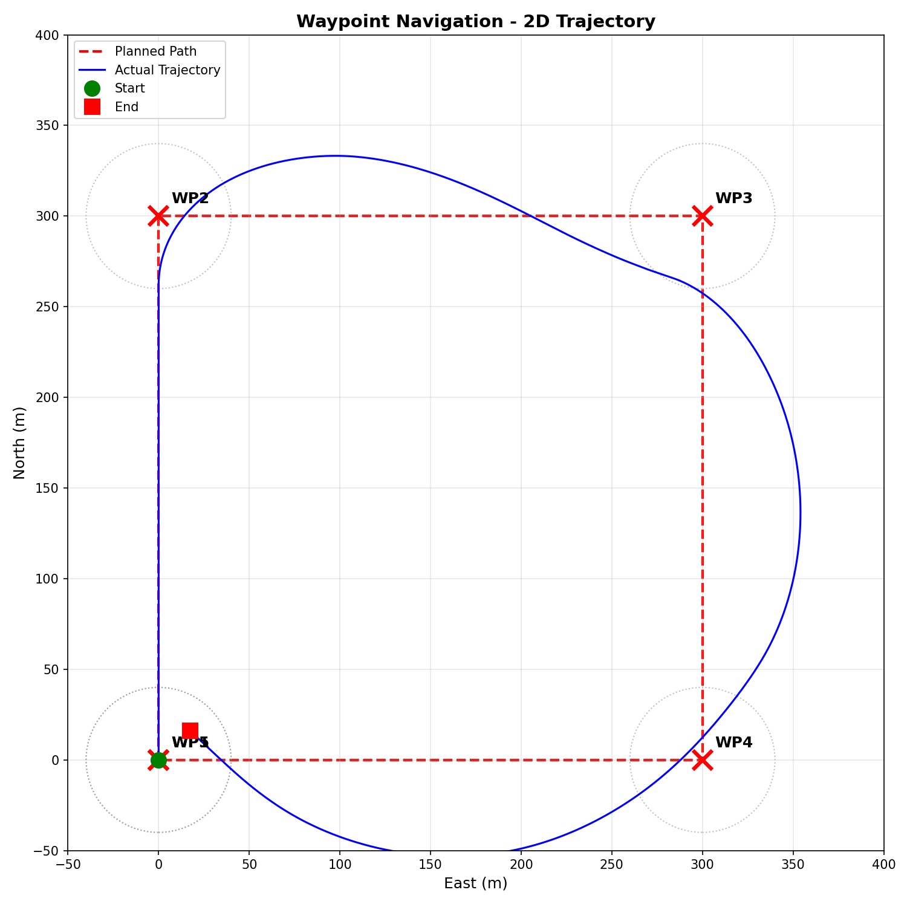
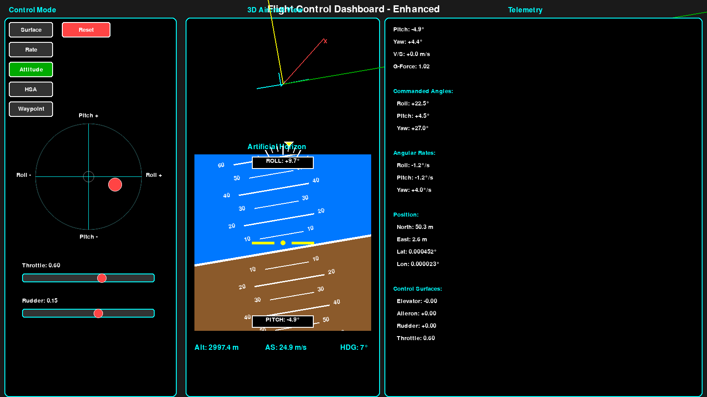
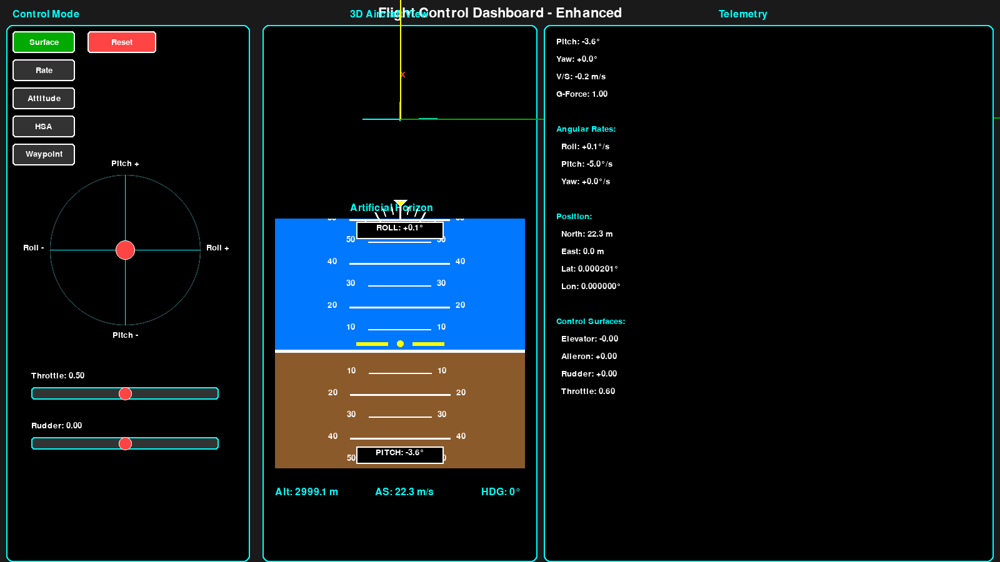

# Multi-Level Flight Control with Hybrid Classical and Reinforcement Learning Controllers

[](tests/)
[](https://www.python.org/downloads/)
[](LICENSE)
[](.)

This is a hobby project. The goal is to write every aspect of simulation and flight controller from scratch. This project provides a platform for comparing classical PID and reinforcement learning control strategies across multiple levels of a cascaded flight control hierarchy. This project implements a **5-level control abstraction** enabling systematic study of where and when learned controllers outperform classical approaches. This repo also implements a light and simplified 6dof aircraft simulation.

---

## Project

1. **Multi-Level Learning Framework**: Train RL agents at any of 5 control abstraction levels (waypoint, HSA, attitude, rate, surface) with level-specific observation spaces, action spaces, and reward functions

2. **Hybrid Classical-RL Architecture**: Seamlessly compose classical and learned controllers (e.g., RL waypoint planner → PID attitude control) with live switching for direct comparison

3. **Rigorous Validation Pipeline**: Physics validation against JSBSim (industry gold standard), quantitative metrics (settling time, overshoot, RMSE, smoothness), reproducible experiments

4. **Curriculum Learning Implementation**: Progressive training difficulty (easy → medium → hard scenarios) with PPO+LSTM for temporal pattern learning

5. **Real-Time Performance Analysis**: Live RL↔PID switching in GUI, comprehensive telemetry logging (HDF5), and custom TensorBoard plugin for flight visualization

---

## System Architecture

### 5-Level Cascaded Control Hierarchy



Agents can operate at ANY level, enabling systematic comparison of where learned controllers outperform classical approaches, sample efficiency vs control quality tradeoffs, and transfer learning between abstraction levels.

---

## Results

All development, tuning, and RL training was done on a **MacBook Pro (CPU only, no GPU)**. The PID controllers were hand-tuned to achieve >90% tracking accuracy across all 5 control levels. The RL rate controller was trained with PPO (25M steps, ~8 hours) using curriculum learning (easy-to-hard) and behavior cloning pretraining from PID demonstrations. On the rate tracking task, the learned controller outperforms PID by a wide margin:

| Difficulty | RL Mean Reward | PID Mean Reward | RL Survival | PID Survival |
|:----------:|:--------------:|:---------------:|:-----------:|:------------:|
| Easy       | +305           | -960            | 7.4s avg    | 6.1s avg     |
| Medium     | +308           | -546            | 7.9s avg    | 3.2s avg     |
| Hard       | +197           | -186            | 6.7s avg    | 1.3s avg     |

The simulation runs at ~1,000 steps/sec per environment, enabling rapid iteration even without a GPU.

### Rate Controller (Level 4) - Step Response

The inner-loop rate controller tracks a 30 deg/s roll rate command with fast settling and minimal cross-coupling:



### Attitude Controller (Level 3) - Cascaded PID

The outer-loop attitude controller tracks multi-axis angle commands through a sequence of maneuvers:



### Waypoint Navigation (Level 1) - Full Hierarchy

Autonomous navigation through a square waypoint pattern using all 5 control levels:



### Interactive Flight GUI

Real-time Pygame dashboard with drag-and-drop joystick, artificial horizon, 3D aircraft view, and full telemetry. Supports all 5 control modes with live switching:

| Rate Mode | Attitude Mode | Surface Mode |
|:---------:|:------------:|:------------:|
|  |  |  |

### TensorBoard Flight Visualization Plugin

Custom TensorBoard plugin for 3D flight trajectory visualization, telemetry analysis, and multi-agent comparison. Built with Three.js - see the [submodule repo](https://github.com/lhwright13/TensorBoard-Flight-Analysis) for details.


---

## Key Features

### Control System
- **5-Level Control Hierarchy**: Waypoint → HSA → Attitude → Rate → Surface
- **Cascaded PID Architecture**: Industry-standard inner/outer loop design
- **Hybrid C++/Python**: Performance-critical inner loop in C++ (1000 Hz), flexibility in Python
- **Modularity**: Interface-driven design (Simulation ↔ Hardware, Classical ↔ RL)

### Reinforcement Learning
- **PPO with LSTM**: Temporal pattern learning for non-Markovian flight dynamics
- **Curriculum Learning**: Easy → Medium → Hard scenarios with progressive difficulty
- **Multi-Level Training**: Train agents at any of the 5 control levels
- **Comprehensive Metrics**: Settling time, overshoot, RMSE, smoothness, stability
- **Live RL↔PID Switching**: Press 'L' in GUI to toggle mid-flight

### Simulation & Validation
- **Simplified 6-DOF Physics**: Fast iteration for RL training (~1000 steps/sec)
- **JSBSim Integration**: High-fidelity validation against gold standard
- **Physics Validation Framework**: Quantitative comparison metrics (RMSE, correlation)
- **Sensor Simulation**: Perfect, noisy, and realistic sensor models

### Visualization & Tools
- **Interactive Pygame GUI**: Drag-and-drop joystick, real-time telemetry, mode switching
- **FlightGear Integration**: Photorealistic 3D visualization with HUD overlay
- **Multi-Aircraft Logging**: HDF5 with compression, synchronized replay
- **3D Fleet Visualization**: PyVista-based multi-aircraft viewer
- **TensorBoard Plugin**: Custom flight telemetry visualization
- **Real-Time Plotting**: Matplotlib-based multi-aircraft monitoring
- **Manual Flying**: Experience all 5 control levels hands-on (see [MANUAL_CONTROL.md](MANUAL_CONTROL.md))

### Research Infrastructure
- **132 Comprehensive Tests**: Interface compliance, PID bindings, simulation, control integration
- **Configuration-Driven**: YAML configs for PID gains, visualization, training
- **Reproducible Experiments**: Seeded, versioned configs with automated evaluation
- **Extensible Architecture**: Easy to add new agents, controllers, or RL algorithms

---

## Quick Start

### Installation

```bash
# Create virtual environment
python3 -m venv venv
source venv/bin/activate  # On Windows: venv\Scripts\activate

# Install dependencies
pip install -r requirements.txt

# Build C++ components (1000 Hz PID inner loop)
./build.sh
```

### Run Your First Simulation (2 minutes)

```bash
# Activate virtual environment
source venv/bin/activate

# Interactive flight GUI with live RL↔PID switching
python examples/launch_pygame_gui.py

# Controls:
#   - Drag the joystick to command roll/pitch
#   - Mouse wheel to adjust throttle
#   - Press 'L' to toggle between RL and PID controllers
#   - Press 'M' to cycle control modes (Rate/Attitude/HSA/Waypoint)
```

### Compare RL vs PID (5 minutes)

```bash
# Run side-by-side comparison with quantitative metrics
python examples/02_rl_vs_pid_demo.py

# Outputs:
#   - Settling time comparison (bar chart)
#   - Step response overlay (time series)
#   - Tracking error distribution
#   - Control effort comparison
```

For detailed setup instructions, see [QUICKSTART.md](QUICKSTART.md).

---

## Documentation

### User Guides
- [QUICKSTART.md](QUICKSTART.md) - Installation and first simulation
- [MANUAL_CONTROL.md](MANUAL_CONTROL.md) - Manual flying guide for all 5 control levels
- [examples/README.md](examples/README.md) - Example walkthroughs and learning path
- [FAQ.md](FAQ.md) - Common questions and troubleshooting
- [flightgear/README.md](flightgear/README.md) - FlightGear 3D visualization setup

### Design Documentation (14 comprehensive docs)
- [System Overview](design_docs/00_OVERVIEW.md) - Architecture and philosophy
- [Control Hierarchy](design_docs/03_CONTROL_HIERARCHY.md) - 5-level cascaded design
- [Flight Controller](design_docs/04_FLIGHT_CONTROLLER.md) - PID implementation details
- [RL Training](design_docs/06_RL_AGENT_TRAINING.md) - Learning infrastructure and curriculum
- [Full Documentation Index](design_docs/README.md)

---

## Examples & Demos

See [examples/README.md](examples/README.md) for detailed explanations. Recommended learning path:

1. **`examples/01_hello_controls.py`** - Simplest rate controller demo (30 lines)
2. **`examples/02_rl_vs_pid_demo.py`** - RL vs PID comparison with metrics
3. **`examples/03_waypoint_square_demo.py`** - Autonomous waypoint navigation
4. **`examples/launch_pygame_gui.py`** - Interactive flight with live controller switching
5. **`examples/tune_pids.py`** - Systematic PID gain tuning

### Learned Controller Examples

```bash
# Train a new rate controller from scratch
cd learned_controllers
python train_rate.py

# Evaluate trained model vs PID
python eval_rate.py --model models/rate_controller_best.zip

# Visualize training progress in TensorBoard
tensorboard --logdir runs/
```

See [learned_controllers/README.md](learned_controllers/README.md) for full RL training documentation.

---

## Research Use Cases

### 1. Algorithm Comparison
Compare classical PID vs RL at each control level:
- Which level benefits most from learning?
- Sample efficiency vs control quality tradeoffs
- Generalization to unseen conditions

### 2. Multi-Level Learning
Train agents at different abstraction levels:
- Low-level (Rate/Surface): Fast, dense rewards, tight control
- High-level (Waypoint/HSA): Sparse rewards, long-horizon planning

### 3. Hierarchical Composition
Compose learned and classical controllers:
- RL waypoint planner → Classical attitude control
- RL rate controller ← Classical waypoint navigation
- Adaptive level switching based on task difficulty

### 4. Sim-to-Real Transfer
Validate learned controllers:
- Train on simplified 6-DOF physics
- Validate on JSBSim high-fidelity simulation
- Deploy to hardware (Phase 6 - planned)

---

## Project Structure

```
controls/
├── controllers/               # Flight controller implementations
│   ├── waypoint_agent.py     # L1: Waypoint navigation
│   ├── hsa_agent.py           # L2: Heading/Speed/Altitude
│   ├── attitude_agent.py      # L3: Attitude outer loop
│   ├── rate_agent.py          # L4: Rate inner loop (C++ PID)
│   ├── surface_agent.py       # L5: Direct surface control
│   ├── learned_rate_agent.py  # L4: RL-based rate controller
│   └── mission_planner.py     # Waypoint sequencing
│
├── learned_controllers/       # RL training infrastructure
│   ├── train_rate.py          # Train rate controller (PPO+LSTM)
│   ├── eval_rate.py           # Evaluate and compare to PID
│   ├── envs/                  # Gymnasium environments for each level
│   ├── networks/              # Neural network architectures
│   ├── config/                # Training configurations
│   └── README.md              # Full RL documentation
│
├── simulation/                # Physics simulation
│   └── simplified_6dof.py     # Fast 6-DOF for RL training
│
├── validation/                # Physics validation framework
│   ├── jsbsim_backend.py      # JSBSim integration
│   └── compare_trajectories.py # RMSE, correlation metrics
│
├── gui/                       # Interactive visualization
│   └── flight_gui_pygame_v2.py # Pygame GUI with live RL↔PID toggle
│
├── interfaces/                # Abstract interfaces
│   ├── agent.py               # BaseAgent interface
│   └── aircraft.py            # AircraftInterface (sim/hardware)
│
├── design_docs/               # 14 comprehensive design documents
├── examples/                  # Demonstration scripts
├── tests/                     # 130 tests (all passing)
└── configs/                   # YAML configurations
```

---

## Technology Stack

| Layer | Technologies |
|-------|-------------|
| **Core** | Python 3.8+, C++17, Pybind11 |
| **RL** | Stable-Baselines3, SB3-Contrib (RecurrentPPO), Gymnasium |
| **Simulation** | Simplified 6-DOF, JSBSim (high-fidelity validation) |
| **Visualization** | Matplotlib, PyVista, Pygame, TensorBoard |
| **Data** | HDF5, Pandas, NumPy, SciPy |
| **Build** | CMake, setuptools |
| **Testing** | Pytest (130 tests), pytest-cov |
| **Config** | YAML (controllers, training, visualization) |

---

## Validation & Testing

### Physics Validation
The simplified 6-DOF model is validated against JSBSim:
- **Trajectory Comparison**: RMSE, correlation metrics
- **Test Scenarios**: Level flight, maneuvers, trimmed/untrimmed conditions
- **12 Comprehensive Tests**: All passing
- See [validation/TUNING_GUIDE.md](validation/TUNING_GUIDE.md) for methodology

### Test Coverage
```bash
# Run all 130 tests
pytest tests/

# With coverage report
pytest --cov=controllers --cov=interfaces --cov=simulation tests/

# Test categories:
#   - 34 tests: Interface compliance, type validation
#   - 31 tests: Simulation physics, sensor models
#   - 49 tests: Visualization, logging, replay
#   - 18 tests: Control integration, multi-aircraft
```

---

## Citation

If you use this work in your research, please cite:

```bibtex
@software{multi_level_flight_control,
  author = {Lucas Wright},
  title = {Multi-Level Flight Control with Hybrid Classical and RL Controllers},
  year = {2025},
  url = {https://github.com/lhwright13/Hybrid-Classical-and-Reinforcement-Learning-Aircraft-Controllers}
}
```

---

## License

This project is licensed under the MIT License - see [LICENSE](LICENSE) file for details.

## Acknowledgments:
- **dRehmFlight** by Nicholas Rehm - Inspiration for cascaded control architecture design
- **JSBSim** - Flight dynamics simulation for validation
- **Pybind11** - C++/Python bindings

---

## Contact

For questions, bug reports, or discussions:
- **GitHub Issues**: Bug reports and feature requests
- **GitHub Discussions**: General questions and research discussions

