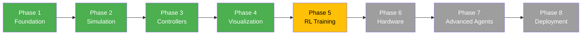
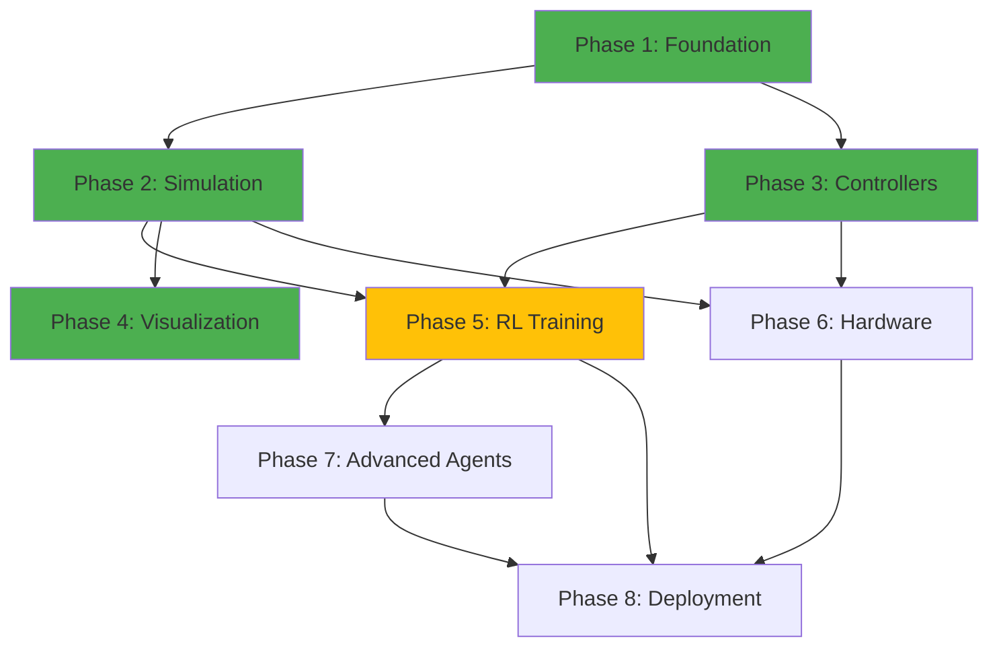

# Project Roadmap

This document outlines the development roadmap for the Multi-Level Flight Control platform, separating completed work from future plans.

---

## Implementation Philosophy

The project follows an **8-phase incremental development approach**, building from foundational interfaces to advanced deployment capabilities. Each phase is designed to be independently valuable while supporting future phases.

**Legend**: 🟢 Complete | 🟡 In Progress | ⚪ Planned

---

## Phase Status Overview

| Phase | Status | Progress | Start Date | Completion |
|-------|--------|----------|------------|------------|
| **1: Foundation** | 🟢 Complete | 100% | - | ✓ |
| **2: Simulation** | 🟢 Complete | 100% | - | ✓ |
| **3: Classical Controllers** | 🟢 Complete | 95% | - | ✓ (needs tuning) |
| **4: Visualization** | 🟢 Complete | 85% | - | ✓ (web deferred) |
| **5: RL Training** | 🟡 In Progress | 60% | - | Rate controller trained |
| **6: Hardware Interface** | ⚪ Planned | 0% | TBD | - |
| **7: Advanced Agents** | ⚪ Planned | 0% | TBD | - |
| **8: Deployment** | ⚪ Planned | 0% | TBD | - |

---

## ✅ Completed Phases (1-4)

### Phase 1: Foundation (100% Complete)

**Goal**: Establish robust interfaces and type system for all components.

**Deliverables**:
- ✅ `AircraftInterface` - Abstract interface for simulation/hardware
- ✅ `BaseAgent` - Abstract interface for all control agents
- ✅ `SensorInterface` - Abstract interface for sensor simulation
- ✅ Type definitions (`AircraftState`, `ControlCommand`, `ControlSurfaces`, etc.)
- ✅ C++ PID bindings via Pybind11 (1000 Hz inner loop)
- ✅ Configuration management (`ControllerConfig`, `PIDGains`)
- ✅ 34 interface compliance tests

**Key Achievement**: Clean separation of concerns enabling swappable backends.

---

### Phase 2: Simulation (100% Complete)

**Goal**: Implement fast, accurate 6-DOF physics simulation for RL training.

**Deliverables**:
- ✅ Simplified 6-DOF dynamics model
  - Mass properties, inertia tensor
  - Aerodynamic forces (lift, drag, side force)
  - Aerodynamic moments (roll, pitch, yaw)
  - RK4 integration for stability
- ✅ `SimulationAircraftBackend` implementing `AircraftInterface`
- ✅ Configurable aircraft parameters
- ✅ Sensor simulation (perfect, noisy, realistic modes)
- ✅ ~1000 simulation steps/second (fast enough for RL)
- ✅ 31 simulation physics tests

**Key Achievement**: Fast, stable simulation suitable for RL training (~1M samples/hour).

---

### Phase 3: Classical Controllers (95% Complete)

**Goal**: Implement industry-standard 5-level cascaded PID control hierarchy.

**Deliverables**:
- ✅ **Level 5**: `SurfaceAgent` - Direct surface control + mixer
- ✅ **Level 4**: `RateAgent` - Angular rate control (C++ PID @ 1000 Hz)
- ✅ **Level 3**: `AttitudeAgent` - Angle mode outer loop
- ✅ **Level 2**: `HSAAgent` - Heading/Speed/Altitude control
- ✅ **Level 1**: `WaypointAgent` - Waypoint navigation
- ✅ `MissionPlanner` - Waypoint sequencing
- ✅ YAML configuration files
- ✅ Cascaded architecture (L3 → L4, L2 → L3, etc.)

**Remaining Work**:
- ⚠️ Systematic PID gain tuning (currently functional but not optimized)
- ⚠️ Auto-tuning tools (Ziegler-Nichols, genetic algorithms)

**Key Achievement**: Complete 5-level hierarchy matching industry flight controllers.

---

### Phase 4: Visualization & Monitoring (85% Complete)

**Goal**: Multi-aircraft logging, visualization, and replay system.

**Deliverables**:
- ✅ HDF5 telemetry logging with compression
- ✅ Multi-aircraft registry and status tracking
- ✅ Real-time matplotlib plotting (1-100+ aircraft)
- ✅ 3D fleet visualization (PyVista + fallback)
- ✅ Synchronized replay with interpolation
- ✅ Pygame interactive GUI with drag-and-drop joystick
- ✅ Custom TensorBoard plugin (submodule, early development)
- ✅ 49 visualization and logging tests

**Remaining Work**:
- ⚠️ Plotly Dash web dashboard (deferred to Phase 6)
- ⚠️ Real-time streaming to web clients

**Key Achievement**: Scalable multi-aircraft monitoring system.

---

## 🟡 Current Phase (5)

### Phase 5: RL Training Infrastructure (60% Complete)

**Goal**: Train RL agents at each control level, compare to classical PID.

**Status**: Rate controller (Level 4) trained, higher levels in progress.

**Completed**:
- ✅ Gymnasium environment interfaces for all 5 levels
- ✅ PPO + LSTM implementation (SB3-Contrib)
- ✅ Curriculum learning (Easy → Medium → Hard)
- ✅ Rate controller (L4) training pipeline
- ✅ `LearnedRateAgent` implementation
- ✅ Evaluation framework with metrics
- ✅ Training visualization (TensorBoard)
- ✅ Model checkpointing and recovery
- ✅ Reward shaping (tracking + smoothness + stability)
- ✅ Live RL↔PID switching in GUI

**In Progress**:
- 🔄 Training higher-level controllers (L1-L3)
- 🔄 Hyperparameter optimization
- 🔄 Ablation studies

**Planned**:
- ⚪ Multi-task learning (train on multiple control levels)
- ⚪ Transfer learning (L4 → L3 → L2)
- ⚪ Distillation (large teacher → small student network)
- ⚪ Comparative study: RL vs PID at each level

**Research Questions**:
1. Which control levels benefit most from learning?
2. How does sample efficiency vary across levels?
3. Can we transfer learned policies between levels?
4. What's the optimal reward function for each level?

**Expected Completion**: When all 5 levels have trained RL alternatives with comprehensive evaluation.

---

## ⚪ Future Phases (6-8)

### Phase 6: Hardware Interface (Planned)

**Goal**: Deploy controllers to real hardware with HIL testing.

**Planned Deliverables**:
- Hardware abstraction layer
  - Teensy 4.1 flight controller support
  - MAVLink protocol integration
  - SBus/PWM receiver input
  - Real sensor integration (IMU, GPS, barometer)
- Hardware-in-the-Loop (HIL) testing
  - Simulation → Teensy → Actuators → Simulation loop
  - Latency measurement and compensation
  - Real-time performance validation
- Safety systems
  - Watchdog timers
  - Failsafe modes
  - Geofencing
  - Battery monitoring
- Telemetry streaming
  - Real-time log upload
  - Remote monitoring dashboard
  - Emergency kill switch

**Prerequisites**: Phases 1-5 complete, hardware platform selected

**Estimated Duration**: 2-3 months

**Research Questions**:
1. How much does sensor noise degrade RL performance?
2. Can we bridge the sim-to-real gap without retraining?
3. What latency is acceptable for each control level?

---

### Phase 7: Advanced Agent Architectures (Planned)

**Goal**: Implement hierarchical, adaptive, and hybrid agent compositions.

**Planned Deliverables**:

#### 7.1 Hierarchical Agents
- High-level agent commands low-level agent
- Example: RL waypoint planner → PID attitude controller
- Temporal abstraction (slow high-level, fast low-level)
- Option frameworks (hierarchical RL)

#### 7.2 Adaptive Agents
- Dynamically switch control levels based on task
- Example: L1 (waypoint) for cruise, L4 (rate) for acrobatics
- Meta-learning to decide optimal level
- Online adaptation to changing conditions

#### 7.3 Hybrid Agents
- RL with classical safety fallback
- Blend RL and PID (trust region mixing)
- Residual RL (RL corrects PID baseline)
- Learn switching policy (when to use RL vs PID)

#### 7.4 Multi-Agent RL
- Formation flight coordination
- Collision avoidance
- Cooperative task completion
- Communication between agents

**Prerequisites**: Phase 5 complete (RL at all levels)

**Estimated Duration**: 3-4 months

**Research Questions**:
1. Does hierarchical composition improve sample efficiency?
2. When should we switch between control levels?
3. Can we guarantee safety with RL components?
4. How do we train multi-agent coordination?

---

### Phase 8: Sim-to-Real Deployment (Planned)

**Goal**: Deploy learned controllers to real aircraft with robust sim-to-real transfer.

**Planned Deliverables**:

#### 8.1 Domain Randomization
- Randomize simulation parameters during training
  - Mass, inertia, aerodynamic coefficients
  - Sensor noise, actuator delays
  - Wind, turbulence, atmospheric conditions
- Train robust policies that generalize

#### 8.2 Model Export & Optimization
- ONNX export for cross-platform deployment
- TensorRT optimization for Jetson Nano/Xavier
- Quantization (FP32 → FP16 → INT8)
- Pruning for edge deployment

#### 8.3 Real-World Validation
- Progressive validation:
  1. HIL testing (Phase 6)
  2. Tethered flight tests
  3. Autonomous flight with safety pilot
  4. Fully autonomous flight
- Failure mode analysis
- Long-duration testing (battery life, thermal)

#### 8.4 Continuous Learning
- Online adaptation to real aircraft dynamics
- Fine-tuning after deployment
- Anomaly detection
- Performance monitoring

**Prerequisites**: Phases 5-7 complete, hardware platform validated

**Estimated Duration**: 4-6 months

**Research Questions**:
1. How much domain randomization is needed?
2. Can we achieve zero-shot sim-to-real transfer?
3. How quickly can policies adapt online?
4. What's the safety certification path for learned controllers?

---

## Alternative Futures

Depending on research direction, the project could branch into:

### Option A: Research Focus
- Publish papers on multi-level learning
- Open-source benchmark suite
- Collaboration with academia
- Grant applications (NSF, DARPA, etc.)

### Option B: Application Focus
- Commercial drone controller
- Open-source flight controller (ArduPilot/PX4 competitor)
- Educational platform for flight control
- Consulting services

### Option C: Hybrid Approach
- Core platform remains research-focused
- Spin-off commercial applications
- Industry partnerships for validation

---

## Milestone Dependencies

---

## Contributing to the Roadmap

Interested in contributing to future phases? See [CONTRIBUTING.md](CONTRIBUTING.md) for:
- Development environment setup
- Code style guidelines
- How to propose new features
- Research collaboration opportunities

Priority areas for contribution:
1. **Phase 5**: Training higher-level RL controllers
2. **Phase 3**: Systematic PID tuning and auto-tuning tools
3. **Phase 4**: Plotly Dash web dashboard
4. **Phase 6**: Hardware integration planning

---

## Research Publications

Planned publications based on completed phases:

1. **"Multi-Level Learning for Flight Control"** (Phase 5)
   - Compare RL across all 5 control levels
   - Sample efficiency vs control quality tradeoffs
   - Venue: ICRA, IROS, or RSS

2. **"Hybrid Classical-RL Flight Controllers"** (Phase 7)
   - Hierarchical and adaptive agent architectures
   - Safety guarantees with learned components
   - Venue: ICML, NeurIPS, or ICLR

3. **"Sim-to-Real Transfer for Learned Flight Control"** (Phase 8)
   - Domain randomization effectiveness
   - Real-world validation results
   - Venue: Science Robotics or Nature Machine Intelligence

---

## Timeline Estimate

Assuming one full-time contributor:

| Phase | Duration | Start | End |
|-------|----------|-------|-----|
| 1-4 (Complete) | - | - | ✓ |
| 5 (Current) | 2 months | Now | +2 months |
| 6 (Hardware) | 3 months | +2 months | +5 months |
| 7 (Advanced Agents) | 4 months | +3 months | +7 months |
| 8 (Deployment) | 5 months | +7 months | +12 months |

**Total Remaining**: ~12 months to full deployment-ready system

With multiple contributors or funding, this could be accelerated significantly.

---

## Feedback & Suggestions

Have ideas for the roadmap? We'd love to hear them!

- **GitHub Discussions**: Share feature requests and research ideas
- **Issues**: Report bugs or suggest improvements
- **Pull Requests**: Contribute directly to planned features
- **Email**: Contact maintainers for collaboration

Let's build the future of intelligent flight control together! 🚁
