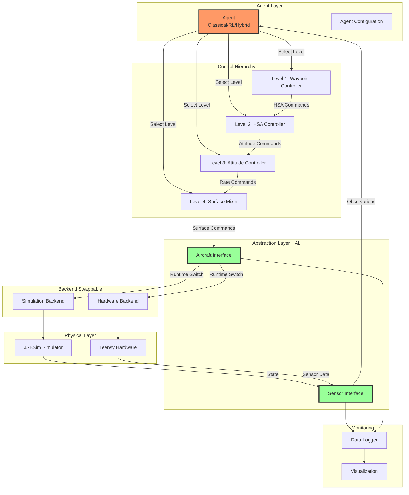
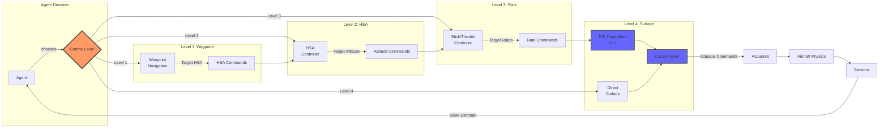
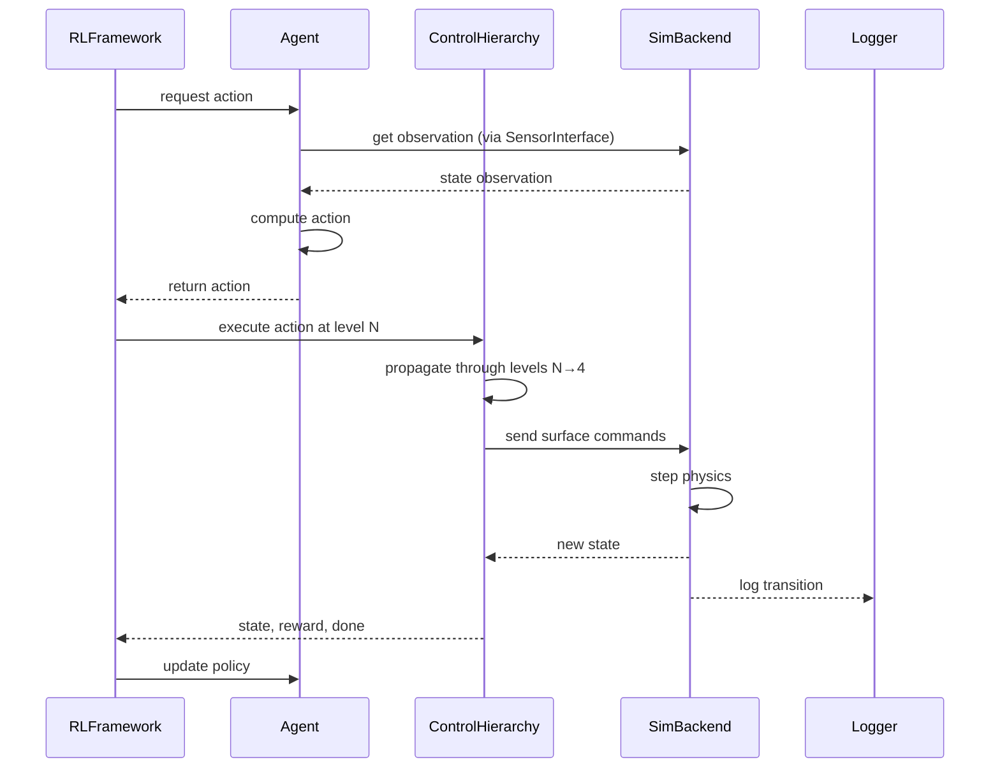
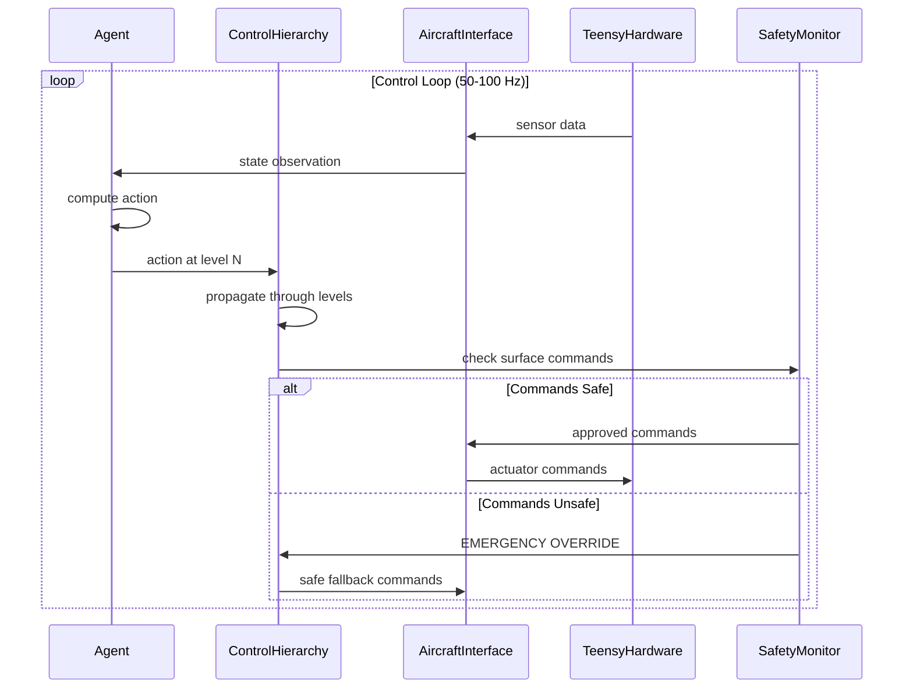

# System Architecture - Multi-Level Aircraft Control Platform

## Overview

This document defines the complete system architecture for the multi-level aircraft control and RL training platform. The architecture is designed around **abstraction layers** and **control level hierarchies** to enable maximum flexibility and swappability.

## High-Level Architecture



## Detailed Multi-Level Control Flow



## Layer Definitions

### 1. Agent Layer

**Responsibility**: High-level decision making

**Components**:
- `BaseAgent`: Abstract base class for all agent types
- `ClassicalAgent`: PID-based controller wrapper
- `RLAgent`: Trained RL policy
- `HybridAgent`: Combination of RL + classical
- `HierarchicalAgent`: Multi-level agent composition

**Interfaces**:
```python
class BaseAgent(ABC):
    def get_control_level(self) -> ControlLevel
    def reset(self, initial_state: AircraftState) -> None
    def get_action(self, observation: np.ndarray) -> Action
    def update(self, transition: Transition) -> None
    def save(self, path: str) -> None
    def load(self, path: str) -> None
```

**Key Properties**:
- Agent is **agnostic** to backend (sim vs real)
- Agent specifies which control level it commands
- Agent receives observations in standardized format
- Agent outputs actions in level-specific format

### 2. Control Hierarchy Layer

**Responsibility**: Convert high-level commands to low-level actuator commands

**Components**:
- **Level 1 Controller**: Waypoint → HSA commands
- **Level 2 Controller**: HSA → Attitude commands
- **Level 3 Controller**: Attitude → Rate commands
- **Level 4 Controller**: Rate → Surface deflections (PID + Mixer)

**Control Flow Rules**:
- Agent at Level N bypasses levels 1 to N-1
- Controllers at Level N+1 onwards still execute
- Emergency override can force direct Level 4 control

**Example Flow**:
```
Agent at Level 2 (HSA):
  ↓
  Skips Level 1 (Waypoint Controller)
  ↓
  HSA Controller converts HSA → Attitude
  ↓
  Level 3 Controller converts Attitude → Rates
  ↓
  Level 4 PID+Mixer converts Rates → Surfaces
```

### 3. Abstraction Layer (HAL)

**Responsibility**: Provide unified interface to backend implementations

**Critical Interfaces**:

#### `AircraftInterface`
```python
class AircraftInterface(ABC):
    def step(self, dt: float) -> AircraftState
    def set_controls(self, surfaces: ControlSurfaces) -> None
    def reset(self, initial_state: Optional[AircraftState]) -> AircraftState
    def get_state(self) -> AircraftState
```

#### `SensorInterface`
```python
class SensorInterface(ABC):
    def get_imu_data(self) -> IMUData
    def get_gps_data(self) -> GPSData
    def get_sensor_state(self) -> SensorReadings
```

**Key Principle**: Same interface, multiple backends
- `SimulationAircraftBackend` implements `AircraftInterface`
- `HardwareAircraftBackend` implements `AircraftInterface`
- Agent code is **identical** for both

### 4. Backend Layer

**Responsibility**: Actual physics simulation or hardware communication

**Implementations**:

#### Simulation Backend
- **JSBSimBackend**: High-fidelity aerodynamics
- **SimplifiedBackend**: Fast 6-DOF for rapid iteration
- Configurable sensor noise
- Configurable actuator dynamics
- Deterministic with seeding

#### Hardware Backend
- **TeensyBackend**: Communication with Teensy/dRehmFlight
- Serial protocol (MAVLink or custom)
- Real sensor data parsing
- Safety interlocks
- Latency compensation

### 5. Monitoring Layer

**Responsibility**: Observation, logging, visualization

**Components**:
- **TelemetryLogger**: Records all state transitions
- **RealtimePlotter**: Live plots of telemetry
- **3DVisualizer**: Aircraft orientation and trajectory
- **Dashboard**: Web-based control and monitoring
- **PerformanceEvaluator**: Metrics computation

## Data Flow Diagrams

### Training Loop Data Flow



### Deployment Data Flow (Real Hardware)



## Component Interaction Patterns

### Pattern 1: Agent-Backend Decoupling

```
Agent Code:
  observation = self.sensor_interface.get_state()
  action = self.policy(observation)
  self.aircraft_interface.set_controls(action)

Configuration Change ONLY to switch backend:
  config.yaml:
    aircraft_backend: "simulation"  # or "hardware"
```

### Pattern 2: Level Bypass

```
If agent operates at Level 2 (HSA):
  1. Agent outputs: [heading_cmd, speed_cmd, alt_cmd]
  2. Level 1 (Waypoint) is SKIPPED
  3. Level 2 HSA controller processes commands
  4. Level 3, 4 execute normally
```

### Pattern 3: Hierarchical Composition

```
High-level Agent (Level 1):
  - Runs at 1 Hz
  - Outputs waypoints

Low-level Agent (Level 3):
  - Runs at 50 Hz
  - Tracks waypoints via stick commands

Composition:
  High-level → Waypoint → Low-level → Stick → Actuators
```

## Technology Stack Architecture

### Python Layer (High-Level)
- **Agent Logic**: `controllers/`, `agents/`
- **Interfaces**: `interfaces/`
- **Visualization**: `visualization/`, `gui/`
- **Training**: RL framework integration
- **Configuration**: YAML/JSON configs

### C++ Layer (Performance-Critical)
- **PID Controllers**: `core/pid_controller.cpp`
- **Control Mixer**: `core/control_mixer.cpp`
- **Attitude Control**: `core/attitude_control.cpp`
- **Target Rate**: 100-500 Hz

### Pybind11 Bridge
- **Bindings**: `core/bindings.cpp`
- Zero-copy data transfer where possible
- Python-callable C++ functions
- C++ classes exposed as Python objects

### Build System
```
CMake (C++ build)
    ↓
Pybind11 (Python bindings)
    ↓
setuptools (Python package)
    ↓
pip install -e .
```

## Deployment Topologies

### Topology 1: Laptop Training
```
[Laptop]
  - Python RL Training Loop
  - Vectorized JSBSim environments (parallel)
  - TensorBoard monitoring
  - Model checkpointing
```

### Topology 2: Cloud Training
```
[Cloud GPU Instance]
  - Distributed RL training (Ray)
  - Hundreds of parallel sims
  - Experiment tracking (WandB)
  - Model registry
```

### Topology 3: Embedded Deployment
```
[Jetson Nano / Raspberry Pi]
  - Exported RL model (ONNX)
  - C++ inference engine
  - Hardware interface to Teensy
  - Minimal Python overhead
```

### Topology 4: Hardware-in-the-Loop
```
[Desktop PC]
  - JSBSim simulation
  - Hardware interface to real Teensy
  - Teensy connected to bench-test actuators
  - Validates hardware integration before flight
```

## Concurrency Model

### Control Loop Thread
- **Rate**: 100-500 Hz (C++ PID controllers)
- **Priority**: Real-time priority on RTOS
- **Tasks**: PID compute, mixer, actuator commands

### Agent Decision Thread
- **Rate**: 1-50 Hz (depends on control level)
- **Priority**: Lower than control loop
- **Tasks**: NN inference, decision making

### Logging Thread
- **Rate**: Async, non-blocking
- **Priority**: Lowest
- **Tasks**: Write telemetry to disk

### Visualization Thread
- **Rate**: 10-30 Hz
- **Priority**: Low
- **Tasks**: Update GUI, plots

## Error Handling & Fault Tolerance

### Error Categories

1. **Transient Errors** (e.g., sensor glitch)
   - Retry with timeout
   - Use last known good state
   - Log warning

2. **Critical Errors** (e.g., actuator failure)
   - Trigger emergency fallback
   - Switch to safe mode (Level 4 override)
   - Alert operator
   - Log critical event

3. **Configuration Errors** (e.g., invalid agent)
   - Fail fast at startup
   - Validate all configs before flight
   - Provide clear error messages

### Safety Fallback Hierarchy
```
Normal Operation
    ↓ (agent failure)
Classical Controller Fallback
    ↓ (controller failure)
Direct Safe Mode (Level 4)
    ↓ (complete failure)
Kill Switch / Parachute
```

## State Management

### State Estimation Pipeline
```
Raw Sensors → Noise Filtering → Sensor Fusion (EKF/UKF) → State Estimate → Agent
```

### State Representation
- **Full State**: Complete 6-DOF state (sim can access this)
- **Observed State**: What sensors actually measure (real hardware limited to this)
- **Estimated State**: Filtered sensor fusion output

### State Synchronization
- All timestamps in monotonic time
- State updates are atomic
- Thread-safe state access

## Configuration Management

### Configuration Hierarchy
```
default_config.yaml        # System defaults
  ↓
aircraft_config.yaml       # Aircraft-specific (mass, inertia, etc.)
  ↓
agent_config.yaml          # Agent hyperparameters
  ↓
experiment_config.yaml     # Experiment-specific overrides
```

### Config Validation
- JSON Schema validation on load
- Type checking (Pydantic models)
- Range checking (e.g., PID gains > 0)
- Compatibility checking (e.g., agent level vs available controllers)

## Security Considerations

### Simulation
- Sandboxed execution
- Resource limits (CPU, memory)
- No network access during training

### Hardware
- Authentication for remote commands
- Encrypted communication (TLS)
- Rate limiting on commands
- Geo-fencing
- Manual kill switch always available

## Performance Requirements

| Component | Target Rate | Latency Budget |
|-----------|-------------|----------------|
| C++ PID Controllers | 100-500 Hz | < 2 ms |
| Python Agent (Level 4) | 50 Hz | < 20 ms |
| Python Agent (Level 3) | 20-50 Hz | < 50 ms |
| Python Agent (Level 2) | 5-20 Hz | < 100 ms |
| Python Agent (Level 1) | 1-10 Hz | < 500 ms |
| Visualization | 10-30 Hz | < 100 ms (non-blocking) |
| Logging | Async | < 10 ms (buffered) |

## Scalability

### Horizontal Scaling (Training)
- Vectorized environments (multiprocessing)
- Distributed training (Ray, MPI)
- Batch simulation on cloud
- Target: 1000+ parallel environments

### Vertical Scaling (Hardware)
- Optimized C++ controllers
- JIT compilation (Numba) for Python hot paths
- GPU acceleration for NN inference
- Efficient data structures (numpy, zero-copy)

---

**Document Status**: ✅ Complete
**Last Updated**: 2025-10-09
**Related Documents**:
- 00_OVERVIEW.md (context)
- 02_ABSTRACTION_LAYERS.md (interface details)
- 03_CONTROL_HIERARCHY.md (control levels)
- 09_DATA_FLOW.md (detailed data flow)
