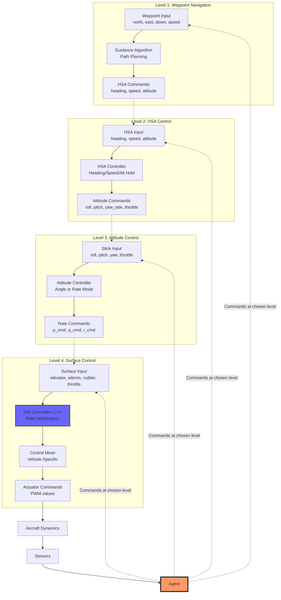

# Control Hierarchy - Multi-Level Control Architecture

## Overview

This document specifies the **4-level control hierarchy** that forms the core of the system. Each level represents a different abstraction of aircraft control, and agents can command at ANY level.

## Control Level Hierarchy



## Level 1: Waypoint Navigation

### Purpose
Highest abstraction level. Agent commands 3D positions for the aircraft to navigate to.

### Agent Action Space
```python
action = {
    "waypoint": {
        "north": float,      # meters
        "east": float,       # meters
        "down": float,       # meters (negative altitude)
        "speed": float       # m/s (optional, None = maintain current)
    }
}
```

### Observation Space (Level 1 Agents)
```python
observation = [
    position_error_north,      # meters to waypoint
    position_error_east,       # meters to waypoint
    position_error_down,       # meters to waypoint
    distance_to_waypoint,      # Euclidean distance
    heading_to_waypoint,       # radians
    current_heading,           # radians
    current_airspeed,          # m/s
    current_altitude,          # m
    current_velocity_ned[3],   # m/s
]
# Shape: (12,)
```

### Controller Output
HSA commands (fed to Level 2):
```python
{
    "heading": float,      # radians, 0=North, clockwise
    "speed": float,        # m/s
    "altitude": float      # meters
}
```

### Guidance Algorithms

#### Line-of-Sight (LOS) Guidance
```python
def compute_los_guidance(current_pos, waypoint, current_speed):
    # Vector from current position to waypoint
    error = waypoint - current_pos
    distance = np.linalg.norm(error[:2])  # Horizontal distance

    # Desired heading
    heading_cmd = np.arctan2(error[1], error[0])  # East, North

    # Desired altitude
    altitude_cmd = -waypoint[2]  # Convert NED down to altitude

    # Speed command (could be waypoint-specified or constant)
    speed_cmd = waypoint.speed if waypoint.speed else current_speed

    return heading_cmd, speed_cmd, altitude_cmd
```

#### Proportional Navigation
```python
def compute_proportional_navigation(current_pos, current_vel, waypoint, N=3):
    # Proportional navigation constant N (typically 3-5)
    # More aggressive pursuit than LOS

    # Relative position
    r = waypoint - current_pos
    r_mag = np.linalg.norm(r)

    # Line-of-sight rate
    los = r / r_mag
    los_rate = np.cross(r, current_vel) / (r_mag**2)

    # Commanded acceleration perpendicular to LOS
    accel_cmd = N * np.linalg.norm(current_vel) * los_rate

    # Convert to heading, speed, altitude commands
    # ... (implementation details)

    return heading_cmd, speed_cmd, altitude_cmd
```

### Use Cases
- Autonomous navigation
- Mission planning (survey, patrol)
- Multi-waypoint routes
- Return-to-home
- Obstacle avoidance (high-level)

### RL Training Considerations

**Challenges:**
- Very sparse rewards (only at waypoint arrival)
- Long horizon (many steps to reach waypoint)
- Sample inefficient

**Reward Function Example:**
```python
def compute_reward_level1(state, waypoint, action):
    # Distance to waypoint (negative reward)
    distance = np.linalg.norm(state.position - waypoint.position)
    reward_distance = -distance / 100.0  # Normalized

    # Progress toward waypoint (positive reward)
    prev_distance = ...  # from previous step
    progress = prev_distance - distance
    reward_progress = progress * 10.0

    # Goal bonus
    reward_goal = 1000.0 if distance < 5.0 else 0.0

    # Energy penalty
    reward_energy = -0.01 * action.speed

    return reward_distance + reward_progress + reward_goal + reward_energy
```

**Training Tips:**
- Use curriculum learning: start with close waypoints, increase distance
- Use Hindsight Experience Replay (HER) for sparse rewards
- Consider hierarchical RL (Level 1 sets waypoints, Level 3 tracks)

### Performance Metrics
- Waypoint reach accuracy (meters)
- Time to reach waypoint
- Energy consumption
- Path smoothness

---

## Level 2: HSA (Heading, Speed, Altitude) Control

### Purpose
Mid-high abstraction. Agent commands flight state variables directly.

### Agent Action Space
```python
action = {
    "heading": float,      # radians, [-π, π]
    "speed": float,        # m/s, [10, 40] typical
    "altitude": float      # meters, [0, 500] typical
}
```

### Observation Space (Level 2 Agents)
```python
observation = [
    # Current state
    current_heading,           # radians
    current_airspeed,          # m/s
    current_altitude,          # m

    # Tracking errors
    heading_error,             # radians
    speed_error,               # m/s
    altitude_error,            # m

    # Attitude (for awareness)
    roll,                      # radians
    pitch,                     # radians

    # Rates
    roll_rate,                 # rad/s
    pitch_rate,                # rad/s
    yaw_rate,                  # rad/s
]
# Shape: (12,)
```

### Controller Output
Attitude commands (fed to Level 3):
```python
{
    "roll": float,         # radians or normalized [-1, 1]
    "pitch": float,        # radians or normalized [-1, 1]
    "yaw_rate": float,     # rad/s or normalized [-1, 1]
    "throttle": float      # [0, 1]
}
```

### HSA Controller Algorithms

#### Heading Hold
```python
def heading_controller(heading_cmd, current_heading, yaw_rate, Kp=2.0, Kd=0.5):
    # Heading error (wrap to [-π, π])
    error = wrap_angle(heading_cmd - current_heading)

    # Desired yaw rate
    yaw_rate_cmd = Kp * error - Kd * yaw_rate

    # Convert to roll command (coordinated turn)
    roll_cmd = np.clip(yaw_rate_cmd * 0.5, -np.radians(30), np.radians(30))

    return roll_cmd, yaw_rate_cmd
```

#### Speed Hold
```python
def speed_controller(speed_cmd, current_speed, Kp=0.1, Ki=0.01):
    # Speed error
    error = speed_cmd - current_speed

    # Integral term (with anti-windup)
    integral += error * dt
    integral = np.clip(integral, -10, 10)

    # Throttle command
    throttle_cmd = 0.5 + Kp * error + Ki * integral
    throttle_cmd = np.clip(throttle_cmd, 0, 1)

    return throttle_cmd
```

#### Altitude Hold
```python
def altitude_controller(alt_cmd, current_alt, climb_rate, Kp=0.05, Kd=0.2):
    # Altitude error
    error = alt_cmd - current_alt

    # Desired climb rate
    climb_rate_cmd = Kp * error
    climb_rate_cmd = np.clip(climb_rate_cmd, -5, 5)  # m/s

    # Pitch command
    pitch_cmd = climb_rate_cmd * 0.1 - Kd * climb_rate
    pitch_cmd = np.clip(pitch_cmd, -np.radians(15), np.radians(15))

    return pitch_cmd
```

### Use Cases
- Formation flight (maintain relative HSA)
- Loitering (circle at constant altitude)
- Area coverage patterns
- Terrain following
- Traffic avoidance (altitude separation)

### RL Training Considerations

**Challenges:**
- Medium-term planning
- Multiple simultaneous objectives (track all 3 states)

**Reward Function Example:**
```python
def compute_reward_level2(state, hsa_cmd):
    # Tracking errors
    heading_error = wrap_angle(hsa_cmd.heading - state.heading)
    speed_error = hsa_cmd.speed - state.airspeed
    altitude_error = hsa_cmd.altitude - state.altitude

    # Weighted tracking reward
    reward_tracking = -(
        abs(heading_error) * 10.0 +
        abs(speed_error) * 5.0 +
        abs(altitude_error) * 2.0
    )

    # Smoothness penalty (discourage aggressive maneuvers)
    reward_smoothness = -0.1 * (abs(state.roll_rate) + abs(state.pitch_rate))

    # Fuel efficiency
    reward_fuel = -0.01 * state.throttle

    return reward_tracking + reward_smoothness + reward_fuel
```

**Training Tips:**
- Shaped rewards for each HSA component
- Curriculum: start with one variable (altitude only), add others
- Domain randomization: vary wind, aircraft mass

### Performance Metrics
- Heading tracking error (degrees RMS)
- Speed tracking error (m/s RMS)
- Altitude tracking error (m RMS)
- Settling time for each variable

---

## Level 3: Stick & Throttle (Attitude Control)

### Purpose
Mid-low abstraction. RC-style piloting with attitude stabilization.

### Agent Action Space
```python
action = {
    "roll_stick": float,      # [-1, 1] normalized
    "pitch_stick": float,     # [-1, 1] normalized
    "yaw_stick": float,       # [-1, 1] normalized
    "throttle": float         # [0, 1]
}
```

### Observation Space (Level 3 Agents)
```python
observation = [
    # Attitude
    roll,                      # radians
    pitch,                     # radians
    yaw,                       # radians (or heading)

    # Angular rates
    roll_rate,                 # rad/s
    pitch_rate,                # rad/s
    yaw_rate,                  # rad/s

    # Velocity
    airspeed,                  # m/s
    vertical_speed,            # m/s

    # Commanded vs actual (for tracking)
    roll_error,                # radians
    pitch_error,               # radians
]
# Shape: (10,)
```

### Controller Output
Rate commands (fed to Level 4 PID):
```python
{
    "p_cmd": float,        # rad/s, roll rate command
    "q_cmd": float,        # rad/s, pitch rate command
    "r_cmd": float,        # rad/s, yaw rate command
    "throttle": float      # [0, 1], pass-through
}
```

### Attitude Controller Modes

#### Angle Mode (Stabilized)
```python
def attitude_controller_angle_mode(stick_input, current_attitude, current_rates):
    # Map stick to desired angles
    roll_des = stick_input.roll * np.radians(45)   # ±45° max
    pitch_des = stick_input.pitch * np.radians(30) # ±30° max
    yaw_rate_des = stick_input.yaw * np.radians(90) # ±90°/s max

    # Angle errors
    roll_error = roll_des - current_attitude.roll
    pitch_error = pitch_des - current_attitude.pitch

    # PID on angles → rate commands
    p_cmd = Kp_roll * roll_error - Kd_roll * current_rates.p
    q_cmd = Kp_pitch * pitch_error - Kd_pitch * current_rates.q
    r_cmd = yaw_rate_des  # Direct rate command for yaw

    return p_cmd, q_cmd, r_cmd
```

#### Rate Mode (Acro)
```python
def attitude_controller_rate_mode(stick_input, max_rates):
    # Direct mapping to rate commands
    p_cmd = stick_input.roll * max_rates.roll    # e.g., ±180°/s
    q_cmd = stick_input.pitch * max_rates.pitch  # e.g., ±180°/s
    r_cmd = stick_input.yaw * max_rates.yaw      # e.g., ±90°/s

    return p_cmd, q_cmd, r_cmd
```

### Use Cases
- Manual flight (teleoperation)
- Acrobatic maneuvers
- Aggressive flight in cluttered environments
- Human demonstration collection
- Fine-grained control

### RL Training Considerations

**Challenges:**
- Requires understanding of aircraft dynamics
- Must learn coordinated maneuvers (e.g., coordinated turns)

**Reward Function Example:**
```python
def compute_reward_level3(state, action, target_attitude):
    # Attitude tracking
    roll_error = target_attitude.roll - state.roll
    pitch_error = target_attitude.pitch - state.pitch
    reward_attitude = -(roll_error**2 + pitch_error**2) * 10.0

    # Rate penalty (smoothness)
    reward_rates = -(state.p**2 + state.q**2 + state.r**2) * 0.1

    # Action smoothness (discourage jerky inputs)
    reward_action_smooth = -np.sum(np.abs(np.diff(action_history, axis=0)))

    # Altitude maintenance bonus
    reward_altitude = -abs(state.altitude - target_altitude) * 0.5

    return reward_attitude + reward_rates + reward_action_smooth + reward_altitude
```

**Training Tips:**
- Start in rate mode (easier), progress to angle mode
- Use teacher forcing (classical controller demonstrations)
- Reward smooth actions heavily

### Performance Metrics
- Attitude tracking error (degrees RMS)
- Control smoothness (action variance)
- Task completion (e.g., fly through gates)

---

## Level 4: Direct Surface Control

### Purpose
Lowest abstraction. Direct command of control surfaces.

### Agent Action Space
```python
action = {
    "elevator": float,     # [-1, 1] normalized deflection
    "aileron": float,      # [-1, 1] normalized deflection
    "rudder": float,       # [-1, 1] normalized deflection
    "throttle": float      # [0, 1]
}
```

### Observation Space (Level 4 Agents)
```python
observation = [
    # Full state
    roll, pitch, yaw,              # radians (3)
    p, q, r,                       # rad/s (3)
    u, v, w,                       # m/s body velocity (3)
    airspeed,                      # m/s (1)
    altitude,                      # m (1)

    # Actuator feedback
    elevator_position,             # [-1, 1] (1)
    aileron_position,              # [-1, 1] (1)
    rudder_position,               # [-1, 1] (1)
    throttle_position,             # [0, 1] (1)

    # Optional: aerodynamic coefficients (if available)
    # alpha, beta, CL, CD, ...
]
# Shape: (14+)
```

### Controller Output
Direct actuator commands (to mixer):
```python
{
    "elevator": float,     # [-1, 1]
    "aileron": float,      # [-1, 1]
    "rudder": float,       # [-1, 1]
    "throttle": float      # [0, 1]
}
```

### Control Mixer

The mixer converts abstract control surfaces to vehicle-specific actuator commands.

#### Fixed-Wing Mixer
```python
def fixed_wing_mixer(elevator, aileron, rudder, throttle):
    # Simple mapping for conventional aircraft
    servo_commands = {
        "servo_elevator": elevator,
        "servo_aileron_left": aileron,
        "servo_aileron_right": -aileron,  # Opposite
        "servo_rudder": rudder,
        "motor_throttle": throttle
    }
    return servo_commands
```

#### Quadrotor Mixer
```python
def quadrotor_mixer(roll, pitch, yaw, throttle):
    # + configuration
    m1 = throttle - roll - pitch - yaw  # Front-right
    m2 = throttle - roll + pitch + yaw  # Rear-right
    m3 = throttle + roll + pitch - yaw  # Rear-left
    m4 = throttle + roll - pitch + yaw  # Front-left

    # Saturate
    motors = np.clip([m1, m2, m3, m4], 0, 1)

    return {"m1": motors[0], "m2": motors[1], "m3": motors[2], "m4": motors[3]}
```

### Use Cases
- Novel aircraft configurations (no established control)
- Optimal control (minimize drag, maximize efficiency)
- Damage scenarios (adapt to actuator failures)
- Research on control allocation

### RL Training Considerations

**Challenges:**
- No safety layer (can command dangerous deflections)
- Must learn aircraft dynamics from scratch

**Advantages:**
- Densest rewards (immediate feedback)
- Shortest horizon
- Most sample efficient
- Can discover non-intuitive strategies

**Reward Function Example:**
```python
def compute_reward_level4(state, action, task):
    # Task-specific (e.g., maintain level flight)
    if task == "level_flight":
        reward_task = -(abs(state.roll) + abs(state.pitch)) * 10.0
        reward_task += -(abs(state.altitude - target_altitude)) * 5.0

    # Control effort penalty
    reward_effort = -np.sum(np.abs(action)) * 0.1

    # Crash penalty
    reward_crash = -1000.0 if state.altitude < 0 else 0.0

    # Efficiency bonus (minimize drag)
    reward_efficiency = -state.drag_coefficient * 10.0

    return reward_task + reward_effort + reward_crash + reward_efficiency
```

**Training Tips:**
- Start with very simple task (maintain altitude only)
- Use model-based RL (learn dynamics model first)
- Aggressive domain randomization
- Safety constraints (e.g., altitude floor, angle limits)

### Performance Metrics
- Task success rate
- Control effort (sum of absolute deflections)
- Aerodynamic efficiency (L/D ratio)
- Robustness to disturbances

---

## Multi-Level Agent Architectures

### Architecture 1: Single-Level Agent

Agent operates at ONE fixed level.

```python
class SingleLevelAgent(BaseAgent):
    def __init__(self, level: ControlLevel):
        self.level = level
        self.policy = load_policy_for_level(level)

    def get_control_level(self):
        return self.level

    def get_action(self, observation):
        return self.policy(observation)
```

**Use Case**: Benchmark each level independently.

### Architecture 2: Hierarchical Agent

High-level agent commands low-level agent.

```python
class HierarchicalAgent(BaseAgent):
    def __init__(self):
        self.high_level_agent = SingleLevelAgent(ControlLevel.WAYPOINT)  # Level 1
        self.low_level_agent = SingleLevelAgent(ControlLevel.STICK)      # Level 3

    def get_action(self, observation):
        # High-level runs at 1 Hz
        if self.time % 1.0 < self.dt:
            waypoint = self.high_level_agent.get_action(observation_level1)
            self.current_waypoint = waypoint

        # Low-level runs at 50 Hz
        stick_command = self.low_level_agent.get_action(observation_level3)

        return stick_command  # Low-level commands are what actually execute
```

**Use Case**: Decompose long-horizon tasks.

### Architecture 3: Adaptive Level-Switching Agent

Dynamically chooses which level to operate at.

```python
class AdaptiveAgent(BaseAgent):
    def __init__(self):
        self.meta_policy = MetaPolicy()  # Learns to select level
        self.level_policies = {
            ControlLevel.WAYPOINT: WaypointPolicy(),
            ControlLevel.HSA: HSAPolicy(),
            ControlLevel.STICK: StickPolicy(),
            ControlLevel.SURFACE: SurfacePolicy()
        }

    def get_action(self, observation):
        # Meta-policy selects level based on context
        selected_level = self.meta_policy.select_level(observation)

        # Execute policy for that level
        action = self.level_policies[selected_level].get_action(observation)

        return action, selected_level
```

**Use Case**: Adapt to different phases of flight (takeoff → cruise → landing).

### Architecture 4: Hybrid Classical + RL

RL policy with classical safety fallback.

```python
class HybridAgent(BaseAgent):
    def __init__(self):
        self.rl_policy = RLPolicy(ControlLevel.SURFACE)  # Level 4
        self.safety_controller = ClassicalController(ControlLevel.STICK)  # Level 3
        self.safety_monitor = SafetyMonitor()

    def get_action(self, observation):
        # RL proposes action
        rl_action = self.rl_policy.get_action(observation)

        # Safety monitor checks if safe
        if self.safety_monitor.is_safe(rl_action, observation):
            return rl_action
        else:
            # Fallback to safe classical controller
            safe_action = self.safety_controller.get_action(observation)
            return safe_action
```

**Use Case**: Safe real-world deployment of RL.

---

## Control Level Selection Guide

| Level | Abstraction | Sample Efficiency | Safety | Use Case |
|-------|-------------|-------------------|--------|----------|
| 1: Waypoint | Highest | Lowest | Safest | Navigation, missions |
| 2: HSA | High | Medium-Low | Safe | Formation, coverage |
| 3: Stick | Medium | Medium-High | Moderate | Acrobatics, manual |
| 4: Surface | Lowest | Highest | Risky | Novel aircraft, research |

**Decision Tree:**
- **Need navigation?** → Start at Level 1
- **Need state tracking?** → Level 2
- **Need agile maneuvers?** → Level 3
- **Novel aircraft or optimal control?** → Level 4

---

**Document Status**: ✅ Complete
**Last Updated**: 2025-10-09
**Related Documents**:
- 05_AGENT_INTERFACE_CONTROL.md (agent integration)
- 04_FLIGHT_CONTROLLER.md (controller implementations)
- 06_RL_AGENT_TRAINING.md (training strategies per level)
