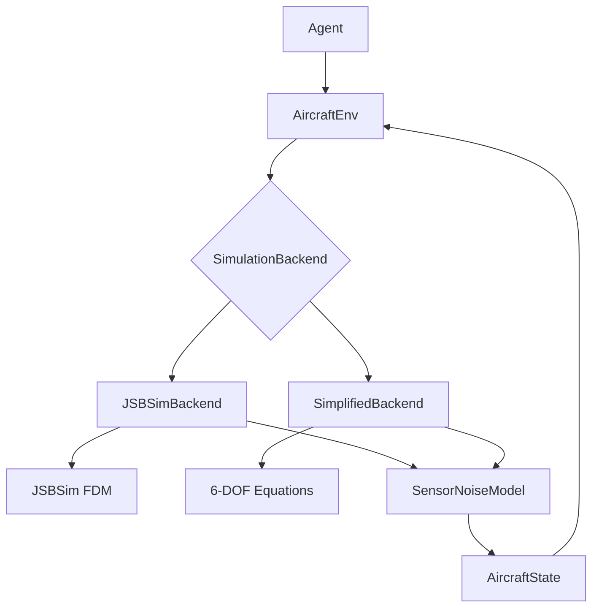

# Simulation Interface

## Overview

This document specifies the simulation backend integration for training and testing aircraft control agents. The simulation interface provides high-fidelity aerodynamic modeling through JSBSim while maintaining the flexibility to use simplified 6-DOF models for rapid prototyping.

## Architecture



## Backend Implementations

### 1. JSBSimBackend

**Purpose**: High-fidelity aerodynamic simulation using JSBSim Flight Dynamics Model.

**File**: `simulation/jsbsim_backend.py`

```python
import jsbsim
import numpy as np
from typing import Optional, Dict
from controllers.types import AircraftState, ControlSurfaces
from interfaces.aircraft import AircraftInterface

class JSBSimBackend(AircraftInterface):
    """JSBSim-based aircraft simulation backend."""

    def __init__(self, config: dict):
        """
        Initialize JSBSim backend.

        Args:
            config: Configuration dict with:
                - aircraft_model: str (e.g., "f16", "c172")
                - initial_conditions: dict
                - dt_sim: float (simulation timestep, default 0.01)
                - sensor_noise: dict (noise parameters)
                - environment: dict (wind, turbulence)
                - realtime: bool (run at realtime speed, default False)
                - time_scale: float (simulation speed multiplier, default 1.0)
        """
        self.config = config
        self.dt_sim = config.get("dt_sim", 0.01)
        self.realtime = config.get("realtime", False)
        self.time_scale = config.get("time_scale", 1.0)

        # Initialize JSBSim FDM
        self.fdm = jsbsim.FGFDMExec()
        self.fdm.set_debug_level(0)

        # Load aircraft model
        model_name = config["aircraft_model"]
        model_path = self._get_model_path(model_name)
        self.fdm.load_model(model_path)

        # Set initial conditions
        self._set_initial_conditions(config["initial_conditions"])

        # Initialize environment
        self._setup_environment(config.get("environment", {}))

        # Sensor noise model
        self.sensor_noise = SensorNoiseModel(config.get("sensor_noise", {}))

        # Geodetic conversion (for accurate NED coordinates)
        try:
            from pyproj import Transformer
            # WGS84 (lat/lon) to local tangent plane (NED)
            self.transformer = Transformer.from_crs(
                "EPSG:4326",  # WGS84
                "+proj=tmerc +lat_0={} +lon_0={} +k=1 +x_0=0 +y_0=0 +ellps=WGS84 +units=m +no_defs".format(
                    config["initial_conditions"].get("lat", 37.4099),
                    config["initial_conditions"].get("lon", -121.995)
                ),
                always_xy=True
            )
            self.use_pyproj = True
            self.origin_lat = config["initial_conditions"].get("lat", 37.4099)
            self.origin_lon = config["initial_conditions"].get("lon", -121.995)
        except ImportError:
            print("Warning: pyproj not available, using simplified geodetic conversion")
            self.use_pyproj = False
            self.origin_lat = config["initial_conditions"].get("lat", 37.4099)
            self.origin_lon = config["initial_conditions"].get("lon", -121.995)

        # Initialize simulation
        self.fdm.run_ic()

        # Current state cache
        self._current_state = self._extract_state()

        # Realtime tracking
        if self.realtime:
            import time
            self.real_time_start = time.time()
            self.sim_time_start = 0.0

    def _get_model_path(self, model_name: str) -> str:
        """Get JSBSim model path from model name."""
        model_map = {
            "f16": "f16",
            "c172": "c172p",
            "x8": "x8",  # Custom models
        }
        return model_map.get(model_name, model_name)

    def _set_initial_conditions(self, ic: dict):
        """Set initial conditions in JSBSim."""
        # Position
        self.fdm.set_property_value("ic/lat-gc-deg", ic.get("lat", 37.4099))
        self.fdm.set_property_value("ic/long-gc-deg", ic.get("lon", -121.995))
        self.fdm.set_property_value("ic/h-sl-ft", ic.get("altitude_ft", 5000.0))

        # Velocity
        self.fdm.set_property_value("ic/vc-kts", ic.get("airspeed_kt", 120.0))

        # Attitude
        self.fdm.set_property_value("ic/phi-deg", ic.get("roll_deg", 0.0))
        self.fdm.set_property_value("ic/theta-deg", ic.get("pitch_deg", 0.0))
        self.fdm.set_property_value("ic/psi-true-deg", ic.get("yaw_deg", 0.0))

        # Engine
        self.fdm.set_property_value("propulsion/engine/set-running", 1)

    def _setup_environment(self, env_config: dict):
        """Configure wind, turbulence, atmosphere."""
        # Wind
        wind_speed_kt = env_config.get("wind_speed_kt", 0.0)
        wind_dir_deg = env_config.get("wind_direction_deg", 0.0)

        wind_north = wind_speed_kt * np.cos(np.radians(wind_dir_deg))
        wind_east = wind_speed_kt * np.sin(np.radians(wind_dir_deg))

        self.fdm.set_property_value("atmosphere/wind-north-fps", wind_north * 1.68781)
        self.fdm.set_property_value("atmosphere/wind-east-fps", wind_east * 1.68781)
        self.fdm.set_property_value("atmosphere/wind-down-fps", 0.0)

        # Turbulence
        if env_config.get("turbulence_enabled", False):
            turb_severity = env_config.get("turbulence_severity", 0.1)
            self.fdm.set_property_value("atmosphere/turb-type", 4)  # Milspec
            self.fdm.set_property_value("atmosphere/turbulence/milspec/severity", turb_severity)

    def step(self, dt: float) -> AircraftState:
        """
        Step simulation forward in time.

        Args:
            dt: Time step (seconds)

        Returns:
            Updated AircraftState
        """
        # Apply time scaling
        scaled_dt = dt * self.time_scale

        # Run JSBSim for dt duration
        num_steps = int(scaled_dt / self.dt_sim)
        for _ in range(num_steps):
            self.fdm.run()

        # Extract state
        self._current_state = self._extract_state()

        # Realtime throttling (if enabled)
        if self.realtime:
            self._throttle_realtime()

        # Apply sensor noise
        return self.sensor_noise.apply(self._current_state)

    def _throttle_realtime(self):
        """Throttle simulation to run at realtime speed."""
        import time

        # Calculate how much real time should have passed
        sim_time_elapsed = self._current_state.time - self.sim_time_start
        real_time_elapsed = time.time() - self.real_time_start

        # Sleep if sim is running faster than realtime
        time_ahead = sim_time_elapsed / self.time_scale - real_time_elapsed

        if time_ahead > 0:
            time.sleep(time_ahead)

    def set_controls(self, surfaces: ControlSurfaces) -> None:
        """
        Set control surface deflections.

        Args:
            surfaces: Control surface commands
        """
        # Normalize to [-1, 1] if needed
        aileron = np.clip(surfaces.aileron, -1, 1)
        elevator = np.clip(surfaces.elevator, -1, 1)
        rudder = np.clip(surfaces.rudder, -1, 1)
        throttle = np.clip(surfaces.throttle, 0, 1)

        # Map to JSBSim properties
        self.fdm.set_property_value("fcs/aileron-cmd-norm", aileron)
        self.fdm.set_property_value("fcs/elevator-cmd-norm", elevator)
        self.fdm.set_property_value("fcs/rudder-cmd-norm", rudder)
        self.fdm.set_property_value("fcs/throttle-cmd-norm", throttle)

    def reset(self, initial_state: Optional[AircraftState] = None) -> AircraftState:
        """
        Reset simulation.

        Args:
            initial_state: Optional custom initial state

        Returns:
            Initial AircraftState
        """
        if initial_state is None:
            # Use config initial conditions
            self._set_initial_conditions(self.config["initial_conditions"])
        else:
            # Use provided state
            self._set_state_from_aircraft_state(initial_state)

        self.fdm.run_ic()
        self.sensor_noise.reset()

        self._current_state = self._extract_state()
        return self.sensor_noise.apply(self._current_state)

    def get_state(self) -> AircraftState:
        """Get current aircraft state."""
        return self._current_state

    def _extract_state(self) -> AircraftState:
        """Extract AircraftState from JSBSim properties."""
        # Time
        time = self.fdm.get_property_value("simulation/sim-time-sec")

        # Position (NED frame, meters)
        lat = self.fdm.get_property_value("position/lat-gc-deg")
        lon = self.fdm.get_property_value("position/long-gc-deg")
        alt = self.fdm.get_property_value("position/h-sl-ft") * 0.3048  # ft to m

        # Convert geodetic to NED
        if self.use_pyproj:
            # Accurate conversion using pyproj
            east, north = self.transformer.transform(lon, lat)
            down = -alt
        else:
            # Simplified conversion (accurate for local flights < 10km)
            lat_rad = np.radians(lat)
            lon_rad = np.radians(lon)
            origin_lat_rad = np.radians(self.origin_lat)
            origin_lon_rad = np.radians(self.origin_lon)

            R = 6371000  # Earth radius (m)
            north = R * (lat_rad - origin_lat_rad)
            east = R * np.cos(origin_lat_rad) * (lon_rad - origin_lon_rad)
            down = -alt

        position = np.array([north, east, down])

        # Velocity (body frame, m/s)
        u = self.fdm.get_property_value("velocities/u-fps") * 0.3048
        v = self.fdm.get_property_value("velocities/v-fps") * 0.3048
        w = self.fdm.get_property_value("velocities/w-fps") * 0.3048
        velocity = np.array([u, v, w])

        # Attitude (rad)
        roll = self.fdm.get_property_value("attitude/phi-rad")
        pitch = self.fdm.get_property_value("attitude/theta-rad")
        yaw = self.fdm.get_property_value("attitude/psi-rad")
        attitude = np.array([roll, pitch, yaw])

        # Angular rates (rad/s)
        p = self.fdm.get_property_value("velocities/p-rad_sec")
        q = self.fdm.get_property_value("velocities/q-rad_sec")
        r = self.fdm.get_property_value("velocities/r-rad_sec")
        angular_rate = np.array([p, q, r])

        # Airspeed (m/s)
        airspeed = self.fdm.get_property_value("velocities/vc-fps") * 0.3048

        return AircraftState(
            time=time,
            position=position,
            velocity=velocity,
            attitude=attitude,
            angular_rate=angular_rate,
            airspeed=airspeed,
            altitude=alt
        )

    def _set_state_from_aircraft_state(self, state: AircraftState):
        """Set JSBSim state from AircraftState."""
        # Position
        self.fdm.set_property_value("ic/h-sl-ft", -state.position[2] / 0.3048)

        # Velocity
        self.fdm.set_property_value("ic/u-fps", state.velocity[0] / 0.3048)
        self.fdm.set_property_value("ic/v-fps", state.velocity[1] / 0.3048)
        self.fdm.set_property_value("ic/w-fps", state.velocity[2] / 0.3048)

        # Attitude
        self.fdm.set_property_value("ic/phi-deg", np.degrees(state.attitude[0]))
        self.fdm.set_property_value("ic/theta-deg", np.degrees(state.attitude[1]))
        self.fdm.set_property_value("ic/psi-true-deg", np.degrees(state.attitude[2]))
```

### 2. SimplifiedBackend

**Purpose**: Fast 6-DOF simulation for rapid prototyping and debugging.

**File**: `simulation/simplified_backend.py`

```python
import numpy as np
from typing import Optional
from scipy.spatial.transform import Rotation
from controllers.types import AircraftState, ControlSurfaces
from interfaces.aircraft import AircraftInterface

class SimplifiedBackend(AircraftInterface):
    """Simplified 6-DOF aircraft dynamics."""

    def __init__(self, config: dict):
        """
        Initialize simplified backend.

        Args:
            config: Configuration with:
                - mass: float (kg)
                - inertia: [Ixx, Iyy, Izz] (kg*m^2)
                - initial_conditions: dict
                - aerodynamics: dict (simplified coefficients)
        """
        self.config = config
        self.dt = config.get("dt", 0.01)

        # Aircraft parameters
        self.mass = config.get("mass", 1.0)
        self.inertia = np.array(config.get("inertia", [0.1, 0.1, 0.1]))

        # Aerodynamic parameters (simplified)
        aero = config.get("aerodynamics", {})
        self.CL_alpha = aero.get("CL_alpha", 5.0)  # Lift curve slope
        self.CD_0 = aero.get("CD_0", 0.03)  # Parasitic drag
        self.S_wing = aero.get("S_wing", 0.5)  # Wing area (m^2)

        # Control derivatives
        self.CL_elevator = aero.get("CL_elevator", 0.5)
        self.Cl_aileron = aero.get("Cl_aileron", 0.2)
        self.Cn_rudder = aero.get("Cn_rudder", 0.1)

        # State
        self.state = self._initialize_state(config["initial_conditions"])

        # Sensor noise
        self.sensor_noise = SensorNoiseModel(config.get("sensor_noise", {}))

    def _initialize_state(self, ic: dict) -> AircraftState:
        """Initialize state from initial conditions."""
        position = np.array([0.0, 0.0, -ic.get("altitude", 100.0)])

        # Initial velocity (assume aligned with body x-axis)
        airspeed = ic.get("airspeed", 20.0)
        velocity = np.array([airspeed, 0.0, 0.0])

        attitude = np.array([
            np.radians(ic.get("roll_deg", 0.0)),
            np.radians(ic.get("pitch_deg", 0.0)),
            np.radians(ic.get("yaw_deg", 0.0))
        ])

        angular_rate = np.array([0.0, 0.0, 0.0])

        return AircraftState(
            time=0.0,
            position=position,
            velocity=velocity,
            attitude=attitude,
            angular_rate=angular_rate,
            airspeed=airspeed,
            altitude=-position[2]
        )

    def step(self, dt: float) -> AircraftState:
        """Step dynamics forward."""
        # Use RK4 integration
        k1 = self._derivatives(self.state, self.current_controls)

        state2 = self._add_derivatives(self.state, k1, dt/2)
        k2 = self._derivatives(state2, self.current_controls)

        state3 = self._add_derivatives(self.state, k2, dt/2)
        k3 = self._derivatives(state3, self.current_controls)

        state4 = self._add_derivatives(self.state, k3, dt)
        k4 = self._derivatives(state4, self.current_controls)

        # Combine
        self.state = self._add_derivatives(
            self.state,
            [(k1[i] + 2*k2[i] + 2*k3[i] + k4[i]) / 6 for i in range(len(k1))],
            dt
        )

        self.state.time += dt

        return self.sensor_noise.apply(self.state)

    def _derivatives(self, state: AircraftState, controls: ControlSurfaces):
        """Compute state derivatives (6-DOF equations of motion)."""
        # Extract state
        u, v, w = state.velocity
        p, q, r = state.angular_rate
        phi, theta, psi = state.attitude

        # Airspeed
        V = np.sqrt(u**2 + v**2 + w**2)
        alpha = np.arctan2(w, u)  # Angle of attack

        # Dynamic pressure
        rho = 1.225  # Air density (kg/m^3)
        q_bar = 0.5 * rho * V**2

        # Aerodynamic forces (body frame)
        CL = self.CL_alpha * alpha + self.CL_elevator * controls.elevator
        CD = self.CD_0 + 0.05 * CL**2  # Induced drag

        L = q_bar * self.S_wing * CL  # Lift
        D = q_bar * self.S_wing * CD  # Drag

        # Rotate to body frame
        F_aero_x = -D * np.cos(alpha) + L * np.sin(alpha)
        F_aero_y = 0.0
        F_aero_z = -D * np.sin(alpha) - L * np.cos(alpha)

        # Thrust (simple model)
        T = controls.throttle * 10.0  # 10N max thrust

        # Total forces
        F_x = F_aero_x + T
        F_y = F_aero_y
        F_z = F_aero_z

        # Gravity (rotate to body frame)
        g = 9.81
        R = Rotation.from_euler('xyz', state.attitude)
        F_grav_body = R.apply(np.array([0, 0, self.mass * g]))

        F_x += F_grav_body[0]
        F_y += F_grav_body[1]
        F_z += F_grav_body[2]

        # Translational accelerations (body frame)
        u_dot = F_x / self.mass - q*w + r*v
        v_dot = F_y / self.mass - r*u + p*w
        w_dot = F_z / self.mass - p*v + q*u

        # Moments (simplified)
        L_moment = q_bar * self.S_wing * 0.5 * self.Cl_aileron * controls.aileron
        M_moment = q_bar * self.S_wing * 0.3 * self.CL_elevator * controls.elevator
        N_moment = q_bar * self.S_wing * 0.5 * self.Cn_rudder * controls.rudder

        # Angular accelerations
        p_dot = L_moment / self.inertia[0]
        q_dot = M_moment / self.inertia[1]
        r_dot = N_moment / self.inertia[2]

        # Attitude rates (Euler angle rates from body rates)
        phi_dot = p + q*np.sin(phi)*np.tan(theta) + r*np.cos(phi)*np.tan(theta)
        theta_dot = q*np.cos(phi) - r*np.sin(phi)
        psi_dot = (q*np.sin(phi) + r*np.cos(phi)) / np.cos(theta)

        # Position rates (NED frame)
        R_ned = Rotation.from_euler('xyz', state.attitude)
        vel_ned = R_ned.apply(state.velocity)

        return [
            vel_ned,  # position_dot
            np.array([u_dot, v_dot, w_dot]),  # velocity_dot
            np.array([phi_dot, theta_dot, psi_dot]),  # attitude_dot
            np.array([p_dot, q_dot, r_dot])  # angular_rate_dot
        ]

    def _add_derivatives(self, state: AircraftState, derivs, dt):
        """Add derivatives * dt to state."""
        new_state = AircraftState(
            time=state.time,
            position=state.position + derivs[0] * dt,
            velocity=state.velocity + derivs[1] * dt,
            attitude=state.attitude + derivs[2] * dt,
            angular_rate=state.angular_rate + derivs[3] * dt,
            airspeed=np.linalg.norm(state.velocity + derivs[1] * dt),
            altitude=-state.position[2] - derivs[0][2] * dt
        )
        return new_state

    def set_controls(self, surfaces: ControlSurfaces) -> None:
        """Set control surfaces."""
        self.current_controls = surfaces

    def reset(self, initial_state: Optional[AircraftState] = None) -> AircraftState:
        """Reset simulation."""
        if initial_state is None:
            self.state = self._initialize_state(self.config["initial_conditions"])
        else:
            self.state = initial_state

        self.current_controls = ControlSurfaces(0, 0, 0, 0)
        self.sensor_noise.reset()

        return self.sensor_noise.apply(self.state)

    def get_state(self) -> AircraftState:
        """Get current state."""
        return self.state
```

## Sensor Noise Model

**File**: `simulation/sensor_noise.py`

```python
import numpy as np
from dataclasses import replace
from controllers.types import AircraftState

class SensorNoiseModel:
    """Add realistic sensor noise to state measurements."""

    def __init__(self, config: dict):
        """
        Initialize sensor noise model.

        Args:
            config: Noise parameters:
                - imu_gyro_stddev: float (rad/s)
                - imu_accel_stddev: float (m/s^2)
                - gps_position_stddev: float (m)
                - gps_velocity_stddev: float (m/s)
                - airspeed_stddev: float (m/s)
                - altitude_stddev: float (m)
                - attitude_stddev: float (rad)
        """
        self.config = config
        self.enabled = config.get("enabled", True)

        # Noise standard deviations
        self.gyro_noise = config.get("imu_gyro_stddev", 0.01)
        self.accel_noise = config.get("imu_accel_stddev", 0.1)
        self.gps_pos_noise = config.get("gps_position_stddev", 1.0)
        self.gps_vel_noise = config.get("gps_velocity_stddev", 0.1)
        self.airspeed_noise = config.get("airspeed_stddev", 0.5)
        self.altitude_noise = config.get("altitude_stddev", 0.5)
        self.attitude_noise = config.get("attitude_stddev", 0.01)

        # Bias (slowly varying)
        self.gyro_bias = np.zeros(3)
        self.accel_bias = np.zeros(3)

        # Random number generator
        self.rng = np.random.default_rng(config.get("seed", None))

    def apply(self, state: AircraftState) -> AircraftState:
        """Apply sensor noise to state."""
        if not self.enabled:
            return state

        # Add noise to each measurement
        noisy_position = state.position + self.rng.normal(0, self.gps_pos_noise, 3)
        noisy_velocity = state.velocity + self.rng.normal(0, self.gps_vel_noise, 3)
        noisy_attitude = state.attitude + self.rng.normal(0, self.attitude_noise, 3)
        noisy_angular_rate = state.angular_rate + self.rng.normal(0, self.gyro_noise, 3) + self.gyro_bias
        noisy_airspeed = state.airspeed + self.rng.normal(0, self.airspeed_noise)
        noisy_altitude = state.altitude + self.rng.normal(0, self.altitude_noise)

        # Update bias (random walk)
        self.gyro_bias += self.rng.normal(0, 0.0001, 3)
        self.accel_bias += self.rng.normal(0, 0.001, 3)

        return replace(
            state,
            position=noisy_position,
            velocity=noisy_velocity,
            attitude=noisy_attitude,
            angular_rate=noisy_angular_rate,
            airspeed=noisy_airspeed,
            altitude=noisy_altitude
        )

    def reset(self):
        """Reset biases."""
        self.gyro_bias = np.zeros(3)
        self.accel_bias = np.zeros(3)
```

## Batch Simulation (Parallel Training)

**File**: `simulation/batch_simulator.py`

```python
from typing import List
import multiprocessing as mp
from stable_baselines3.common.vec_env import SubprocVecEnv
from environments.aircraft_env import AircraftEnv

def make_env(config: dict, rank: int, seed: int = 0):
    """Create a single environment instance."""
    def _init():
        env_config = config.copy()
        env_config["seed"] = seed + rank
        env = AircraftEnv(env_config)
        return env
    return _init

def create_batch_envs(config: dict, num_envs: int = 8) -> SubprocVecEnv:
    """
    Create batch of parallel environments.

    Args:
        config: Base environment configuration
        num_envs: Number of parallel environments

    Returns:
        Vectorized environment
    """
    env_fns = [make_env(config, i) for i in range(num_envs)]
    return SubprocVecEnv(env_fns)
```

## Configuration Examples

### JSBSim F-16 Configuration

**File**: `configs/simulation/jsbsim_f16.yaml`

```yaml
simulation:
  backend: "jsbsim"
  aircraft_model: "f16"
  dt_sim: 0.01

  initial_conditions:
    lat: 37.4099
    lon: -121.995
    altitude_ft: 5000.0
    airspeed_kt: 300.0
    roll_deg: 0.0
    pitch_deg: 5.0
    yaw_deg: 90.0

  sensor_noise:
    enabled: true
    imu_gyro_stddev: 0.01
    imu_accel_stddev: 0.1
    gps_position_stddev: 2.0
    gps_velocity_stddev: 0.2
    airspeed_stddev: 1.0
    altitude_stddev: 1.0
    attitude_stddev: 0.005

  environment:
    wind_speed_kt: 10.0
    wind_direction_deg: 270.0
    turbulence_enabled: true
    turbulence_severity: 0.2
```

### Simplified 6-DOF Configuration

**File**: `configs/simulation/simplified.yaml`

```yaml
simulation:
  backend: "simplified"
  dt: 0.01

  mass: 1.5  # kg
  inertia: [0.08, 0.12, 0.15]  # kg*m^2

  initial_conditions:
    altitude: 100.0  # m
    airspeed: 15.0  # m/s
    roll_deg: 0.0
    pitch_deg: 0.0
    yaw_deg: 0.0

  aerodynamics:
    CL_alpha: 4.5
    CD_0: 0.03
    S_wing: 0.45  # m^2
    CL_elevator: 0.6
    Cl_aileron: 0.25
    Cn_rudder: 0.15

  sensor_noise:
    enabled: true
    imu_gyro_stddev: 0.02
    airspeed_stddev: 0.5
    altitude_stddev: 0.5
```

## Domain Randomization

**File**: `simulation/domain_randomization.py`

```python
import numpy as np
from typing import Dict

class DomainRandomizer:
    """Randomize simulation parameters for robust sim-to-real transfer."""

    def __init__(self, config: dict):
        """
        Initialize domain randomizer.

        Args:
            config: Randomization ranges:
                - mass_range: [min, max] (kg)
                - inertia_range: [min, max] (fraction)
                - wind_speed_range: [min, max] (m/s)
                - sensor_noise_scale_range: [min, max]
        """
        self.config = config
        self.rng = np.random.default_rng(config.get("seed", None))

    def randomize(self, base_config: dict) -> dict:
        """
        Create randomized configuration.

        Args:
            base_config: Base simulation config

        Returns:
            Randomized config
        """
        config = base_config.copy()

        # Randomize mass
        if "mass_range" in self.config:
            mass_min, mass_max = self.config["mass_range"]
            config["mass"] = self.rng.uniform(mass_min, mass_max)

        # Randomize inertia
        if "inertia_range" in self.config:
            scale_min, scale_max = self.config["inertia_range"]
            scale = self.rng.uniform(scale_min, scale_max)
            config["inertia"] = [I * scale for I in config["inertia"]]

        # Randomize wind
        if "wind_speed_range" in self.config:
            wind_min, wind_max = self.config["wind_speed_range"]
            config.setdefault("environment", {})["wind_speed_kt"] = \
                self.rng.uniform(wind_min, wind_max)
            config["environment"]["wind_direction_deg"] = \
                self.rng.uniform(0, 360)

        # Randomize sensor noise
        if "sensor_noise_scale_range" in self.config:
            scale_min, scale_max = self.config["sensor_noise_scale_range"]
            scale = self.rng.uniform(scale_min, scale_max)

            for key in config.get("sensor_noise", {}).keys():
                if key.endswith("_stddev"):
                    config["sensor_noise"][key] *= scale

        return config
```

## Testing

**File**: `tests/test_simulation.py`

```python
import pytest
import numpy as np
from simulation.jsbsim_backend import JSBSimBackend
from simulation.simplified_backend import SimplifiedBackend
from controllers.types import ControlSurfaces

def test_jsbsim_initialization():
    """Test JSBSim backend initializes correctly."""
    config = {
        "aircraft_model": "c172",
        "initial_conditions": {
            "lat": 37.4,
            "lon": -122.0,
            "altitude_ft": 5000,
            "airspeed_kt": 120
        }
    }

    backend = JSBSimBackend(config)
    state = backend.get_state()

    assert state.airspeed > 0
    assert state.altitude > 0

def test_simplified_step():
    """Test simplified backend steps correctly."""
    config = {
        "mass": 1.0,
        "inertia": [0.1, 0.1, 0.1],
        "initial_conditions": {"altitude": 100, "airspeed": 20},
        "aerodynamics": {}
    }

    backend = SimplifiedBackend(config)
    initial_state = backend.get_state()

    # Apply constant elevator
    backend.set_controls(ControlSurfaces(0, 0.1, 0, 0.5))

    # Step forward
    for _ in range(100):
        state = backend.step(0.01)

    # Pitch should change
    assert abs(state.attitude[1] - initial_state.attitude[1]) > 0.01
```

---

**Document Status**: ✅ Complete
**Last Updated**: 2025-10-09
**Related Documents**: 01_ARCHITECTURE.md, 02_ABSTRACTION_LAYERS.md, 06_RL_AGENT_TRAINING.md
