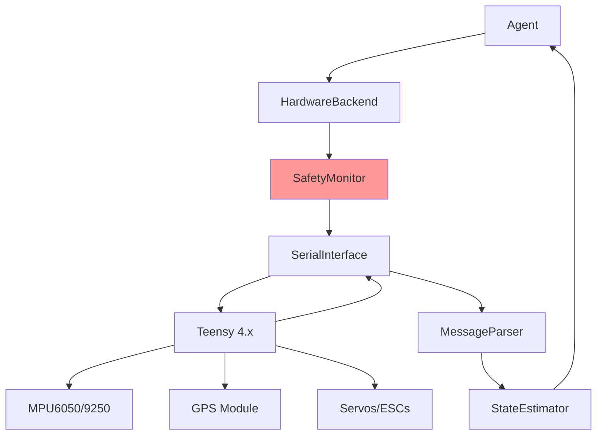

# Hardware Interface

## Overview

This document specifies the real hardware integration for deploying trained control agents to physical aircraft. The hardware interface provides communication with Teensy-based flight controllers (dRehmFlight) and implements critical safety features for real flight operations.

## Architecture



## Hardware Backend

### TeensyBackend

**Purpose**: Interface with Teensy-based dRehmFlight flight controller.

**File**: `hardware/teensy_backend.py`

```python
import serial
import struct
import time
import numpy as np
from typing import Optional, Dict
from threading import Thread, Lock
from controllers.types import AircraftState, ControlSurfaces
from interfaces.aircraft import AircraftInterface

class TeensyBackend(AircraftInterface):
    """Real hardware interface for Teensy/dRehmFlight."""

    def __init__(self, config: dict):
        """
        Initialize Teensy hardware backend.

        Args:
            config: Configuration with:
                - serial_port: str (e.g., "/dev/ttyACM0")
                - baudrate: int (default 115200)
                - protocol: str ("mavlink" or "custom")
                - update_rate_hz: float (default 100)
                - safety: dict (safety parameters)
        """
        self.config = config

        # Serial connection
        self.serial_port = config["serial_port"]
        self.baudrate = config.get("baudrate", 115200)
        self.serial = None

        # Communication protocol
        self.protocol = config.get("protocol", "custom")
        if self.protocol == "mavlink":
            from pymavlink import mavutil
            self.mav = mavutil.mavlink_connection(self.serial_port, baud=self.baudrate)
        else:
            self.serial = serial.Serial(self.serial_port, self.baudrate, timeout=0.1)

        # Safety monitor
        self.safety = SafetyMonitor(config.get("safety", {}))

        # State
        self._current_state = None
        self._state_lock = Lock()

        # Update rate
        self.update_rate_hz = config.get("update_rate_hz", 100)
        self.dt = 1.0 / self.update_rate_hz

        # Background reading thread
        self.running = False
        self.read_thread = None

        # Start communication
        self._start()

    def _start(self):
        """Start serial communication and reading thread."""
        # Wait for connection
        time.sleep(2)

        # Start background reading
        self.running = True
        self.read_thread = Thread(target=self._read_loop, daemon=True)
        self.read_thread.start()

        # Initialize state
        time.sleep(0.5)
        if self._current_state is None:
            # Create default state
            self._current_state = AircraftState(
                time=0.0,
                position=np.zeros(3),
                velocity=np.zeros(3),
                attitude=np.zeros(3),
                angular_rate=np.zeros(3),
                airspeed=0.0,
                altitude=0.0
            )

    def _read_loop(self):
        """Background thread for reading sensor data."""
        while self.running:
            try:
                if self.protocol == "mavlink":
                    state = self._read_mavlink()
                else:
                    state = self._read_custom()

                if state is not None:
                    with self._state_lock:
                        self._current_state = state

            except Exception as e:
                print(f"Read error: {e}")
                time.sleep(0.01)

    def _read_custom(self) -> Optional[AircraftState]:
        """
        Read custom binary protocol from Teensy.

        Protocol:
            Packet format: [HEADER(2)][LENGTH(1)][PAYLOAD(N)][CRC(2)]
            HEADER = 0xAA55
            Payload = [time(4), roll(4), pitch(4), yaw(4), p(4), q(4), r(4),
                       ax(4), ay(4), az(4), lat(4), lon(4), alt(4)]
        """
        # Wait for header
        while True:
            byte = self.serial.read(1)
            if len(byte) == 0:
                return None
            if byte[0] == 0xAA:
                break

        # Read second header byte
        byte = self.serial.read(1)
        if len(byte) == 0 or byte[0] != 0x55:
            return None

        # Read length
        length_byte = self.serial.read(1)
        if len(length_byte) == 0:
            return None
        length = length_byte[0]

        # Read payload
        payload = self.serial.read(length)
        if len(payload) != length:
            return None

        # Read CRC
        crc_bytes = self.serial.read(2)
        if len(crc_bytes) != 2:
            return None

        # Verify CRC
        expected_crc = struct.unpack('<H', crc_bytes)[0]
        calculated_crc = self._calculate_crc(payload)
        if expected_crc != calculated_crc:
            print("CRC mismatch")
            return None

        # Parse payload (13 floats = 52 bytes)
        if length != 52:
            return None

        data = struct.unpack('<13f', payload)

        # Construct AircraftState
        state = AircraftState(
            time=data[0],
            position=np.array([data[10], data[11], -data[12]]),  # lat, lon, -alt -> NED approx
            velocity=np.zeros(3),  # Not provided, use estimator
            attitude=np.array([data[1], data[2], data[3]]),  # roll, pitch, yaw
            angular_rate=np.array([data[4], data[5], data[6]]),  # p, q, r
            airspeed=0.0,  # Not provided
            altitude=data[12]
        )

        return state

    def _read_mavlink(self) -> Optional[AircraftState]:
        """Read MAVLink ATTITUDE and GLOBAL_POSITION_INT messages."""
        msg = self.mav.recv_match(blocking=False)
        if msg is None:
            return None

        # Parse MAVLink messages
        if msg.get_type() == 'ATTITUDE':
            # Update attitude and rates
            # (Implementation depends on message accumulation)
            pass

        # Full implementation would accumulate multiple message types
        # and construct complete AircraftState
        return None

    def _calculate_crc(self, data: bytes) -> int:
        """Calculate CRC16 checksum."""
        crc = 0xFFFF
        for byte in data:
            crc ^= byte
            for _ in range(8):
                if crc & 0x0001:
                    crc = (crc >> 1) ^ 0xA001
                else:
                    crc = crc >> 1
        return crc

    def step(self, dt: float) -> AircraftState:
        """
        Step returns latest sensor data (non-blocking).

        Note: dt parameter is ignored for hardware; real-time data is returned.
        """
        with self._state_lock:
            return self._current_state

    def set_controls(self, surfaces: ControlSurfaces) -> None:
        """
        Send control commands to Teensy.

        CRITICAL: Safety checks applied BEFORE sending.
        """
        # SAFETY CHECK FIRST
        if not self.safety.is_safe(surfaces, self._current_state):
            # Get safe fallback
            surfaces = self.safety.get_safe_fallback(self._current_state)
            print("SAFETY: Controls overridden")

        # Send to Teensy
        if self.protocol == "mavlink":
            self._send_mavlink(surfaces)
        else:
            self._send_custom(surfaces)

    def _send_custom(self, surfaces: ControlSurfaces):
        """
        Send custom binary control packet.

        Packet: [HEADER(2)][LENGTH(1)][PAYLOAD(16)][CRC(2)]
        Payload: [aileron(4), elevator(4), rudder(4), throttle(4)]
        """
        # Pack controls
        payload = struct.pack('<4f',
                              surfaces.aileron,
                              surfaces.elevator,
                              surfaces.rudder,
                              surfaces.throttle)

        # Build packet
        header = bytes([0xAA, 0x55])
        length = bytes([len(payload)])
        crc = struct.pack('<H', self._calculate_crc(payload))

        packet = header + length + payload + crc

        # Send
        self.serial.write(packet)

    def _send_mavlink(self, surfaces: ControlSurfaces):
        """Send MAVLink RC_CHANNELS_OVERRIDE message."""
        # Convert [-1, 1] to [1000, 2000] PWM
        def to_pwm(value, center=1500, range_val=500):
            return int(center + value * range_val)

        self.mav.mav.rc_channels_override_send(
            self.mav.target_system,
            self.mav.target_component,
            to_pwm(surfaces.aileron),   # Channel 1
            to_pwm(surfaces.elevator),  # Channel 2
            to_pwm(surfaces.throttle, 1500, 500),  # Channel 3
            to_pwm(surfaces.rudder),    # Channel 4
            0, 0, 0, 0  # Unused channels
        )

    def reset(self, initial_state: Optional[AircraftState] = None) -> AircraftState:
        """
        Reset not applicable for hardware.

        Returns current state.
        """
        with self._state_lock:
            return self._current_state

    def get_state(self) -> AircraftState:
        """Get current aircraft state."""
        with self._state_lock:
            return self._current_state

    def shutdown(self):
        """Safely shutdown hardware interface."""
        # Stop reading thread
        self.running = False
        if self.read_thread is not None:
            self.read_thread.join(timeout=1.0)

        # Send zero controls
        self.set_controls(ControlSurfaces(0, 0, 0, 0))

        # Close serial
        if self.serial is not None:
            self.serial.close()
        if self.protocol == "mavlink":
            self.mav.close()

    def __del__(self):
        """Destructor - ensure clean shutdown."""
        self.shutdown()
```

## Safety Monitor

**File**: `hardware/safety_monitor.py`

```python
import numpy as np
from dataclasses import dataclass
from typing import Optional
from controllers.types import ControlSurfaces, AircraftState

@dataclass
class SafetyLimits:
    """Safety limit parameters."""
    # Control surface limits (deg)
    aileron_max: float = 30.0
    elevator_max: float = 25.0
    rudder_max: float = 30.0
    throttle_min: float = 0.0
    throttle_max: float = 1.0

    # Attitude limits (deg)
    roll_max: float = 60.0
    pitch_max: float = 30.0
    pitch_min: float = -20.0

    # Altitude limits (m)
    altitude_min: float = 10.0
    altitude_max: float = 500.0

    # Geofence (lat/lon, meters radius)
    geofence_enabled: bool = False
    geofence_center: tuple = (37.4099, -121.995)
    geofence_radius: float = 500.0

    # Battery limits (volts)
    battery_min_voltage: float = 10.5
    battery_critical_voltage: float = 10.0

    # Kill switch
    kill_switch_enabled: bool = True


class SafetyMonitor:
    """
    Safety monitoring and enforcement for real hardware.

    CRITICAL: This is the LAST LINE OF DEFENSE before controls reach actuators.
    """

    def __init__(self, config: dict):
        """
        Initialize safety monitor.

        Args:
            config: Safety configuration matching SafetyLimits
        """
        self.limits = SafetyLimits(**config.get("limits", {}))
        self.kill_switch_active = False
        self.emergency_mode = False

        # Violation counters
        self.violation_count = 0
        self.max_violations = config.get("max_violations", 10)

    def is_safe(self, surfaces: ControlSurfaces, state: AircraftState) -> bool:
        """
        Check if controls and state are within safety limits.

        Args:
            surfaces: Commanded control surfaces
            state: Current aircraft state

        Returns:
            True if safe, False if violation detected
        """
        # Kill switch check
        if self.kill_switch_active:
            return False

        # Emergency mode
        if self.emergency_mode:
            return False

        # Check control surface limits
        if not self._check_control_limits(surfaces):
            return False

        # Check attitude limits
        if not self._check_attitude_limits(state):
            return False

        # Check altitude limits
        if not self._check_altitude_limits(state):
            return False

        # Check geofence
        if self.limits.geofence_enabled:
            if not self._check_geofence(state):
                return False

        return True

    def _check_control_limits(self, surfaces: ControlSurfaces) -> bool:
        """Check control surface deflection limits."""
        # Convert to degrees for checking
        aileron_deg = surfaces.aileron * 45.0  # Assume max 45 deg
        elevator_deg = surfaces.elevator * 30.0
        rudder_deg = surfaces.rudder * 30.0

        if abs(aileron_deg) > self.limits.aileron_max:
            print(f"SAFETY: Aileron limit exceeded: {aileron_deg:.1f} deg")
            return False

        if abs(elevator_deg) > self.limits.elevator_max:
            print(f"SAFETY: Elevator limit exceeded: {elevator_deg:.1f} deg")
            return False

        if abs(rudder_deg) > self.limits.rudder_max:
            print(f"SAFETY: Rudder limit exceeded: {rudder_deg:.1f} deg")
            return False

        if not (self.limits.throttle_min <= surfaces.throttle <= self.limits.throttle_max):
            print(f"SAFETY: Throttle limit exceeded: {surfaces.throttle:.2f}")
            return False

        return True

    def _check_attitude_limits(self, state: AircraftState) -> bool:
        """Check attitude limits."""
        roll_deg = np.degrees(state.attitude[0])
        pitch_deg = np.degrees(state.attitude[1])

        if abs(roll_deg) > self.limits.roll_max:
            print(f"SAFETY: Roll limit exceeded: {roll_deg:.1f} deg")
            self.emergency_mode = True
            return False

        if pitch_deg > self.limits.pitch_max:
            print(f"SAFETY: Pitch max exceeded: {pitch_deg:.1f} deg")
            self.emergency_mode = True
            return False

        if pitch_deg < self.limits.pitch_min:
            print(f"SAFETY: Pitch min exceeded: {pitch_deg:.1f} deg")
            self.emergency_mode = True
            return False

        return True

    def _check_altitude_limits(self, state: AircraftState) -> bool:
        """Check altitude limits."""
        if state.altitude < self.limits.altitude_min:
            print(f"SAFETY: Altitude too low: {state.altitude:.1f} m")
            return False

        if state.altitude > self.limits.altitude_max:
            print(f"SAFETY: Altitude too high: {state.altitude:.1f} m")
            return False

        return True

    def _check_geofence(self, state: AircraftState) -> bool:
        """Check geofence boundary."""
        # Convert NED position to lat/lon (simplified)
        # Full implementation would use proper geodetic conversion

        center_lat, center_lon = self.limits.geofence_center

        # Approximate distance
        lat = state.position[0] / 111320.0 + center_lat
        lon = state.position[1] / (111320.0 * np.cos(np.radians(center_lat))) + center_lon

        dist = np.sqrt((lat - center_lat)**2 + (lon - center_lon)**2) * 111320.0

        if dist > self.limits.geofence_radius:
            print(f"SAFETY: Geofence violated: {dist:.1f} m from center")
            self.emergency_mode = True
            return False

        return True

    def get_safe_fallback(self, state: AircraftState) -> ControlSurfaces:
        """
        Get safe fallback controls.

        Returns:
            Safe control surfaces (level flight attempt)
        """
        # Emergency: Level wings, slight nose up, maintain throttle
        return ControlSurfaces(
            aileron=0.0,
            elevator=0.1,  # Slight nose up
            rudder=0.0,
            throttle=0.5  # Moderate throttle
        )

    def activate_kill_switch(self):
        """Activate kill switch - cuts throttle."""
        print("KILL SWITCH ACTIVATED")
        self.kill_switch_active = True

    def deactivate_kill_switch(self):
        """Deactivate kill switch."""
        print("Kill switch deactivated")
        self.kill_switch_active = False

    def enter_emergency_mode(self):
        """Enter emergency mode - safe fallback controls."""
        print("EMERGENCY MODE ACTIVATED")
        self.emergency_mode = True
```

## Hardware-in-the-Loop (HIL)

**Purpose**: Test agents with real Teensy hardware but simulated physics.

**File**: `hardware/hil_backend.py`

```python
from typing import Optional
from controllers.types import AircraftState, ControlSurfaces
from interfaces.aircraft import AircraftInterface
from simulation.jsbsim_backend import JSBSimBackend
from hardware.teensy_backend import TeensyBackend

class HILBackend(AircraftInterface):
    """
    Hardware-in-the-Loop: Simulation + real Teensy (no motors/servos).

    Flow:
        Simulation -> State -> Teensy (as sensor data)
        Teensy -> Controls -> Simulation (physics)
    """

    def __init__(self, config: dict):
        """
        Initialize HIL backend.

        Args:
            config: Combined simulation + hardware config:
                - simulation: dict (JSBSim config)
                - hardware: dict (Teensy config)
                - mode: str ("sim_physics" or "teensy_controller")
        """
        self.config = config
        self.mode = config.get("mode", "sim_physics")

        # Simulation backend
        self.sim = JSBSimBackend(config["simulation"])

        # Hardware backend
        self.teensy = TeensyBackend(config["hardware"])

    def step(self, dt: float) -> AircraftState:
        """
        Step HIL simulation.

        Mode 1 - sim_physics (test Teensy control output):
            1. Get controls from Teensy
            2. Apply to simulation physics
            3. Send sim state to Teensy as sensor data

        Mode 2 - teensy_controller (test agent + Teensy sensors):
            1. Get state from Teensy
            2. Agent commands controls
            3. Simulation provides ground truth
        """
        if self.mode == "sim_physics":
            # Get controls from Teensy
            controls = self._read_teensy_controls()

            # Apply to simulation
            self.sim.set_controls(controls)
            sim_state = self.sim.step(dt)

            # Send simulated sensor data to Teensy
            self._send_state_to_teensy(sim_state)

            return sim_state

        else:  # teensy_controller
            # Simulation runs
            sim_state = self.sim.step(dt)

            # Send state to Teensy
            self._send_state_to_teensy(sim_state)

            # Read Teensy's processed state (after filtering)
            teensy_state = self.teensy.get_state()

            return teensy_state

    def set_controls(self, surfaces: ControlSurfaces) -> None:
        """Set controls (depends on mode)."""
        if self.mode == "sim_physics":
            # Controls go to Teensy
            self.teensy.set_controls(surfaces)
        else:
            # Controls go to simulation
            self.sim.set_controls(surfaces)

    def _read_teensy_controls(self) -> ControlSurfaces:
        """Read control outputs from Teensy."""
        # Implementation depends on Teensy firmware
        # Would read PWM outputs or control signals
        pass

    def _send_state_to_teensy(self, state: AircraftState):
        """Send simulated state to Teensy as sensor data."""
        # Implementation depends on protocol
        # Would send IMU, GPS, airspeed data
        pass

    def reset(self, initial_state: Optional[AircraftState] = None) -> AircraftState:
        """Reset both simulation and Teensy."""
        sim_state = self.sim.reset(initial_state)
        self._send_state_to_teensy(sim_state)
        return sim_state

    def get_state(self) -> AircraftState:
        """Get current state."""
        return self.sim.get_state()
```

## Pre-Flight Checklist

**File**: `hardware/preflight.py`

```python
from typing import List, Tuple
from hardware.teensy_backend import TeensyBackend

class PreFlightChecker:
    """Automated pre-flight safety checks."""

    def __init__(self, backend: TeensyBackend):
        """
        Initialize pre-flight checker.

        Args:
            backend: Hardware backend to test
        """
        self.backend = backend

    def run_checks(self) -> Tuple[bool, List[str]]:
        """
        Run all pre-flight checks.

        Returns:
            (passed, messages): True if all checks pass, list of check results
        """
        messages = []
        all_passed = True

        # 1. Communication check
        passed, msg = self._check_communication()
        messages.append(msg)
        all_passed &= passed

        # 2. Sensor health
        passed, msg = self._check_sensors()
        messages.append(msg)
        all_passed &= passed

        # 3. Calibration status
        passed, msg = self._check_calibration()
        messages.append(msg)
        all_passed &= passed

        # 4. Control surface response
        passed, msg = self._check_control_surfaces()
        messages.append(msg)
        all_passed &= passed

        # 5. Battery voltage
        passed, msg = self._check_battery()
        messages.append(msg)
        all_passed &= passed

        # 6. Kill switch
        passed, msg = self._check_kill_switch()
        messages.append(msg)
        all_passed &= passed

        return all_passed, messages

    def _check_communication(self) -> Tuple[bool, str]:
        """Check serial communication is active."""
        try:
            state = self.backend.get_state()
            if state is not None:
                return True, "✓ Communication OK"
            else:
                return False, "✗ No state received"
        except Exception as e:
            return False, f"✗ Communication error: {e}"

    def _check_sensors(self) -> Tuple[bool, str]:
        """Check sensor data is valid."""
        state = self.backend.get_state()

        # Check for NaN or unrealistic values
        if np.any(np.isnan(state.attitude)):
            return False, "✗ Invalid attitude data"

        if np.any(np.isnan(state.angular_rate)):
            return False, "✗ Invalid gyro data"

        return True, "✓ Sensors OK"

    def _check_calibration(self) -> Tuple[bool, str]:
        """Check IMU calibration status."""
        # Would query Teensy for calibration status
        # Placeholder
        return True, "✓ Calibration OK"

    def _check_control_surfaces(self) -> Tuple[bool, str]:
        """Check control surfaces respond to commands."""
        import time

        # Send test commands and verify response
        # CAUTION: Only for bench testing with servos disconnected from control surfaces
        test_deflection = 0.2

        self.backend.set_controls(ControlSurfaces(test_deflection, 0, 0, 0))
        time.sleep(0.5)

        # Would verify servo position feedback
        # Placeholder
        self.backend.set_controls(ControlSurfaces(0, 0, 0, 0))

        return True, "✓ Control surfaces OK"

    def _check_battery(self) -> Tuple[bool, str]:
        """Check battery voltage."""
        # Would read battery voltage from Teensy
        # Placeholder
        voltage = 11.8  # Mock value

        if voltage < 10.5:
            return False, f"✗ Battery low: {voltage:.1f}V"
        elif voltage < 11.0:
            return True, f"Warning: Battery OK but low: {voltage:.1f}V"
        else:
            return True, f"✓ Battery OK: {voltage:.1f}V"

    def _check_kill_switch(self) -> Tuple[bool, str]:
        """Verify kill switch is accessible and functional."""
        # Would test kill switch signal
        return True, "✓ Kill switch OK"
```

## Configuration Example

**File**: `configs/hardware/teensy_default.yaml`

```yaml
hardware:
  serial_port: "/dev/ttyACM0"
  baudrate: 115200
  protocol: "custom"  # or "mavlink"
  update_rate_hz: 100

  safety:
    limits:
      aileron_max: 30.0  # degrees
      elevator_max: 25.0
      rudder_max: 30.0
      throttle_min: 0.0
      throttle_max: 1.0

      roll_max: 60.0
      pitch_max: 30.0
      pitch_min: -20.0

      altitude_min: 10.0
      altitude_max: 500.0

      geofence_enabled: true
      geofence_center: [37.4099, -121.995]
      geofence_radius: 500.0

      battery_min_voltage: 10.5
      battery_critical_voltage: 10.0

      kill_switch_enabled: true

    max_violations: 10
```

## Testing

**File**: `tests/test_hardware.py`

```python
import pytest
from hardware.safety_monitor import SafetyMonitor, SafetyLimits
from controllers.types import ControlSurfaces, AircraftState
import numpy as np

def test_safety_control_limits():
    """Test control surface limit enforcement."""
    safety = SafetyMonitor({"limits": {"aileron_max": 30.0}})

    # Safe controls
    safe = ControlSurfaces(aileron=0.5, elevator=0.0, rudder=0.0, throttle=0.5)
    state = AircraftState(
        time=0, position=np.zeros(3), velocity=np.zeros(3),
        attitude=np.zeros(3), angular_rate=np.zeros(3),
        airspeed=20, altitude=100
    )

    assert safety.is_safe(safe, state) == True

    # Unsafe controls (excessive aileron)
    unsafe = ControlSurfaces(aileron=1.5, elevator=0.0, rudder=0.0, throttle=0.5)
    assert safety.is_safe(unsafe, state) == False

def test_safety_altitude_limits():
    """Test altitude limit enforcement."""
    safety = SafetyMonitor({"limits": {"altitude_min": 10.0}})

    state_safe = AircraftState(
        time=0, position=np.zeros(3), velocity=np.zeros(3),
        attitude=np.zeros(3), angular_rate=np.zeros(3),
        airspeed=20, altitude=50
    )

    state_unsafe = AircraftState(
        time=0, position=np.zeros(3), velocity=np.zeros(3),
        attitude=np.zeros(3), angular_rate=np.zeros(3),
        airspeed=20, altitude=5
    )

    controls = ControlSurfaces(0, 0, 0, 0.5)

    assert safety.is_safe(controls, state_safe) == True
    assert safety.is_safe(controls, state_unsafe) == False

def test_kill_switch():
    """Test kill switch activation."""
    safety = SafetyMonitor({})

    controls = ControlSurfaces(0, 0, 0, 0.5)
    state = AircraftState(
        time=0, position=np.zeros(3), velocity=np.zeros(3),
        attitude=np.zeros(3), angular_rate=np.zeros(3),
        airspeed=20, altitude=100
    )

    assert safety.is_safe(controls, state) == True

    safety.activate_kill_switch()

    assert safety.is_safe(controls, state) == False
```

---

**Document Status**: Complete
**Last Updated**: 2025-10-09
**Related Documents**: 01_ARCHITECTURE.md, 02_ABSTRACTION_LAYERS.md, 11_DEPLOYMENT.md
