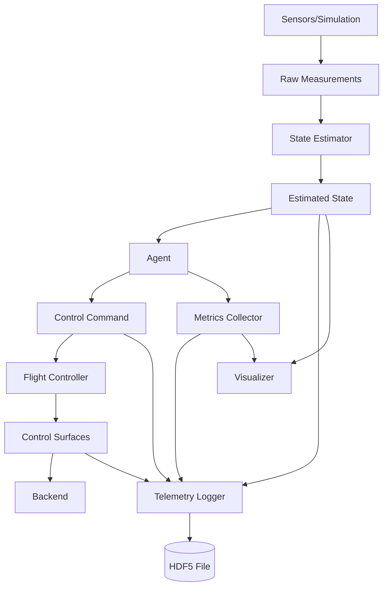

# Data Flow & State Estimation

## Overview

This document specifies the data pipelines, message passing, state estimation, and logging systems throughout the aircraft control platform. Proper data flow is critical for real-time control, training data collection, and system debugging.

## Architecture



## State Estimation

### Extended Kalman Filter (EKF)

**Purpose**: Fuse noisy sensor measurements (IMU, GPS, airspeed) into optimal state estimate.

**File**: `estimation/ekf.py`

```python
import numpy as np
from typing import Tuple
from scipy.linalg import block_diag
from controllers.types import AircraftState

class ExtendedKalmanFilter:
    """
    Extended Kalman Filter for aircraft state estimation.

    State vector (13-D):
        x = [N, E, D, u, v, w, φ, θ, ψ, p, q, r, airspeed]

    Measurements:
        - IMU: [ax, ay, az, p, q, r] (100 Hz)
        - GPS: [lat, lon, alt, vN, vE, vD] (10 Hz)
        - Airspeed: [V_air] (50 Hz)
    """

    def __init__(self, config: dict):
        """
        Initialize EKF.

        Args:
            config: EKF parameters:
                - initial_state: dict
                - process_noise: dict (Q matrix params)
                - measurement_noise: dict (R matrix params)
        """
        self.config = config

        # State dimension
        self.n = 13

        # Initialize state
        self.x = self._init_state(config["initial_state"])

        # Initialize covariance
        self.P = np.eye(self.n) * 1.0

        # Process noise Q
        self.Q = self._build_process_noise(config.get("process_noise", {}))

        # Measurement noise R (updated per measurement type)
        self.R_imu = self._build_imu_noise(config.get("measurement_noise", {}))
        self.R_gps = self._build_gps_noise(config.get("measurement_noise", {}))
        self.R_airspeed = config.get("measurement_noise", {}).get("airspeed_var", 0.25)

        # Gravity
        self.g = 9.81

    def _init_state(self, ic: dict) -> np.ndarray:
        """Initialize state vector from initial conditions."""
        return np.array([
            0.0,  # North
            0.0,  # East
            -ic.get("altitude", 100.0),  # Down
            ic.get("airspeed", 20.0),  # u
            0.0,  # v
            0.0,  # w
            0.0,  # roll
            0.0,  # pitch
            np.radians(ic.get("heading", 0.0)),  # yaw
            0.0,  # p
            0.0,  # q
            0.0,  # r
            ic.get("airspeed", 20.0),  # airspeed
        ])

    def _build_process_noise(self, config: dict) -> np.ndarray:
        """Build process noise covariance Q."""
        # Position noise
        q_pos = config.get("position", 0.1)
        # Velocity noise
        q_vel = config.get("velocity", 0.5)
        # Attitude noise
        q_att = config.get("attitude", 0.01)
        # Angular rate noise
        q_rate = config.get("angular_rate", 0.05)
        # Airspeed noise
        q_air = config.get("airspeed", 0.1)

        Q = np.diag([
            q_pos, q_pos, q_pos,  # N, E, D
            q_vel, q_vel, q_vel,  # u, v, w
            q_att, q_att, q_att,  # φ, θ, ψ
            q_rate, q_rate, q_rate,  # p, q, r
            q_air  # airspeed
        ])
        return Q

    def _build_imu_noise(self, config: dict) -> np.ndarray:
        """Build IMU measurement noise R."""
        accel_var = config.get("accel_var", 0.1)
        gyro_var = config.get("gyro_var", 0.001)

        R = np.diag([
            accel_var, accel_var, accel_var,  # ax, ay, az
            gyro_var, gyro_var, gyro_var  # p, q, r
        ])
        return R

    def _build_gps_noise(self, config: dict) -> np.ndarray:
        """Build GPS measurement noise R."""
        pos_var = config.get("gps_pos_var", 4.0)
        vel_var = config.get("gps_vel_var", 0.04)

        R = np.diag([
            pos_var, pos_var, pos_var,  # N, E, D
            vel_var, vel_var, vel_var  # vN, vE, vD
        ])
        return R

    def predict(self, controls: np.ndarray, dt: float):
        """
        Prediction step: propagate state forward using dynamics model.

        Args:
            controls: [aileron, elevator, rudder, throttle]
            dt: Time step
        """
        # Nonlinear state transition function
        self.x = self._f(self.x, controls, dt)

        # Jacobian of state transition
        F = self._compute_F(self.x, controls, dt)

        # Covariance prediction
        self.P = F @ self.P @ F.T + self.Q * dt

    def _f(self, x: np.ndarray, u: np.ndarray, dt: float) -> np.ndarray:
        """
        Nonlinear state transition function (simplified dynamics).

        Args:
            x: State vector
            u: Control vector
            dt: Time step

        Returns:
            x_next: Next state
        """
        # Extract state
        N, E, D, u_vel, v, w, phi, theta, psi, p, q, r, V_air = x

        # Simplified dynamics (full model would use aerodynamic equations)

        # Position update (from velocity)
        R_body_to_ned = self._rotation_matrix(phi, theta, psi)
        vel_body = np.array([u_vel, v, w])
        vel_ned = R_body_to_ned @ vel_body

        N_next = N + vel_ned[0] * dt
        E_next = E + vel_ned[1] * dt
        D_next = D + vel_ned[2] * dt

        # Velocity update (simplified - no aerodynamics)
        # In full model, would compute aero forces and integrate
        u_next = u_vel  # Placeholder
        v_next = v
        w_next = w

        # Attitude update (from angular rates)
        phi_next = phi + (p + q*np.sin(phi)*np.tan(theta) + r*np.cos(phi)*np.tan(theta)) * dt
        theta_next = theta + (q*np.cos(phi) - r*np.sin(phi)) * dt
        psi_next = psi + ((q*np.sin(phi) + r*np.cos(phi)) / np.cos(theta)) * dt

        # Angular rates (simplified - no moments)
        p_next = p  # Placeholder
        q_next = q
        r_next = r

        # Airspeed
        V_air_next = np.sqrt(u_next**2 + v_next**2 + w_next**2)

        x_next = np.array([
            N_next, E_next, D_next,
            u_next, v_next, w_next,
            phi_next, theta_next, psi_next,
            p_next, q_next, r_next,
            V_air_next
        ])

        return x_next

    def _rotation_matrix(self, phi: float, theta: float, psi: float) -> np.ndarray:
        """Compute rotation matrix from body to NED frame."""
        # Roll
        R_x = np.array([
            [1, 0, 0],
            [0, np.cos(phi), -np.sin(phi)],
            [0, np.sin(phi), np.cos(phi)]
        ])

        # Pitch
        R_y = np.array([
            [np.cos(theta), 0, np.sin(theta)],
            [0, 1, 0],
            [-np.sin(theta), 0, np.cos(theta)]
        ])

        # Yaw
        R_z = np.array([
            [np.cos(psi), -np.sin(psi), 0],
            [np.sin(psi), np.cos(psi), 0],
            [0, 0, 1]
        ])

        return R_z @ R_y @ R_x

    def _compute_F(self, x: np.ndarray, u: np.ndarray, dt: float) -> np.ndarray:
        """
        Compute Jacobian of state transition function.

        Returns:
            F: State transition matrix (13x13)
        """
        # Numerical Jacobian (finite differences)
        # Full implementation would use analytical Jacobian
        eps = 1e-6
        F = np.eye(self.n)

        for i in range(self.n):
            x_plus = x.copy()
            x_plus[i] += eps
            f_plus = self._f(x_plus, u, dt)

            x_minus = x.copy()
            x_minus[i] -= eps
            f_minus = self._f(x_minus, u, dt)

            F[:, i] = (f_plus - f_minus) / (2 * eps)

        return F

    def update_imu(self, measurement: np.ndarray):
        """
        Update step with IMU measurement.

        Args:
            measurement: [ax, ay, az, p, q, r]
        """
        # Measurement model: h(x) = expected measurement given state
        h = self._h_imu(self.x)

        # Jacobian
        H = self._compute_H_imu(self.x)

        # Update
        self._update(measurement, h, H, self.R_imu)

    def _h_imu(self, x: np.ndarray) -> np.ndarray:
        """
        IMU measurement model.

        Returns:
            h: [ax, ay, az, p, q, r] expected from state
        """
        phi, theta, psi = x[6:9]
        p, q, r = x[9:12]

        # Accelerometer measures specific force (including gravity)
        # Simplified: gravity rotated to body frame
        R = self._rotation_matrix(phi, theta, psi)
        g_body = R.T @ np.array([0, 0, self.g])

        ax = g_body[0]
        ay = g_body[1]
        az = g_body[2]

        # Gyro measures angular rates directly
        return np.array([ax, ay, az, p, q, r])

    def _compute_H_imu(self, x: np.ndarray) -> np.ndarray:
        """Jacobian of IMU measurement model."""
        # Simplified: only attitude affects accelerometer
        H = np.zeros((6, self.n))

        # Gyro measurements (direct)
        H[3, 9] = 1.0  # p
        H[4, 10] = 1.0  # q
        H[5, 11] = 1.0  # r

        # Accelerometer Jacobian (numerical)
        eps = 1e-6
        for i in [6, 7, 8]:  # phi, theta, psi
            x_plus = x.copy()
            x_plus[i] += eps
            h_plus = self._h_imu(x_plus)

            x_minus = x.copy()
            x_minus[i] -= eps
            h_minus = self._h_imu(x_minus)

            H[:3, i] = (h_plus[:3] - h_minus[:3]) / (2 * eps)

        return H

    def update_gps(self, measurement: np.ndarray):
        """
        Update step with GPS measurement.

        Args:
            measurement: [N, E, D, vN, vE, vD]
        """
        # GPS directly measures position and velocity (NED frame)
        h = self.x[[0, 1, 2, 3, 4, 5]]  # N, E, D, u, v, w (approx vN, vE, vD)

        # Jacobian (direct measurement)
        H = np.zeros((6, self.n))
        H[0, 0] = 1.0  # N
        H[1, 1] = 1.0  # E
        H[2, 2] = 1.0  # D
        H[3, 3] = 1.0  # vN ≈ u (simplified)
        H[4, 4] = 1.0  # vE ≈ v
        H[5, 5] = 1.0  # vD ≈ w

        self._update(measurement, h, H, self.R_gps)

    def update_airspeed(self, measurement: float):
        """
        Update step with airspeed measurement.

        Args:
            measurement: Airspeed (m/s)
        """
        # Airspeed measurement
        h = np.array([self.x[12]])

        # Jacobian
        H = np.zeros((1, self.n))
        H[0, 12] = 1.0

        R = np.array([[self.R_airspeed]])

        self._update(measurement, h, H, R)

    def _update(self, z: np.ndarray, h: np.ndarray, H: np.ndarray, R: np.ndarray):
        """
        Generic Kalman update step.

        Args:
            z: Measurement
            h: Expected measurement
            H: Measurement Jacobian
            R: Measurement noise covariance
        """
        # Innovation
        y = z - h

        # Innovation covariance
        S = H @ self.P @ H.T + R

        # Kalman gain
        K = self.P @ H.T @ np.linalg.inv(S)

        # State update
        self.x = self.x + K @ y

        # Covariance update
        I = np.eye(self.n)
        self.P = (I - K @ H) @ self.P

    def get_state(self) -> AircraftState:
        """
        Convert EKF state to AircraftState.

        Returns:
            AircraftState object
        """
        return AircraftState(
            time=0.0,  # Would be set externally
            position=self.x[0:3],
            velocity=self.x[3:6],
            attitude=self.x[6:9],
            angular_rate=self.x[9:12],
            airspeed=self.x[12],
            altitude=-self.x[2]
        )
```

## Telemetry Logging

### HDF5 Logger

**Purpose**: Efficiently log all telemetry data for post-flight analysis and RL training.

**File**: `logging/telemetry_logger.py`

```python
import h5py
import numpy as np
from pathlib import Path
from typing import Dict, Any, Optional
from controllers.types import AircraftState, ControlCommand, ControlSurfaces

class TelemetryLogger:
    """
    HDF5-based telemetry logger.

    Structure:
        /metadata/
            /config          # Experiment configuration (JSON)
            /agent_type      # Agent type string
            /start_time      # Timestamp
        /episode_0000/
            /states/         # AircraftState at each timestep
            /actions/        # Agent actions
            /controls/       # Control surfaces
            /rewards/        # Rewards (if training)
            /observations/   # Processed observations
            /info/           # Additional metadata per step
        /episode_0001/
            ...
    """

    def __init__(self, log_path: str, config: dict):
        """
        Initialize telemetry logger.

        Args:
            log_path: Path to HDF5 log file
            config: Experiment configuration to save
        """
        self.log_path = Path(log_path)
        self.log_path.parent.mkdir(parents=True, exist_ok=True)

        self.file = h5py.File(self.log_path, 'w')
        self.config = config

        # Episode tracking
        self.current_episode = -1
        self.episode_group = None
        self.step_count = 0

        # Save metadata
        self._save_metadata()

    def _save_metadata(self):
        """Save experiment metadata."""
        import json
        import datetime

        meta = self.file.create_group("metadata")
        meta.attrs["config"] = json.dumps(self.config)
        meta.attrs["agent_type"] = self.config.get("agent_type", "unknown")
        meta.attrs["start_time"] = datetime.datetime.now().isoformat()

    def start_episode(self, episode_id: Optional[int] = None):
        """
        Start logging a new episode.

        Args:
            episode_id: Optional episode ID (auto-increments if None)
        """
        if episode_id is None:
            self.current_episode += 1
        else:
            self.current_episode = episode_id

        episode_name = f"episode_{self.current_episode:04d}"
        self.episode_group = self.file.create_group(episode_name)

        # Create datasets with chunked storage for efficient appending
        chunk_size = 1000
        state_dim = 16  # Flattened AircraftState size
        action_dim = self.config.get("action_dim", 4)
        obs_dim = self.config.get("observation_dim", 12)

        # States (time-series)
        self.episode_group.create_dataset(
            "states",
            shape=(0, state_dim),
            maxshape=(None, state_dim),
            dtype=np.float32,
            chunks=(chunk_size, state_dim)
        )

        # Actions
        self.episode_group.create_dataset(
            "actions",
            shape=(0, action_dim),
            maxshape=(None, action_dim),
            dtype=np.float32,
            chunks=(chunk_size, action_dim)
        )

        # Observations
        self.episode_group.create_dataset(
            "observations",
            shape=(0, obs_dim),
            maxshape=(None, obs_dim),
            dtype=np.float32,
            chunks=(chunk_size, obs_dim)
        )

        # Rewards
        self.episode_group.create_dataset(
            "rewards",
            shape=(0,),
            maxshape=(None,),
            dtype=np.float32,
            chunks=(chunk_size,)
        )

        # Control surfaces
        self.episode_group.create_dataset(
            "controls",
            shape=(0, 4),
            maxshape=(None, 4),
            dtype=np.float32,
            chunks=(chunk_size, 4)
        )

        self.step_count = 0

    def log_step(self,
                 state: AircraftState,
                 observation: np.ndarray,
                 action: np.ndarray,
                 controls: ControlSurfaces,
                 reward: float = 0.0,
                 info: Optional[Dict[str, Any]] = None):
        """
        Log a single timestep.

        Args:
            state: Aircraft state
            observation: Processed observation
            action: Agent action
            controls: Control surfaces
            reward: Reward value (if RL training)
            info: Additional metadata
        """
        if self.episode_group is None:
            raise RuntimeError("Must call start_episode() before log_step()")

        # Flatten state
        state_array = self._flatten_state(state)

        # Append to datasets
        self._append_dataset("states", state_array)
        self._append_dataset("observations", observation)
        self._append_dataset("actions", action)
        self._append_dataset("rewards", np.array([reward]))
        self._append_dataset("controls", np.array([
            controls.aileron, controls.elevator, controls.rudder, controls.throttle
        ]))

        # Save info as attributes (per-step metadata)
        if info is not None:
            step_name = f"step_{self.step_count:06d}"
            step_group = self.episode_group.create_group(f"info/{step_name}")
            for key, value in info.items():
                step_group.attrs[key] = value

        self.step_count += 1

    def _flatten_state(self, state: AircraftState) -> np.ndarray:
        """Flatten AircraftState to array."""
        return np.array([
            state.time,
            state.position[0], state.position[1], state.position[2],
            state.velocity[0], state.velocity[1], state.velocity[2],
            state.attitude[0], state.attitude[1], state.attitude[2],
            state.angular_rate[0], state.angular_rate[1], state.angular_rate[2],
            state.airspeed,
            state.altitude,
            0.0  # Padding for alignment
        ])

    def _append_dataset(self, name: str, data: np.ndarray):
        """Append data to dataset."""
        dataset = self.episode_group[name]
        current_size = dataset.shape[0]

        # Resize
        new_size = current_size + 1
        dataset.resize((new_size,) + dataset.shape[1:])

        # Append
        dataset[current_size] = data

    def end_episode(self, final_info: Optional[Dict[str, Any]] = None):
        """
        End current episode.

        Args:
            final_info: Final episode metadata (e.g., total reward, success)
        """
        if final_info is not None:
            for key, value in final_info.items():
                self.episode_group.attrs[key] = value

        # Flush to disk
        self.file.flush()

    def close(self):
        """Close log file."""
        self.file.close()

    def __del__(self):
        """Ensure file is closed."""
        if hasattr(self, 'file'):
            self.file.close()
```

## Message Passing

### Asynchronous State Buffer

**Purpose**: Thread-safe communication between control loop and agent decision thread.

**File**: `utils/state_buffer.py`

```python
import threading
import time
from collections import deque
from typing import Optional
from controllers.types import AircraftState

class StateBuffer:
    """
    Thread-safe circular buffer for aircraft state.

    Used for async communication between:
        - Fast control loop (100-500 Hz)
        - Agent decision thread (1-50 Hz)
    """

    def __init__(self, maxlen: int = 1000):
        """
        Initialize state buffer.

        Args:
            maxlen: Maximum buffer size
        """
        self.buffer = deque(maxlen=maxlen)
        self.lock = threading.Lock()

        # Latest state cache
        self._latest = None

    def put(self, state: AircraftState):
        """
        Add state to buffer (thread-safe).

        Args:
            state: Aircraft state
        """
        with self.lock:
            self.buffer.append(state)
            self._latest = state

    def get_latest(self) -> Optional[AircraftState]:
        """
        Get most recent state.

        Returns:
            Latest AircraftState or None if empty
        """
        with self.lock:
            return self._latest

    def get_latest_n(self, n: int) -> list:
        """
        Get N most recent states.

        Args:
            n: Number of states to retrieve

        Returns:
            List of AircraftState (oldest to newest)
        """
        with self.lock:
            return list(self.buffer)[-n:]

    def get_all(self) -> list:
        """Get all buffered states."""
        with self.lock:
            return list(self.buffer)

    def clear(self):
        """Clear buffer."""
        with self.lock:
            self.buffer.clear()
            self._latest = None
```

## Data Pipeline

**File**: `pipelines/data_pipeline.py`

```python
from typing import Callable, List
from controllers.types import AircraftState
import numpy as np

class DataPipeline:
    """
    Data processing pipeline for observations.

    Example:
        pipeline = DataPipeline([
            NormalizeObservation(mean, std),
            AddNoise(stddev=0.01),
            ClipObservation(min_val, max_val)
        ])

        obs = pipeline.process(state)
    """

    def __init__(self, processors: List[Callable]):
        """
        Initialize pipeline.

        Args:
            processors: List of processing functions/objects
        """
        self.processors = processors

    def process(self, state: AircraftState) -> np.ndarray:
        """
        Process state through pipeline.

        Args:
            state: Aircraft state

        Returns:
            Processed observation
        """
        # Start with state
        data = state

        # Apply each processor
        for proc in self.processors:
            data = proc(data)

        return data


class NormalizeObservation:
    """Normalize observation using mean and std."""

    def __init__(self, mean: np.ndarray, std: np.ndarray):
        self.mean = mean
        self.std = std

    def __call__(self, obs: np.ndarray) -> np.ndarray:
        return (obs - self.mean) / (self.std + 1e-8)


class ClipObservation:
    """Clip observation to range."""

    def __init__(self, min_val: float, max_val: float):
        self.min_val = min_val
        self.max_val = max_val

    def __call__(self, obs: np.ndarray) -> np.ndarray:
        return np.clip(obs, self.min_val, self.max_val)
```

## Configuration Example

**File**: `configs/logging/default.yaml`

```yaml
logging:
  enabled: true
  log_dir: "logs/experiments"
  format: "hdf5"

  # What to log
  log_states: true
  log_actions: true
  log_observations: true
  log_rewards: true
  log_controls: true

  # Logging frequency
  log_frequency_hz: 100

  # Compression
  compression: "gzip"
  compression_opts: 4

estimation:
  enabled: true
  algorithm: "ekf"

  ekf:
    process_noise:
      position: 0.1
      velocity: 0.5
      attitude: 0.01
      angular_rate: 0.05
      airspeed: 0.1

    measurement_noise:
      accel_var: 0.1
      gyro_var: 0.001
      gps_pos_var: 4.0
      gps_vel_var: 0.04
      airspeed_var: 0.25

  # Sensor update rates
  imu_rate_hz: 100
  gps_rate_hz: 10
  airspeed_rate_hz: 50
```

## Testing

**File**: `tests/test_logging.py`

```python
import pytest
import numpy as np
from logging.telemetry_logger import TelemetryLogger
from controllers.types import AircraftState, ControlSurfaces

def test_telemetry_logging(tmp_path):
    """Test telemetry logger saves data correctly."""
    log_path = tmp_path / "test_log.h5"

    config = {"action_dim": 4, "observation_dim": 12}
    logger = TelemetryLogger(str(log_path), config)

    # Start episode
    logger.start_episode()

    # Log steps
    for i in range(10):
        state = AircraftState(
            time=i * 0.01,
            position=np.array([i, 0, -100]),
            velocity=np.array([20, 0, 0]),
            attitude=np.zeros(3),
            angular_rate=np.zeros(3),
            airspeed=20.0,
            altitude=100.0
        )

        obs = np.random.randn(12)
        action = np.random.randn(4)
        controls = ControlSurfaces(0, 0, 0, 0.5)

        logger.log_step(state, obs, action, controls, reward=1.0)

    logger.end_episode({"total_reward": 10.0})
    logger.close()

    # Verify file
    import h5py
    with h5py.File(log_path, 'r') as f:
        assert "episode_0000" in f
        assert len(f["episode_0000/states"]) == 10
        assert f["episode_0000"].attrs["total_reward"] == 10.0
```

---

**Document Status**: ✅ Complete
**Last Updated**: 2025-10-09
**Related Documents**: 01_ARCHITECTURE.md, 06_RL_AGENT_TRAINING.md, 10_VISUALIZATION_MONITORING.md
