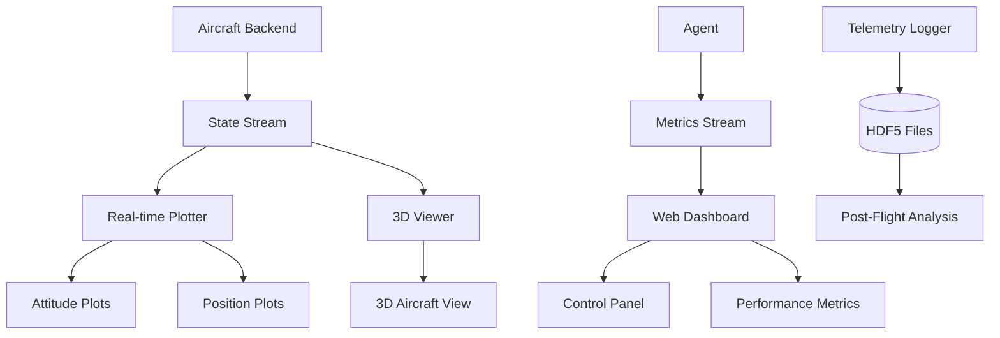

# Visualization & Monitoring

## Overview

This document specifies the real-time visualization, telemetry monitoring, and training progress tracking systems. Effective visualization is critical for debugging control algorithms, monitoring flight tests, and analyzing RL training performance.

## Architecture



## Real-Time Dashboard

### Plotly Dash Web Interface

**Purpose**: Web-based real-time monitoring dashboard accessible from any browser.

**File**: `gui/app.py`

```python
import dash
from dash import dcc, html
from dash.dependencies import Input, Output
import plotly.graph_objs as go
import numpy as np
from threading import Thread
import time
from utils.state_buffer import StateBuffer

class DashboardApp:
    """Real-time telemetry dashboard using Plotly Dash."""

    def __init__(self, state_buffer: StateBuffer, config: dict):
        """
        Initialize dashboard.

        Args:
            state_buffer: Shared state buffer for telemetry
            config: Dashboard configuration
        """
        self.state_buffer = state_buffer
        self.config = config

        # Create Dash app
        self.app = dash.Dash(__name__)

        # Build layout
        self._build_layout()

        # Register callbacks
        self._register_callbacks()

    def _build_layout(self):
        """Build dashboard layout."""
        self.app.layout = html.Div([
            html.H1("Aircraft Control Telemetry Dashboard",
                    style={'textAlign': 'center'}),

            # Update interval
            dcc.Interval(
                id='update-interval',
                interval=100,  # 10 Hz update
                n_intervals=0
            ),

            # Row 1: Attitude and Position
            html.Div([
                html.Div([
                    html.H3("Attitude (deg)"),
                    dcc.Graph(id='attitude-plot')
                ], className='six columns'),

                html.Div([
                    html.H3("3D Position (m)"),
                    dcc.Graph(id='position-3d-plot')
                ], className='six columns'),
            ], className='row'),

            # Row 2: Angular Rates and Control Surfaces
            html.Div([
                html.Div([
                    html.H3("Angular Rates (deg/s)"),
                    dcc.Graph(id='rates-plot')
                ], className='six columns'),

                html.Div([
                    html.H3("Control Surfaces"),
                    dcc.Graph(id='controls-plot')
                ], className='six columns'),
            ], className='row'),

            # Row 3: Airspeed and Altitude
            html.Div([
                html.Div([
                    html.H3("Airspeed (m/s)"),
                    dcc.Graph(id='airspeed-plot')
                ], className='six columns'),

                html.Div([
                    html.H3("Altitude (m)"),
                    dcc.Graph(id='altitude-plot')
                ], className='six columns'),
            ], className='row'),

            # Row 4: Performance Metrics
            html.Div([
                html.H3("Performance Metrics"),
                dcc.Graph(id='performance-plot')
            ], className='row'),
        ])

    def _register_callbacks(self):
        """Register callback functions."""

        @self.app.callback(
            Output('attitude-plot', 'figure'),
            Input('update-interval', 'n_intervals')
        )
        def update_attitude(n):
            return self._create_attitude_plot()

        @self.app.callback(
            Output('position-3d-plot', 'figure'),
            Input('update-interval', 'n_intervals')
        )
        def update_position_3d(n):
            return self._create_position_3d_plot()

        @self.app.callback(
            Output('rates-plot', 'figure'),
            Input('update-interval', 'n_intervals')
        )
        def update_rates(n):
            return self._create_rates_plot()

        @self.app.callback(
            Output('controls-plot', 'figure'),
            Input('update-interval', 'n_intervals')
        )
        def update_controls(n):
            return self._create_controls_plot()

        @self.app.callback(
            Output('airspeed-plot', 'figure'),
            Input('update-interval', 'n_intervals')
        )
        def update_airspeed(n):
            return self._create_airspeed_plot()

        @self.app.callback(
            Output('altitude-plot', 'figure'),
            Input('update-interval', 'n_intervals')
        )
        def update_altitude(n):
            return self._create_altitude_plot()

        @self.app.callback(
            Output('performance-plot', 'figure'),
            Input('update-interval', 'n_intervals')
        )
        def update_performance(n):
            return self._create_performance_plot()

    def _create_attitude_plot(self):
        """Create attitude time-series plot."""
        states = self.state_buffer.get_latest_n(100)

        if len(states) == 0:
            return go.Figure()

        times = [s.time for s in states]
        rolls = [np.degrees(s.attitude[0]) for s in states]
        pitches = [np.degrees(s.attitude[1]) for s in states]
        yaws = [np.degrees(s.attitude[2]) for s in states]

        fig = go.Figure()

        fig.add_trace(go.Scatter(
            x=times, y=rolls,
            mode='lines',
            name='Roll',
            line=dict(color='red')
        ))

        fig.add_trace(go.Scatter(
            x=times, y=pitches,
            mode='lines',
            name='Pitch',
            line=dict(color='green')
        ))

        fig.add_trace(go.Scatter(
            x=times, y=yaws,
            mode='lines',
            name='Yaw',
            line=dict(color='blue')
        ))

        fig.update_layout(
            xaxis_title='Time (s)',
            yaxis_title='Angle (deg)',
            hovermode='x unified',
            height=300
        )

        return fig

    def _create_position_3d_plot(self):
        """Create 3D trajectory plot."""
        states = self.state_buffer.get_latest_n(200)

        if len(states) == 0:
            return go.Figure()

        north = [s.position[0] for s in states]
        east = [s.position[1] for s in states]
        down = [-s.position[2] for s in states]  # Flip to altitude

        fig = go.Figure(data=[
            go.Scatter3d(
                x=north,
                y=east,
                z=down,
                mode='lines+markers',
                marker=dict(size=2, color=down, colorscale='Viridis'),
                line=dict(width=2)
            )
        ])

        fig.update_layout(
            scene=dict(
                xaxis_title='North (m)',
                yaxis_title='East (m)',
                zaxis_title='Altitude (m)',
                aspectmode='data'
            ),
            height=400
        )

        return fig

    def _create_rates_plot(self):
        """Create angular rates plot."""
        states = self.state_buffer.get_latest_n(100)

        if len(states) == 0:
            return go.Figure()

        times = [s.time for s in states]
        p_rates = [np.degrees(s.angular_rate[0]) for s in states]
        q_rates = [np.degrees(s.angular_rate[1]) for s in states]
        r_rates = [np.degrees(s.angular_rate[2]) for s in states]

        fig = go.Figure()

        fig.add_trace(go.Scatter(x=times, y=p_rates, mode='lines', name='p (roll rate)'))
        fig.add_trace(go.Scatter(x=times, y=q_rates, mode='lines', name='q (pitch rate)'))
        fig.add_trace(go.Scatter(x=times, y=r_rates, mode='lines', name='r (yaw rate)'))

        fig.update_layout(
            xaxis_title='Time (s)',
            yaxis_title='Rate (deg/s)',
            hovermode='x unified',
            height=300
        )

        return fig

    def _create_controls_plot(self):
        """Create control surfaces plot."""
        # Note: Would need separate control buffer
        # Placeholder implementation
        fig = go.Figure()
        fig.update_layout(height=300)
        return fig

    def _create_airspeed_plot(self):
        """Create airspeed plot."""
        states = self.state_buffer.get_latest_n(100)

        if len(states) == 0:
            return go.Figure()

        times = [s.time for s in states]
        airspeeds = [s.airspeed for s in states]

        fig = go.Figure()
        fig.add_trace(go.Scatter(x=times, y=airspeeds, mode='lines', fill='tozeroy'))

        fig.update_layout(
            xaxis_title='Time (s)',
            yaxis_title='Airspeed (m/s)',
            height=300
        )

        return fig

    def _create_altitude_plot(self):
        """Create altitude plot."""
        states = self.state_buffer.get_latest_n(100)

        if len(states) == 0:
            return go.Figure()

        times = [s.time for s in states]
        altitudes = [s.altitude for s in states]

        fig = go.Figure()
        fig.add_trace(go.Scatter(x=times, y=altitudes, mode='lines', fill='tozeroy'))

        fig.update_layout(
            xaxis_title='Time (s)',
            yaxis_title='Altitude (m)',
            height=300
        )

        return fig

    def _create_performance_plot(self):
        """Create performance metrics plot."""
        # Placeholder - would show reward, tracking error, etc.
        fig = go.Figure()
        fig.update_layout(height=300)
        return fig

    def run(self, host='0.0.0.0', port=8050, debug=False):
        """
        Run dashboard server.

        Args:
            host: Host address
            port: Port number
            debug: Debug mode
        """
        self.app.run_server(host=host, port=port, debug=debug)
```

## 3D Aircraft Visualization

**File**: `visualization/aircraft_3d.py`

```python
import pyvista as pv
import numpy as np
from controllers.types import AircraftState
from scipy.spatial.transform import Rotation

class Aircraft3DViewer:
    """Real-time 3D aircraft visualization using PyVista."""

    def __init__(self, config: dict):
        """
        Initialize 3D viewer.

        Args:
            config: Visualization configuration:
                - aircraft_model: str (path to STL/OBJ file)
                - show_trail: bool
                - trail_length: int
                - headless: bool (enable headless rendering)
                - save_screenshots: bool (save frames instead of displaying)
        """
        self.config = config
        self.headless = config.get("headless", False)
        self.save_screenshots = config.get("save_screenshots", False)
        self.screenshot_dir = config.get("screenshot_dir", "logs/screenshots")

        # Create plotter (with headless support)
        if self.headless:
            # Headless mode using OSMesa or EGL
            try:
                pv.start_xvfb()  # Start virtual framebuffer if needed
            except:
                pass  # May already be running

        self.plotter = pv.Plotter(off_screen=self.headless)
        self.plotter.set_background('skyblue')

        # Screenshot counter
        self.frame_count = 0

        # Create screenshot directory if needed
        if self.save_screenshots:
            import os
            os.makedirs(self.screenshot_dir, exist_ok=True)

        # Load aircraft mesh
        model_path = config.get("aircraft_model", None)
        if model_path:
            self.aircraft_mesh = pv.read(model_path)
        else:
            # Default: simple arrow
            self.aircraft_mesh = pv.Arrow(
                start=(0, 0, 0),
                direction=(1, 0, 0),
                scale=5.0
            )

        # Add mesh to plotter
        self.aircraft_actor = self.plotter.add_mesh(
            self.aircraft_mesh,
            color='red',
            show_edges=True
        )

        # Ground plane
        ground = pv.Plane(
            center=(0, 0, 0),
            direction=(0, 0, 1),
            i_size=1000,
            j_size=1000
        )
        self.plotter.add_mesh(ground, color='lightgreen', opacity=0.5)

        # Trail
        self.show_trail = config.get("show_trail", True)
        self.trail_length = config.get("trail_length", 100)
        self.trail_points = []

        if self.show_trail:
            self.trail_actor = None

        # Axes
        self.plotter.add_axes(interactive=True)

        # Camera
        self.plotter.camera_position = 'xy'
        self.plotter.camera.zoom(1.5)

    def update(self, state: AircraftState):
        """
        Update visualization with new state.

        Args:
            state: Current aircraft state
        """
        # Extract position and attitude
        north, east, down = state.position
        altitude = -down

        roll, pitch, yaw = state.attitude

        # Create rotation matrix (Euler ZYX)
        R = Rotation.from_euler('xyz', [roll, pitch, yaw])
        rotation_matrix = R.as_matrix()

        # Transform aircraft mesh
        # 1. Reset to origin
        transformed_mesh = self.aircraft_mesh.copy()

        # 2. Rotate
        transformed_mesh.points = (rotation_matrix @ transformed_mesh.points.T).T

        # 3. Translate
        transformed_mesh.points += np.array([north, east, altitude])

        # Update actor
        self.aircraft_actor.mapper.SetInputData(transformed_mesh)

        # Update trail
        if self.show_trail:
            self.trail_points.append([north, east, altitude])
            if len(self.trail_points) > self.trail_length:
                self.trail_points.pop(0)

            if len(self.trail_points) > 1:
                trail_polydata = pv.lines_from_points(np.array(self.trail_points))

                if self.trail_actor is not None:
                    self.plotter.remove_actor(self.trail_actor)

                self.trail_actor = self.plotter.add_mesh(
                    trail_polydata,
                    color='blue',
                    line_width=3
                )

        # Update camera to follow aircraft
        self.plotter.camera.focal_point = (north, east, altitude)
        self.plotter.camera.position = (
            north - 50,
            east - 50,
            altitude + 30
        )

        # Render
        if self.headless or self.save_screenshots:
            # Save screenshot instead of displaying
            self.screenshot(f"{self.screenshot_dir}/frame_{self.frame_count:06d}.png")
            self.frame_count += 1
        else:
            # Interactive rendering
            self.plotter.render()

    def run(self):
        """Start interactive viewer (only in non-headless mode)."""
        if not self.headless:
            self.plotter.show()
        else:
            print("Headless mode enabled - use save_screenshots to capture frames")

    def screenshot(self, filename: str):
        """Save screenshot."""
        self.plotter.screenshot(filename)

    def close(self):
        """Close plotter and clean up."""
        self.plotter.close()
```

## Training Progress Monitoring

### TensorBoard Integration

**File**: `visualization/tensorboard_logger.py`

```python
from torch.utils.tensorboard import SummaryWriter
import numpy as np

class TensorBoardLogger:
    """TensorBoard logger for RL training progress."""

    def __init__(self, log_dir: str):
        """
        Initialize TensorBoard logger.

        Args:
            log_dir: Directory for TensorBoard logs
        """
        self.writer = SummaryWriter(log_dir)
        self.step = 0

    def log_scalar(self, tag: str, value: float, step: int = None):
        """
        Log scalar value.

        Args:
            tag: Metric name
            value: Metric value
            step: Training step (uses internal counter if None)
        """
        if step is None:
            step = self.step

        self.writer.add_scalar(tag, value, step)

    def log_episode(self, episode_data: dict, episode: int):
        """
        Log episode summary.

        Args:
            episode_data: Dict with keys like 'total_reward', 'episode_length', etc.
            episode: Episode number
        """
        for key, value in episode_data.items():
            self.log_scalar(f"episode/{key}", value, episode)

    def log_training_metrics(self, metrics: dict):
        """
        Log training metrics (loss, etc.).

        Args:
            metrics: Dict of training metrics
        """
        for key, value in metrics.items():
            self.log_scalar(f"train/{key}", value, self.step)

        self.step += 1

    def log_histogram(self, tag: str, values: np.ndarray, step: int = None):
        """Log histogram of values."""
        if step is None:
            step = self.step

        self.writer.add_histogram(tag, values, step)

    def log_video(self, tag: str, video: np.ndarray, step: int = None, fps: int = 30):
        """
        Log video.

        Args:
            tag: Video name
            video: Video array (T, H, W, C)
            step: Training step
            fps: Frames per second
        """
        if step is None:
            step = self.step

        # Rearrange to (N, T, C, H, W) format
        video = video.transpose(0, 3, 1, 2)[np.newaxis, ...]

        self.writer.add_video(tag, video, step, fps=fps)

    def close(self):
        """Close writer."""
        self.writer.close()
```

### Weights & Biases Integration

**File**: `visualization/wandb_logger.py`

```python
import wandb
from typing import Dict, Any, Optional

class WandBLogger:
    """Weights & Biases logger for experiment tracking."""

    def __init__(self, project: str, config: dict, name: Optional[str] = None):
        """
        Initialize W&B logger.

        Args:
            project: W&B project name
            config: Experiment configuration
            name: Run name (optional)
        """
        self.run = wandb.init(
            project=project,
            config=config,
            name=name
        )

    def log(self, metrics: Dict[str, Any], step: Optional[int] = None):
        """
        Log metrics.

        Args:
            metrics: Dict of metrics to log
            step: Training step (optional)
        """
        wandb.log(metrics, step=step)

    def log_episode(self, episode_data: dict, episode: int):
        """Log episode summary."""
        wandb.log(episode_data, step=episode)

    def log_video(self, video: np.ndarray, caption: str = "Episode"):
        """Log episode video."""
        wandb.log({"video": wandb.Video(video, caption=caption, fps=30)})

    def finish(self):
        """Finish W&B run."""
        wandb.finish()
```

## Post-Flight Analysis

**File**: `visualization/post_flight_analysis.py`

```python
import h5py
import matplotlib.pyplot as plt
import numpy as np
from pathlib import Path

class PostFlightAnalyzer:
    """Analyze and visualize logged flight data."""

    def __init__(self, log_path: str):
        """
        Initialize analyzer.

        Args:
            log_path: Path to HDF5 log file
        """
        self.log_path = Path(log_path)
        self.file = h5py.File(self.log_path, 'r')

    def plot_episode(self, episode_id: int, save_path: Optional[str] = None):
        """
        Plot all telemetry for an episode.

        Args:
            episode_id: Episode number
            save_path: Optional path to save figure
        """
        episode_name = f"episode_{episode_id:04d}"
        if episode_name not in self.file:
            print(f"Episode {episode_id} not found")
            return

        episode = self.file[episode_name]

        # Load data
        states = episode['states'][:]
        actions = episode['actions'][:]
        rewards = episode['rewards'][:]

        # Extract time series
        times = states[:, 0]
        positions = states[:, 1:4]
        attitudes = states[:, 7:10]
        angular_rates = states[:, 10:13]
        airspeeds = states[:, 13]
        altitudes = states[:, 14]

        # Create figure
        fig, axes = plt.subplots(3, 2, figsize=(14, 10))

        # Attitude
        axes[0, 0].plot(times, np.degrees(attitudes[:, 0]), label='Roll')
        axes[0, 0].plot(times, np.degrees(attitudes[:, 1]), label='Pitch')
        axes[0, 0].plot(times, np.degrees(attitudes[:, 2]), label='Yaw')
        axes[0, 0].set_ylabel('Angle (deg)')
        axes[0, 0].set_title('Attitude')
        axes[0, 0].legend()
        axes[0, 0].grid()

        # Angular rates
        axes[0, 1].plot(times, np.degrees(angular_rates[:, 0]), label='p')
        axes[0, 1].plot(times, np.degrees(angular_rates[:, 1]), label='q')
        axes[0, 1].plot(times, np.degrees(angular_rates[:, 2]), label='r')
        axes[0, 1].set_ylabel('Rate (deg/s)')
        axes[0, 1].set_title('Angular Rates')
        axes[0, 1].legend()
        axes[0, 1].grid()

        # Position (2D)
        axes[1, 0].plot(positions[:, 0], positions[:, 1])
        axes[1, 0].set_xlabel('North (m)')
        axes[1, 0].set_ylabel('East (m)')
        axes[1, 0].set_title('2D Trajectory')
        axes[1, 0].grid()
        axes[1, 0].axis('equal')

        # Altitude
        axes[1, 1].plot(times, altitudes)
        axes[1, 1].set_ylabel('Altitude (m)')
        axes[1, 1].set_title('Altitude')
        axes[1, 1].grid()

        # Airspeed
        axes[2, 0].plot(times, airspeeds)
        axes[2, 0].set_xlabel('Time (s)')
        axes[2, 0].set_ylabel('Airspeed (m/s)')
        axes[2, 0].set_title('Airspeed')
        axes[2, 0].grid()

        # Rewards
        axes[2, 1].plot(times, rewards)
        axes[2, 1].set_xlabel('Time (s)')
        axes[2, 1].set_ylabel('Reward')
        axes[2, 1].set_title('Cumulative Reward')
        axes[2, 1].grid()

        plt.tight_layout()

        if save_path:
            plt.savefig(save_path, dpi=150)
        else:
            plt.show()

    def compare_episodes(self, episode_ids: list):
        """Compare multiple episodes."""
        fig, ax = plt.subplots(figsize=(10, 6))

        for ep_id in episode_ids:
            episode_name = f"episode_{ep_id:04d}"
            if episode_name not in self.file:
                continue

            episode = self.file[episode_name]
            rewards = episode['rewards'][:]
            cumulative = np.cumsum(rewards)

            ax.plot(cumulative, label=f"Episode {ep_id}")

        ax.set_xlabel('Step')
        ax.set_ylabel('Cumulative Reward')
        ax.set_title('Episode Comparison')
        ax.legend()
        ax.grid()
        plt.show()

    def close(self):
        """Close log file."""
        self.file.close()

    def __del__(self):
        """Ensure file is closed."""
        if hasattr(self, 'file'):
            self.file.close()
```

## Configuration Example

**File**: `configs/visualization/dashboard.yaml`

```yaml
visualization:
  dashboard:
    enabled: true
    host: "0.0.0.0"
    port: 8050
    update_rate_hz: 10

  3d_viewer:
    enabled: false  # Resource intensive
    aircraft_model: "models/aircraft.stl"
    show_trail: true
    trail_length: 200

  tensorboard:
    enabled: true
    log_dir: "logs/tensorboard"

  wandb:
    enabled: false
    project: "aircraft-control"
    entity: "your-username"

  recording:
    enabled: true
    video_dir: "logs/videos"
    fps: 30
    resolution: [640, 480]
```

## Usage Example

**File**: `examples/run_with_visualization.py`

```python
from simulation.jsbsim_backend import JSBSimBackend
from agents.classical_agent import ClassicalAgent
from utils.state_buffer import StateBuffer
from gui.app import DashboardApp
from threading import Thread
import time

# Create backend
backend = JSBSimBackend(config)

# Create agent
agent = ClassicalAgent(config)

# Create shared state buffer
state_buffer = StateBuffer(maxlen=1000)

# Create dashboard
dashboard = DashboardApp(state_buffer, config)

# Start dashboard in background thread
dashboard_thread = Thread(target=dashboard.run, kwargs={"debug": False}, daemon=True)
dashboard_thread.start()

# Control loop
state = backend.reset()
for i in range(1000):
    # Get action
    obs = agent.preprocess_observation(state)
    action = agent.get_action(obs)

    # Apply action
    command = agent.postprocess_action(action)
    backend.set_controls(command)

    # Step
    state = backend.step(dt=0.01)

    # Update buffer
    state_buffer.put(state)

    time.sleep(0.01)
```

---

**Document Status**: ✅ Complete
**Last Updated**: 2025-10-09
**Related Documents**: 09_DATA_FLOW.md, 06_RL_AGENT_TRAINING.md, 01_ARCHITECTURE.md
