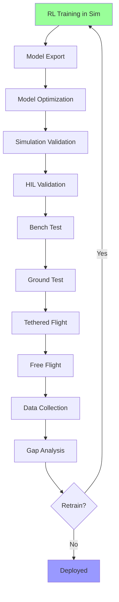

# Deployment & Sim-to-Real Transfer

## Overview

This document specifies the complete workflow for deploying trained RL agents from simulation to real hardware. Successful sim-to-real transfer is critical for the system's ultimate goal: autonomous flight control on physical aircraft.

## Deployment Pipeline



## Model Export

### ONNX Export

**Purpose**: Export PyTorch/TensorFlow models to cross-platform ONNX format.

**File**: `deployment/export_onnx.py`

```python
import torch
import torch.onnx
import numpy as np
from pathlib import Path
from stable_baselines3 import PPO, SAC, TD3

def export_sb3_to_onnx(model_path: str,
                       output_path: str,
                       obs_dim: int,
                       verify: bool = True):
    """
    Export Stable-Baselines3 model to ONNX.

    Args:
        model_path: Path to saved SB3 model (.zip)
        output_path: Output ONNX path
        obs_dim: Observation dimension
        verify: Verify exported model
    """
    # Load model
    model = PPO.load(model_path)

    # Extract policy network
    policy = model.policy

    # Create dummy input
    dummy_input = torch.randn(1, obs_dim)

    # Export to ONNX
    torch.onnx.export(
        policy,
        dummy_input,
        output_path,
        export_params=True,
        opset_version=11,
        do_constant_folding=True,
        input_names=['observation'],
        output_names=['action'],
        dynamic_axes={
            'observation': {0: 'batch_size'},
            'action': {0: 'batch_size'}
        }
    )

    print(f"Model exported to {output_path}")

    # Verify
    if verify:
        import onnx
        onnx_model = onnx.load(output_path)
        onnx.checker.check_model(onnx_model)
        print("ONNX model verified successfully")

        # Test inference
        import onnxruntime as ort
        ort_session = ort.InferenceSession(output_path)

        # Compare outputs
        with torch.no_grad():
            torch_out = policy(dummy_input)

        ort_inputs = {ort_session.get_inputs()[0].name: dummy_input.numpy()}
        ort_out = ort_session.run(None, ort_inputs)[0]

        np.testing.assert_allclose(
            torch_out.numpy(),
            ort_out,
            rtol=1e-3,
            atol=1e-5
        )
        print("ONNX output matches PyTorch output")


def export_custom_model_to_onnx(model: torch.nn.Module,
                                output_path: str,
                                input_shape: tuple):
    """
    Export custom PyTorch model to ONNX.

    Args:
        model: PyTorch model
        output_path: Output ONNX path
        input_shape: Input tensor shape
    """
    model.eval()

    dummy_input = torch.randn(*input_shape)

    torch.onnx.export(
        model,
        dummy_input,
        output_path,
        export_params=True,
        opset_version=11,
        input_names=['observation'],
        output_names=['action']
    )

    print(f"Model exported to {output_path}")
```

### TorchScript Export

**File**: `deployment/export_torchscript.py`

```python
import torch
from stable_baselines3 import PPO

def export_to_torchscript(model_path: str, output_path: str):
    """
    Export model to TorchScript.

    Args:
        model_path: Path to saved model
        output_path: Output TorchScript path
    """
    # Load model
    model = PPO.load(model_path)
    policy = model.policy
    policy.eval()

    # Trace or script
    dummy_input = torch.randn(1, policy.observation_space.shape[0])

    # Use tracing
    traced_model = torch.jit.trace(policy, dummy_input)

    # Save
    traced_model.save(output_path)

    print(f"TorchScript model saved to {output_path}")

    # Verify
    loaded = torch.jit.load(output_path)
    with torch.no_grad():
        output = loaded(dummy_input)
    print("TorchScript model verified")
```

## Model Optimization

### Quantization

**Purpose**: Reduce model size and increase inference speed for embedded deployment.

**File**: `deployment/optimize_model.py`

```python
import onnx
from onnxruntime.quantization import quantize_dynamic, QuantType

def quantize_onnx_model(model_path: str,
                        output_path: str,
                        weight_type: str = 'int8'):
    """
    Quantize ONNX model for faster inference.

    Args:
        model_path: Input ONNX model path
        output_path: Output quantized model path
        weight_type: 'int8' or 'uint8'
    """
    # Map weight type
    weight_type_map = {
        'int8': QuantType.QInt8,
        'uint8': QuantType.QUInt8
    }

    # Quantize
    quantize_dynamic(
        model_path,
        output_path,
        weight_type=weight_type_map[weight_type]
    )

    print(f"Quantized model saved to {output_path}")

    # Compare file sizes
    import os
    original_size = os.path.getsize(model_path) / 1024  # KB
    quantized_size = os.path.getsize(output_path) / 1024

    print(f"Original size: {original_size:.2f} KB")
    print(f"Quantized size: {quantized_size:.2f} KB")
    print(f"Compression ratio: {original_size / quantized_size:.2f}x")
```

### Pruning

**File**: `deployment/prune_model.py`

```python
import torch
import torch.nn.utils.prune as prune

def prune_model(model: torch.nn.Module,
                amount: float = 0.3,
                method: str = 'l1') -> torch.nn.Module:
    """
    Prune model weights to reduce size.

    Args:
        model: PyTorch model
        amount: Fraction of weights to prune (0-1)
        method: 'l1' or 'random'

    Returns:
        Pruned model
    """
    # Prune all linear and conv layers
    for name, module in model.named_modules():
        if isinstance(module, (torch.nn.Linear, torch.nn.Conv2d)):
            if method == 'l1':
                prune.l1_unstructured(module, name='weight', amount=amount)
            elif method == 'random':
                prune.random_unstructured(module, name='weight', amount=amount)

            # Make pruning permanent
            prune.remove(module, 'weight')

    print(f"Model pruned (amount={amount}, method={method})")

    return model
```

## Validation Checklist

**File**: `deployment/validation.py`

```python
from dataclasses import dataclass
from typing import List, Tuple
import numpy as np

@dataclass
class ValidationResult:
    """Validation test result."""
    name: str
    passed: bool
    metrics: dict
    notes: str


class DeploymentValidator:
    """Pre-deployment validation suite."""

    def __init__(self, config: dict):
        """
        Initialize validator.

        Args:
            config: Validation thresholds and parameters
        """
        self.config = config

    def run_all_checks(self) -> Tuple[bool, List[ValidationResult]]:
        """
        Run all validation checks.

        Returns:
            (all_passed, results): Overall pass/fail and detailed results
        """
        results = []

        # 1. Model export check
        results.append(self._check_model_export())

        # 2. Inference latency check
        results.append(self._check_inference_latency())

        # 3. Simulation validation
        results.append(self._check_sim_performance())

        # 4. HIL validation
        results.append(self._check_hil_performance())

        # 5. Safety checks
        results.append(self._check_safety_compliance())

        all_passed = all(r.passed for r in results)

        return all_passed, results

    def _check_model_export(self) -> ValidationResult:
        """Verify model exports without errors."""
        try:
            # Load ONNX model
            import onnx
            import onnxruntime as ort

            model_path = self.config["model_path"]
            onnx_model = onnx.load(model_path)
            onnx.checker.check_model(onnx_model)

            # Create inference session
            session = ort.InferenceSession(model_path)

            return ValidationResult(
                name="Model Export",
                passed=True,
                metrics={},
                notes="Model loads successfully"
            )
        except Exception as e:
            return ValidationResult(
                name="Model Export",
                passed=False,
                metrics={},
                notes=f"Export error: {e}"
            )

    def _check_inference_latency(self) -> ValidationResult:
        """Check inference latency meets real-time requirements."""
        import onnxruntime as ort
        import time

        model_path = self.config["model_path"]
        obs_dim = self.config["obs_dim"]
        max_latency_ms = self.config.get("max_latency_ms", 20)

        session = ort.InferenceSession(model_path)

        # Warm up
        dummy_input = np.random.randn(1, obs_dim).astype(np.float32)
        for _ in range(10):
            session.run(None, {'observation': dummy_input})

        # Measure latency
        latencies = []
        for _ in range(100):
            start = time.perf_counter()
            session.run(None, {'observation': dummy_input})
            end = time.perf_counter()
            latencies.append((end - start) * 1000)  # ms

        mean_latency = np.mean(latencies)
        max_measured = np.max(latencies)

        passed = mean_latency < max_latency_ms

        return ValidationResult(
            name="Inference Latency",
            passed=passed,
            metrics={
                "mean_ms": mean_latency,
                "max_ms": max_measured,
                "p95_ms": np.percentile(latencies, 95)
            },
            notes=f"{'PASS' if passed else 'FAIL'}: Mean latency {mean_latency:.2f} ms"
        )

    def _check_sim_performance(self) -> ValidationResult:
        """Validate agent performance in simulation."""
        # Run N episodes in simulation
        n_episodes = self.config.get("sim_validation_episodes", 100)
        success_threshold = self.config.get("sim_success_threshold", 0.8)

        # Placeholder - would actually run episodes
        successes = 85  # Mock
        success_rate = successes / n_episodes

        passed = success_rate >= success_threshold

        return ValidationResult(
            name="Simulation Performance",
            passed=passed,
            metrics={
                "episodes": n_episodes,
                "successes": successes,
                "success_rate": success_rate
            },
            notes=f"{'PASS' if passed else 'FAIL'}: {success_rate:.1%} success rate"
        )

    def _check_hil_performance(self) -> ValidationResult:
        """Validate agent in Hardware-in-the-Loop."""
        n_episodes = self.config.get("hil_validation_episodes", 50)
        success_threshold = self.config.get("hil_success_threshold", 0.7)

        # Placeholder
        successes = 38  # Mock
        success_rate = successes / n_episodes

        passed = success_rate >= success_threshold

        return ValidationResult(
            name="HIL Performance",
            passed=passed,
            metrics={
                "episodes": n_episodes,
                "successes": successes,
                "success_rate": success_rate
            },
            notes=f"{'PASS' if passed else 'FAIL'}: {success_rate:.1%} success rate"
        )

    def _check_safety_compliance(self) -> ValidationResult:
        """Verify safety checks are implemented."""
        # Check configuration has safety limits
        required_safety_params = [
            "aileron_max",
            "elevator_max",
            "altitude_min",
            "kill_switch_enabled"
        ]

        safety_config = self.config.get("safety", {})
        missing = [p for p in required_safety_params if p not in safety_config]

        passed = len(missing) == 0

        return ValidationResult(
            name="Safety Compliance",
            passed=passed,
            metrics={},
            notes=f"{'PASS' if passed else 'FAIL'}: Missing params: {missing}"
        )

    def print_report(self, results: List[ValidationResult]):
        """Print validation report."""
        print("\n" + "=" * 60)
        print("DEPLOYMENT VALIDATION REPORT")
        print("=" * 60)

        for result in results:
            status = "✓ PASS" if result.passed else "✗ FAIL"
            print(f"\n{status} - {result.name}")
            print(f"  {result.notes}")

            if result.metrics:
                print("  Metrics:")
                for key, value in result.metrics.items():
                    if isinstance(value, float):
                        print(f"    {key}: {value:.4f}")
                    else:
                        print(f"    {key}: {value}")

        print("\n" + "=" * 60)
        all_passed = all(r.passed for r in results)
        if all_passed:
            print("✓ ALL CHECKS PASSED - READY FOR DEPLOYMENT")
        else:
            print("✗ VALIDATION FAILED - DO NOT DEPLOY")
        print("=" * 60 + "\n")
```

## Deployment Script

**File**: `scripts/deploy_agent.sh`

```bash
#!/bin/bash
# deploy_agent.sh - Complete deployment pipeline

set -e  # Exit on error

AGENT_NAME=$1
MODEL_PATH=$2
TARGET_HOST=${3:-"jetson@192.168.1.100"}

if [ -z "$AGENT_NAME" ] || [ -z "$MODEL_PATH" ]; then
    echo "Usage: $0 <agent_name> <model_path> [target_host]"
    exit 1
fi

echo "========================================="
echo "Deploying Agent: $AGENT_NAME"
echo "Model: $MODEL_PATH"
echo "Target: $TARGET_HOST"
echo "========================================="

# Step 1: Export model to ONNX
echo "[1/6] Exporting model to ONNX..."
python deployment/export_onnx.py \
    --model-path "$MODEL_PATH" \
    --output "models/${AGENT_NAME}.onnx"

# Step 2: Optimize model
echo "[2/6] Optimizing model (quantization)..."
python deployment/optimize_model.py \
    --input "models/${AGENT_NAME}.onnx" \
    --output "models/${AGENT_NAME}_quantized.onnx"

# Step 3: Validation
echo "[3/6] Running validation checks..."
python deployment/validation.py \
    --model "models/${AGENT_NAME}_quantized.onnx" \
    --config "configs/validation/default.yaml"

# Check validation result
if [ $? -ne 0 ]; then
    echo "✗ Validation failed. Aborting deployment."
    exit 1
fi

# Step 4: Copy to target
echo "[4/6] Copying model to target hardware..."
scp "models/${AGENT_NAME}_quantized.onnx" \
    "$TARGET_HOST:/home/jetson/controls/models/"

# Step 5: Test inference on target
echo "[5/6] Testing inference on target..."
ssh "$TARGET_HOST" << 'EOF'
cd /home/jetson/controls
python deployment/test_inference.py \
    --model "models/${AGENT_NAME}_quantized.onnx"
EOF

# Step 6: HIL validation
echo "[6/6] Running HIL validation..."
python validation/hil_test.py \
    --model "models/${AGENT_NAME}_quantized.onnx" \
    --episodes 50

echo "========================================="
echo "✓ Deployment complete!"
echo "========================================="
echo ""
echo "Next steps:"
echo "1. Bench test (actuators without aircraft)"
echo "2. Ground test (powered on, no takeoff)"
echo "3. Tethered flight test"
echo "4. Free flight test (supervised)"
```

## Sim-to-Real Gap Analysis

**File**: `analysis/sim_to_real_gap.py`

```python
import numpy as np
import matplotlib.pyplot as plt
from typing import Dict, List
from dataclasses import dataclass

@dataclass
class PerformanceMetrics:
    """Performance metrics for gap analysis."""
    success_rate: float
    mean_tracking_error: float
    mean_control_effort: float
    episode_length: float


class SimToRealGapAnalyzer:
    """Analyze performance gap between simulation and real hardware."""

    def __init__(self):
        self.sim_metrics = None
        self.real_metrics = None

    def load_sim_data(self, log_path: str):
        """Load simulation performance data."""
        # Load from HDF5 logs
        # Placeholder
        self.sim_metrics = PerformanceMetrics(
            success_rate=0.87,
            mean_tracking_error=2.5,
            mean_control_effort=0.35,
            episode_length=120.0
        )

    def load_real_data(self, log_path: str):
        """Load real hardware performance data."""
        # Load from HDF5 logs
        # Placeholder
        self.real_metrics = PerformanceMetrics(
            success_rate=0.72,
            mean_tracking_error=4.1,
            mean_control_effort=0.52,
            episode_length=95.0
        )

    def compute_gap_metrics(self) -> Dict[str, float]:
        """
        Compute sim-to-real gap metrics.

        Returns:
            Dictionary of gap metrics
        """
        if self.sim_metrics is None or self.real_metrics is None:
            raise ValueError("Must load both sim and real data first")

        gap = {
            "success_rate_diff": self.real_metrics.success_rate - self.sim_metrics.success_rate,
            "tracking_error_ratio": self.real_metrics.mean_tracking_error / self.sim_metrics.mean_tracking_error,
            "control_effort_ratio": self.real_metrics.mean_control_effort / self.sim_metrics.mean_control_effort,
            "episode_length_ratio": self.real_metrics.episode_length / self.sim_metrics.episode_length
        }

        return gap

    def diagnose_gap(self) -> List[str]:
        """
        Diagnose causes of sim-to-real gap and suggest improvements.

        Returns:
            List of recommendations
        """
        gap = self.compute_gap_metrics()
        recommendations = []

        # Success rate
        if gap["success_rate_diff"] < -0.15:
            recommendations.append(
                "Warning: Large success rate gap detected. Consider:\n"
                "  - Increase domain randomization in simulation\n"
                "  - Add actuator delay modeling\n"
                "  - Increase sensor noise in training"
            )

        # Tracking error
        if gap["tracking_error_ratio"] > 1.5:
            recommendations.append(
                "Warning: Tracking error much higher on real hardware. Consider:\n"
                "  - Improve state estimation (tune EKF)\n"
                "  - Add latency compensation\n"
                "  - Retune controller gains"
            )

        # Control effort
        if gap["control_effort_ratio"] > 1.3:
            recommendations.append(
                "Warning: Higher control effort on real hardware. Consider:\n"
                "  - Increase control smoothing\n"
                "  - Add rate limits on control changes\n"
                "  - Check for measurement noise issues"
            )

        # Episode length
        if gap["episode_length_ratio"] < 0.7:
            recommendations.append(
                "Warning: Episodes terminating early on real hardware. Consider:\n"
                "  - Review safety limits (may be too strict)\n"
                "  - Check for sensor failures\n"
                "  - Validate hardware calibration"
            )

        if len(recommendations) == 0:
            recommendations.append("✓ Sim-to-real gap is acceptable (<20% on all metrics)")

        return recommendations

    def plot_comparison(self, save_path: str = None):
        """Plot sim vs real performance comparison."""
        metrics = ['Success Rate', 'Tracking Error', 'Control Effort', 'Episode Length']

        sim_values = [
            self.sim_metrics.success_rate,
            self.sim_metrics.mean_tracking_error,
            self.sim_metrics.mean_control_effort,
            self.sim_metrics.episode_length
        ]

        real_values = [
            self.real_metrics.success_rate,
            self.real_metrics.mean_tracking_error,
            self.real_metrics.mean_control_effort,
            self.real_metrics.episode_length
        ]

        # Normalize for comparison
        sim_norm = np.array(sim_values) / np.array(sim_values)  # All 1.0
        real_norm = np.array(real_values) / np.array(sim_values)

        x = np.arange(len(metrics))
        width = 0.35

        fig, ax = plt.subplots(figsize=(10, 6))

        ax.bar(x - width/2, sim_norm, width, label='Simulation', color='skyblue')
        ax.bar(x + width/2, real_norm, width, label='Real Hardware', color='coral')

        ax.set_ylabel('Normalized Performance')
        ax.set_title('Simulation vs Real Hardware Performance')
        ax.set_xticks(x)
        ax.set_xticklabels(metrics)
        ax.legend()
        ax.grid(axis='y', alpha=0.3)

        # Add horizontal line at 1.0
        ax.axhline(1.0, color='black', linestyle='--', alpha=0.5)

        plt.tight_layout()

        if save_path:
            plt.savefig(save_path, dpi=150)
        else:
            plt.show()
```

## Continuous Learning (Optional)

**File**: `deployment/continuous_learning.py`

```python
from stable_baselines3 import PPO
from environments.aircraft_env import AircraftEnv

def finetune_with_real_data(sim_model_path: str,
                            real_env_config: dict,
                            n_timesteps: int = 10000,
                            output_path: str = "models/finetuned.zip"):
    """
    Fine-tune simulation-trained model with real-world data.

    Args:
        sim_model_path: Path to simulation-trained model
        real_env_config: Configuration for real hardware environment
        n_timesteps: Number of timesteps to fine-tune
        output_path: Output path for fine-tuned model
    """
    print("Loading simulation-trained model...")
    model = PPO.load(sim_model_path)

    print("Creating real hardware environment...")
    real_env = AircraftEnv(real_env_config)

    print("Setting environment...")
    model.set_env(real_env)

    print(f"Fine-tuning for {n_timesteps} timesteps...")
    model.learn(total_timesteps=n_timesteps)

    print(f"Saving fine-tuned model to {output_path}")
    model.save(output_path)

    print("Fine-tuning complete!")
```

## Configuration Example

**File**: `configs/deployment/default.yaml`

```yaml
deployment:
  model_export:
    format: "onnx"  # or "torchscript"
    opset_version: 11

  optimization:
    quantize: true
    quantization_type: "int8"
    prune: false
    pruning_amount: 0.3

  validation:
    sim_validation_episodes: 100
    sim_success_threshold: 0.80

    hil_validation_episodes: 50
    hil_success_threshold: 0.70

    max_latency_ms: 20

    bench_test_required: true
    ground_test_required: true

  target:
    platform: "jetson_nano"  # or "raspberry_pi", "teensy"
    host: "jetson@192.168.1.100"
    model_dir: "/home/jetson/controls/models"

  safety:
    preflight_checks_required: true
    kill_switch_enabled: true
    geofence_enabled: true
    max_altitude_m: 500
    max_range_m: 500
```

---

**Document Status**: Complete
**Last Updated**: 2025-10-09
**Related Documents**: 06_RL_AGENT_TRAINING.md, 08_HARDWARE_INTERFACE.md, 09_DATA_FLOW.md
