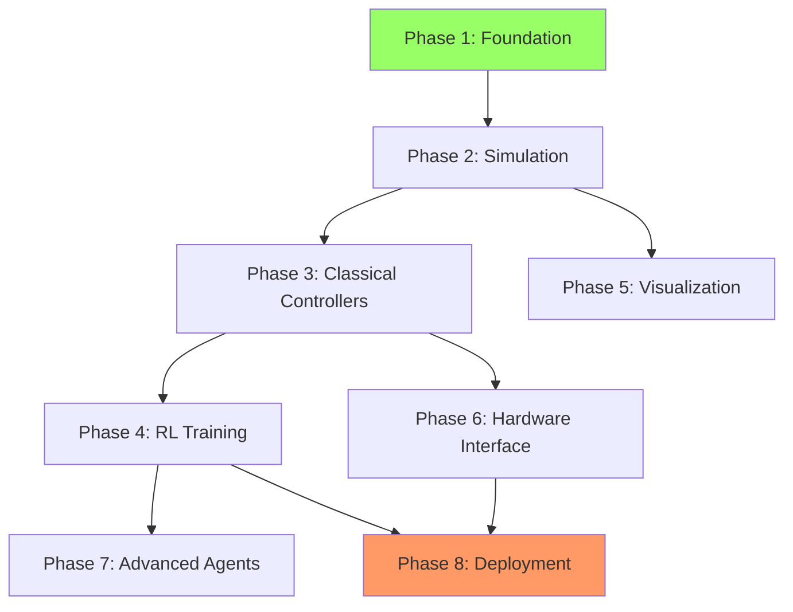

# Implementation Roadmap

## Overview

This document provides the **build order** and **timeline** for implementing the multi-level aircraft control system.

## Progress Summary

**Last Updated**: 2025-10-11

| Phase | Status | Completion | Notes |
|-------|--------|------------|-------|
| **Phase 1**: Foundation | Complete | 100% | All interfaces, types, and C++ bindings working |
| **Phase 2**: Simulation Backend | Complete | 100% | Simplified 6-DOF physics, visualization working |
| **Phase 3**: Classical Controllers | Complete | 95% | All 5 levels implemented, needs PID tuning |
| **Phase 4**: Visualization & Monitoring | Complete | 85% | Multi-aircraft system complete, web dashboard deferred |
| **Phase 5**: RL Training | Next | 0% | Ready to start (formerly Phase 4) |
| **Phase 6**: Hardware Interface | Future | 0% | - |
| **Phase 7**: Advanced Agents | Future | 0% | - |
| **Phase 8**: Deployment | Future | 0% | - |

**Overall Progress**: **4/8 phases complete** (50%)

**Total Tests Passing**: 132/132 (Phase 1&2: 83, Phase 4: 49)

**Lines of Code**: ~11,000+ lines

---

## Implementation Phases

### Phase 1: Foundation (Weeks 1-2)

**Goal**: Core abstractions and data types

**Tasks**:
- [x] Create project structure (Complete)
- [x] Define all data types in `controllers/types.py` (Complete)
- [x] Implement `BaseAgent` abstract class (Complete)
- [x] Implement `AircraftInterface` abstract class (Complete)
- [x] Implement `SensorInterface` abstract class (Complete)
- [x] Write interface unit tests (Complete - 34 tests passing)
- [x] Set up CMake build system for C++ components (Complete)
- [x] Configure Pybind11 bindings skeleton (Complete - 18 tests passing)

**Deliverables**:
- All interface contracts functional
- Data types validated
- Build system working
- Interface tests passing

**Dependencies**: None (start here)

---

### Phase 2: Simulation Backend (Week 3)

**Goal**: Working simulation environment

**Tasks**:
- [x] Implement `SimulationAircraftBackend` class (Complete)
- [x] Create simplified 6-DOF model (Complete)
- [x] Implement perfect sensor simulation (Complete - Phase 1)
- [x] Add configurable sensor noise (Complete - Phase 1)
- [x] Implement `SimulationSensorInterface` (Complete - Phase 1)
- [x] Create simulation configuration files (Complete)
- [x] Write simulation backend tests (Complete - 31 tests passing)
- [x] Create basic visualization (matplotlib plots) (Complete)

**Deliverables**:
- Aircraft simulates correctly in JSBSim
- Sensor data flows through interfaces
- Basic telemetry plots working

**Dependencies**: Phase 1 complete

---

### Phase 3: Classical Controllers (Weeks 4-5)

**Goal**: All 5 control levels working with classical control

**Status**: **COMPLETE** (2025-10-11)

**Architecture**: 5-level cascaded control hierarchy
- Level 1: Waypoint Navigation
- Level 2: HSA (Heading/Speed/Altitude) Control
- Level 3: Attitude Control (Angle Mode - outer loop)
- Level 4: Rate Control (Inner loop) **NEW**
- Level 5: Surface Control (formerly Level 4)

**Tasks**:
- [x] Adapt PID controllers to our system (multi-axis) (Complete)
- [x] Implement Level 5: Surface Agent (Complete)
- [x] Implement Level 4: Rate controller (C++ PID, inner loop) (Complete)
- [x] Implement Level 3: Attitude controller (cascaded, angle mode) (Complete)
- [x] Implement Level 2: HSA controller (Python) (Complete)
- [x] Implement Level 1: Waypoint guidance (Python) (Complete)
- [x] Create Pybind11 bindings for multi-axis C++ PID (Complete)
- [x] Create BaseAgent abstract class (Complete)
- [x] Create PID gains configuration file (Complete)
- [x] Create test flight script (Complete)
- [ ] Tune cascaded PID gains (TODO - needs systematic tuning)
- [ ] Write controller unit tests (TODO - manual integration test passing)

**Deliverables**:
- All 5 control levels implemented and functional
- Cascaded control architecture working (angle → rate → surface)
- C++ controllers callable from Python
- Configuration system for PID gains
- Test flight demonstrates cascaded control
- PID gains need tuning for stable flight
- Unit tests needed

**Files Created**: 11 files (~1,500 lines)
**Files Modified**: 4 files (~250 lines)

**Dependencies**: Phase 2 complete

---

### Phase 4: Visualization & Monitoring (Week 6)

**Goal**: Multi-aircraft visualization and monitoring system

**Status**: **COMPLETE** (2025-10-11)

**Architecture**: Multi-aircraft scalable design (1-100+ aircraft)

**Tasks**:
- [x] Implement `TelemetryLogger` (HDF5 backend, multi-aircraft) (Complete)
- [x] Implement `MultiAircraftPlotter` (matplotlib) (Complete)
- [x] Implement `FleetVisualizer3D` (PyVista + fallback) (Complete)
- [x] Implement `AircraftRegistry` (status tracking) (Complete)
- [x] Implement `MultiAircraftReplay` (synchronized playback) (Complete)
- [x] Create visualization configuration (YAML) (Complete)
- [x] Write visualization tests (49 tests) (Complete)
- [x] Create multi-aircraft demo (Complete)
- [ ] Create Plotly Dash web dashboard (Deferred)
- [ ] Add web control panel (Deferred)

**Deliverables**:
- Multi-aircraft HDF5 logging with compression
- Real-time multi-aircraft matplotlib plotter
- 3D fleet visualization (PyVista + matplotlib fallback)
- Aircraft registry with status tracking
- Replay system with interpolation and CSV export
- Configuration system (YAML)
- 49 tests passing
- Multi-aircraft demo (3 aircraft)
- Web dashboard (Plotly Dash) - deferred

**Files Created**: 9 files (~2,800 lines)
**Files Modified**: 3 files (~280 lines)

**Dependencies**: Phase 2 complete

---

### Phase 5: RL Training Infrastructure (Weeks 7-8)

**Goal**: Train RL agents at all control levels (multi-agent support)

**Status**: **READY TO START** (formerly Phase 4)

**Tasks**:
- [ ] Create Gymnasium/Gym environment wrapper (multi-aircraft support)
- [ ] Integrate Stable-Baselines3
- [ ] Define observation/action spaces per level (5 levels)
- [ ] Implement reward functions per level (5 levels)
- [ ] Set up vectorized environments (parallel training)
- [ ] Implement `RLAgent` class
- [ ] Create training scripts per level
- [ ] Set up TensorBoard monitoring (use Phase 4 logging)
- [ ] Implement curriculum learning
- [ ] Add domain randomization
- [ ] Train initial agents at each level (prioritize Level 4 & 5)
- [ ] Create agent evaluation framework
- [ ] Multi-agent training (optional: formation flight)

**Deliverables**:
- RL agents trainable at all 5 levels
- Multi-agent training pipeline
- Training pipeline automated
- Level 5 agent flies (easiest to train - direct surfaces)
- Level 4 agent flies (rate control)
- Performance baselines established
- Training visualizations integrated with Phase 4 system

**Dependencies**: Phase 3 complete, Phase 4 visualization available

---

### Phase 6: Hardware Interface (Weeks 9-10)

**Goal**: Real hardware integration

**Tasks**:
- [ ] Implement `HardwareAircraftBackend` class
- [ ] Implement serial communication protocol
- [ ] Implement `HardwareSensorInterface`
- [ ] Add Teensy/dRehmFlight communication
- [ ] Implement safety interlocks
- [ ] Add latency compensation
- [ ] Implement hardware state estimator (EKF/UKF)
- [ ] Create HIL simulator setup
- [ ] Write hardware interface tests
- [ ] Test with bench-mounted actuators
- [ ] Validate sensor data parsing

**Deliverables**:
- Hardware backend connects to Teensy
- Sensor data reads correctly
- Commands sent to actuators
- HIL setup validated

**Dependencies**: Phase 3 complete

---

### Phase 7: Advanced Agents (Week 11)

**Goal**: Hierarchical and adaptive agents

**Tasks**:
- [ ] Implement `HierarchicalAgent` (Level 1 + Level 3)
- [ ] Implement `AdaptiveLevelAgent` (dynamic switching)
- [ ] Implement `HybridAgent` (RL + safety controller)
- [ ] Train hierarchical agents
- [ ] Train adaptive meta-policies
- [ ] Validate in simulation
- [ ] Write advanced agent tests

**Deliverables**:
- Hierarchical agents functional
- Adaptive agents switch levels correctly
- Hybrid agents provide safety

**Dependencies**: Phase 4 complete

---

### Phase 8: Deployment & Real Flight (Week 12)

**Goal**: Sim-to-real transfer and real flight testing

**Tasks**:
- [ ] Export RL models (ONNX/TorchScript)
- [ ] Optimize models for embedded (quantization)
- [ ] Implement model loading on target hardware
- [ ] Create deployment pipeline scripts
- [ ] Validate agents in HIL
- [ ] Create preflight checklist
- [ ] Conduct ground tests
- [ ] Conduct real flight tests (classical controller)
- [ ] Conduct real flight tests (RL agent Level 3)
- [ ] Collect real-world data
- [ ] Analyze sim-to-real gap
- [ ] Write deployment documentation

**Deliverables**:
- RL agents deployed to real hardware
- Real flight successful
- Sim-to-real performance documented

**Dependencies**: Phases 4, 6 complete

---

## Dependency Graph

## Critical Path

**Critical path** (cannot be parallelized):
1. Phase 1 (Foundation) - 2 weeks
2. Phase 2 (Simulation) - 1 week
3. Phase 3 (Classical Controllers) - 2 weeks
4. Phase 4 (RL Training) - 2 weeks
5. Phase 8 (Deployment) - 1 week

**Minimum timeline**: 8 weeks

**Parallelizable**:
- Phase 5 (Visualization) can run parallel to Phase 3/4
- Phase 6 (Hardware) can run parallel to Phase 4/5

**Realistic timeline**: 12 weeks with one developer

---

## Quick Start (Minimal Viable Product)

For fastest path to working demo:

### Week 1: MVP
1. Create data types
2. Create interfaces
3. Implement simplified 6-DOF simulation (no JSBSim)
4. Implement Level 3 classical controller
5. Create basic matplotlib visualization

### Week 2: MVP Demo
1. Train Level 3 RL agent on simplified sim
2. Demo: RL agent flies and maintains altitude
3. Create presentation

**MVP Deliverable**: RL agent flying in simulation with basic control

---

## Testing Strategy

### Unit Tests (per phase)
- Interfaces: Mock implementations
- Controllers: Known inputs → expected outputs
- Agents: Valid actions, proper reset

### Integration Tests
- Agent + Simulation: 100 episodes, no crashes
- Classical controller: Stable flight for 60 seconds
- RL agent: Achieves > 80% success rate

### System Tests
- Full pipeline: Agent → Controller → Simulation → Logging
- Performance: Meets latency requirements
- Stress test: 1000 episodes without failure

### Hardware Tests (Phase 6+)
- HIL: Simulation + real Teensy
- Bench test: Real actuators, no flight
- Ground test: Powered on, no takeoff
- Flight test: Tethered then free flight

---

## Risk Mitigation

| Risk | Likelihood | Impact | Mitigation |
|------|-----------|--------|-----------|
| JSBSim integration difficult | Medium | High | Use simplified 6-DOF as backup |
| C++ PID extraction takes too long | Medium | Medium | Use Python PID initially |
| RL agents don't learn | Low | High | Start with Level 4 (easiest), use proven algorithms |
| Sim-to-real gap too large | High | High | Aggressive domain randomization, HIL testing |
| Hardware interface unreliable | Medium | Medium | Extensive HIL testing before flight |

---

## Success Metrics (by Phase)

### Phase 1-3: Classical Control
- Agent flies stably for 5 minutes
- Tracks waypoint within 5 meters
- Maintains altitude within 2 meters

### Phase 4: RL Training
- Level 4 agent learns in < 100k steps
- Level 3 agent achieves < 5° attitude error
- Training completes in < 6 hours (with parallelization)

### Phase 8: Deployment
- RL agent performs within 20% of sim performance on real hardware
- Zero crashes in 10 real flights
- Deployment takes < 5 minutes (model export to flight)

---

## Resources Required

### Computing
- **Development**: Laptop (8GB RAM, quad-core CPU)
- **Training**: GPU recommended (RTX 3060 or better) for RL
- **Deployment**: Jetson Nano or Raspberry Pi 4

### Hardware
- Teensy 4.0 or 4.1 microcontroller
- MPU6050 or MPU9250 IMU
- RC aircraft (fixed-wing or quadrotor)
- Bench test stand
- Safety equipment (kill switch, fire extinguisher)

### Time
- **Development**: 1 developer, 12 weeks full-time
- **Testing**: 2 developers for hardware phases (safety)

---

**Document Status**: Complete
**Last Updated**: 2025-10-09
**Related Documents**: All design docs
