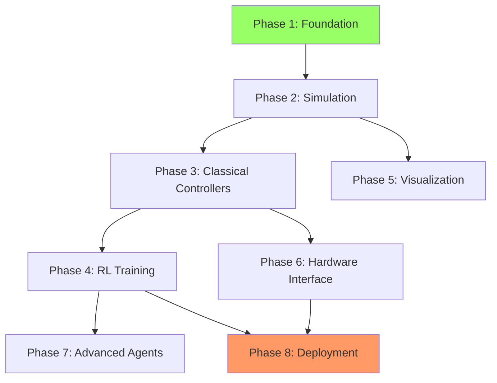

# Implementation Roadmap

## Overview

This document provides the **build order** and **timeline** for implementing the multi-level aircraft control system.

## Implementation Phases

### Phase 1: Foundation (Weeks 1-2)

**Goal**: Core abstractions and data types

**Tasks**:
- [x] Create project structure (✅ Complete)
- [x] Define all data types in `controllers/types.py` (✅ Complete)
- [ ] Implement `BaseAgent` abstract class
- [ ] Implement `AircraftInterface` abstract class
- [ ] Implement `SensorInterface` abstract class
- [ ] Write interface unit tests
- [ ] Set up CMake build system for C++ components
- [ ] Configure Pybind11 bindings skeleton

**Deliverables**:
- All interface contracts functional
- Data types validated
- Build system working
- Interface tests passing

**Dependencies**: None (start here)

---

### Phase 2: Simulation Backend (Week 3)

**Goal**: Working simulation environment

**Tasks**:
- [ ] Implement `SimulationAircraftBackend` class
- [ ] Integrate JSBSim (or create simplified 6-DOF model)
- [ ] Implement perfect sensor simulation
- [ ] Add configurable sensor noise
- [ ] Implement `SimulationSensorInterface`
- [ ] Create simulation configuration files
- [ ] Write simulation backend tests
- [ ] Create basic visualization (matplotlib plots)

**Deliverables**:
- Aircraft simulates correctly in JSBSim
- Sensor data flows through interfaces
- Basic telemetry plots working

**Dependencies**: Phase 1 complete

---

### Phase 3: Classical Controllers (Weeks 4-5)

**Goal**: All 4 control levels working with classical control

**Tasks**:
- [ ] Extract dRehmFlight C++ PID code
- [ ] Adapt PID controllers to our system
- [ ] Implement Level 4: Control mixer (C++)
- [ ] Implement Level 3: Attitude controller (Python wrapper)
- [ ] Implement Level 2: HSA controller (Python)
- [ ] Implement Level 1: Waypoint guidance (Python)
- [ ] Create Pybind11 bindings for C++ controllers
- [ ] Implement `ClassicalAgent` at each level
- [ ] Tune PID gains for stable flight
- [ ] Write controller tests

**Deliverables**:
- Classical PID agent flies stably at Level 3
- All 4 control levels functional
- C++ controllers callable from Python

**Dependencies**: Phase 2 complete

---

### Phase 4: RL Training Infrastructure (Weeks 6-7)

**Goal**: Train RL agents at all control levels

**Tasks**:
- [ ] Create Gymnasium/Gym environment wrapper
- [ ] Integrate Stable-Baselines3
- [ ] Define observation/action spaces per level
- [ ] Implement reward functions per level
- [ ] Set up vectorized environments (parallel training)
- [ ] Implement `RLAgent` class
- [ ] Create training scripts per level
- [ ] Set up TensorBoard monitoring
- [ ] Implement curriculum learning
- [ ] Add domain randomization
- [ ] Train initial agents at each level
- [ ] Create agent evaluation framework

**Deliverables**:
- RL agents trainable at all 4 levels
- Training pipeline automated
- Level 4 agent flies (easiest to train)
- Performance baselines established

**Dependencies**: Phase 3 complete

---

### Phase 5: Visualization & Monitoring (Week 8)

**Goal**: Complete telemetry and visualization system

**Tasks**:
- [ ] Implement `TelemetryLogger` (HDF5 backend)
- [ ] Implement `RealtimePlotter` (matplotlib/plotly)
- [ ] Implement `Aircraft3DVisualizer` (PyVista or matplotlib 3D)
- [ ] Create Plotly Dash web dashboard
- [ ] Add control panel (mode selection, parameters)
- [ ] Add telemetry display (all state variables)
- [ ] Add 3D aircraft view
- [ ] Add training progress visualization
- [ ] Implement playback/replay from logs
- [ ] Write visualization tests

**Deliverables**:
- Web dashboard functional
- Real-time telemetry plots working
- 3D visualization integrated
- Data logging to HDF5

**Dependencies**: Phase 2 complete (can run parallel to Phase 4)

---

### Phase 6: Hardware Interface (Weeks 9-10)

**Goal**: Real hardware integration

**Tasks**:
- [ ] Implement `HardwareAircraftBackend` class
- [ ] Implement serial communication protocol
- [ ] Implement `HardwareSensorInterface`
- [ ] Add Teensy/dRehmFlight communication
- [ ] Implement safety interlocks
- [ ] Add latency compensation
- [ ] Implement hardware state estimator (EKF/UKF)
- [ ] Create HIL simulator setup
- [ ] Write hardware interface tests
- [ ] Test with bench-mounted actuators
- [ ] Validate sensor data parsing

**Deliverables**:
- Hardware backend connects to Teensy
- Sensor data reads correctly
- Commands sent to actuators
- HIL setup validated

**Dependencies**: Phase 3 complete

---

### Phase 7: Advanced Agents (Week 11)

**Goal**: Hierarchical and adaptive agents

**Tasks**:
- [ ] Implement `HierarchicalAgent` (Level 1 + Level 3)
- [ ] Implement `AdaptiveLevelAgent` (dynamic switching)
- [ ] Implement `HybridAgent` (RL + safety controller)
- [ ] Train hierarchical agents
- [ ] Train adaptive meta-policies
- [ ] Validate in simulation
- [ ] Write advanced agent tests

**Deliverables**:
- Hierarchical agents functional
- Adaptive agents switch levels correctly
- Hybrid agents provide safety

**Dependencies**: Phase 4 complete

---

### Phase 8: Deployment & Real Flight (Week 12)

**Goal**: Sim-to-real transfer and real flight testing

**Tasks**:
- [ ] Export RL models (ONNX/TorchScript)
- [ ] Optimize models for embedded (quantization)
- [ ] Implement model loading on target hardware
- [ ] Create deployment pipeline scripts
- [ ] Validate agents in HIL
- [ ] Create preflight checklist
- [ ] Conduct ground tests
- [ ] Conduct real flight tests (classical controller)
- [ ] Conduct real flight tests (RL agent Level 3)
- [ ] Collect real-world data
- [ ] Analyze sim-to-real gap
- [ ] Write deployment documentation

**Deliverables**:
- RL agents deployed to real hardware
- Real flight successful
- Sim-to-real performance documented

**Dependencies**: Phases 4, 6 complete

---

## Dependency Graph

## Critical Path

**Critical path** (cannot be parallelized):
1. Phase 1 (Foundation) - 2 weeks
2. Phase 2 (Simulation) - 1 week
3. Phase 3 (Classical Controllers) - 2 weeks
4. Phase 4 (RL Training) - 2 weeks
5. Phase 8 (Deployment) - 1 week

**Minimum timeline**: 8 weeks

**Parallelizable**:
- Phase 5 (Visualization) can run parallel to Phase 3/4
- Phase 6 (Hardware) can run parallel to Phase 4/5

**Realistic timeline**: 12 weeks with one developer

---

## Quick Start (Minimal Viable Product)

For fastest path to working demo:

### Week 1: MVP
1. ✅ Create data types
2. ✅ Create interfaces
3. Implement simplified 6-DOF simulation (no JSBSim)
4. Implement Level 3 classical controller
5. Create basic matplotlib visualization

### Week 2: MVP Demo
1. Train Level 3 RL agent on simplified sim
2. Demo: RL agent flies and maintains altitude
3. Create presentation

**MVP Deliverable**: RL agent flying in simulation with basic control

---

## Testing Strategy

### Unit Tests (per phase)
- Interfaces: Mock implementations
- Controllers: Known inputs → expected outputs
- Agents: Valid actions, proper reset

### Integration Tests
- Agent + Simulation: 100 episodes, no crashes
- Classical controller: Stable flight for 60 seconds
- RL agent: Achieves > 80% success rate

### System Tests
- Full pipeline: Agent → Controller → Simulation → Logging
- Performance: Meets latency requirements
- Stress test: 1000 episodes without failure

### Hardware Tests (Phase 6+)
- HIL: Simulation + real Teensy
- Bench test: Real actuators, no flight
- Ground test: Powered on, no takeoff
- Flight test: Tethered then free flight

---

## Risk Mitigation

| Risk | Likelihood | Impact | Mitigation |
|------|-----------|--------|-----------|
| JSBSim integration difficult | Medium | High | Use simplified 6-DOF as backup |
| C++ PID extraction takes too long | Medium | Medium | Use Python PID initially |
| RL agents don't learn | Low | High | Start with Level 4 (easiest), use proven algorithms |
| Sim-to-real gap too large | High | High | Aggressive domain randomization, HIL testing |
| Hardware interface unreliable | Medium | Medium | Extensive HIL testing before flight |

---

## Success Metrics (by Phase)

### Phase 1-3: Classical Control
- ✅ Agent flies stably for 5 minutes
- ✅ Tracks waypoint within 5 meters
- ✅ Maintains altitude within 2 meters

### Phase 4: RL Training
- ✅ Level 4 agent learns in < 100k steps
- ✅ Level 3 agent achieves < 5° attitude error
- ✅ Training completes in < 6 hours (with parallelization)

### Phase 8: Deployment
- ✅ RL agent performs within 20% of sim performance on real hardware
- ✅ Zero crashes in 10 real flights
- ✅ Deployment takes < 5 minutes (model export to flight)

---

## Resources Required

### Computing
- **Development**: Laptop (8GB RAM, quad-core CPU)
- **Training**: GPU recommended (RTX 3060 or better) for RL
- **Deployment**: Jetson Nano or Raspberry Pi 4

### Hardware
- Teensy 4.0 or 4.1 microcontroller
- MPU6050 or MPU9250 IMU
- RC aircraft (fixed-wing or quadrotor)
- Bench test stand
- Safety equipment (kill switch, fire extinguisher)

### Time
- **Development**: 1 developer, 12 weeks full-time
- **Testing**: 2 developers for hardware phases (safety)

---

**Document Status**: ✅ Complete
**Last Updated**: 2025-10-09
**Related Documents**: All design docs
