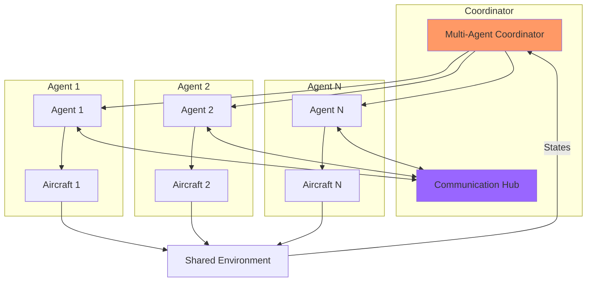

# Multi-Agent & Multi-Aircraft Systems

## Overview

This document specifies the architecture and implementation for **multi-agent control** and **multi-aircraft coordination**. This enables swarm operations, formation flight, distributed control, and multi-agent reinforcement learning experiments.

## Use Cases

### Use Case 1: Formation Flight
- Multiple aircraft maintain relative positions
- Leader-follower or distributed consensus control
- Applications: Aerial refueling, cooperative transport

### Use Case 2: Swarm Operations
- Large number of agents (10-100+)
- Decentralized control, emergent behavior
- Applications: Search and rescue, area coverage

### Use Case 3: Multi-Agent RL Training
- Cooperative tasks (formation maintenance)
- Competitive tasks (adversarial scenarios)
- Mixed objectives (capture the flag)

### Use Case 4: Heterogeneous Fleet
- Different aircraft types (fixed-wing + quadrotor)
- Different control strategies per aircraft
- Applications: Multi-role missions

### Use Case 5: Distributed Sensing
- Multiple aircraft collect sensor data
- Cooperative path planning for coverage
- Applications: Environmental monitoring, mapping

---

## Architecture



---

## Core Abstractions

### 1. MultiAgentCoordinator

**File**: `multi_agent/coordinator.py`

```python
from typing import List, Dict, Optional
import numpy as np
from controllers.types import AircraftState, ControlCommand
from interfaces.agent import BaseAgent
from interfaces.aircraft import AircraftInterface

class MultiAgentCoordinator:
    """
    Coordinates multiple agents and aircraft in a single simulation.

    Responsibilities:
    - Manages agent-aircraft assignments
    - Handles communication between agents
    - Synchronizes simulation steps
    - Aggregates observations (e.g., neighbor states)
    - Detects collisions
    """

    def __init__(self, config: dict):
        """
        Initialize multi-agent coordinator.

        Args:
            config: Configuration with:
                - num_agents: int
                - agent_configs: List[dict]
                - aircraft_configs: List[dict]
                - communication: dict (range, bandwidth, delay)
                - collision_detection: dict
        """
        self.config = config
        self.num_agents = config["num_agents"]

        # Create agents
        self.agents: List[BaseAgent] = []
        for agent_config in config["agent_configs"]:
            agent = self._create_agent(agent_config)
            self.agents.append(agent)

        # Create aircraft backends
        self.aircraft: List[AircraftInterface] = []
        for aircraft_config in config["aircraft_configs"]:
            backend = self._create_aircraft(aircraft_config)
            self.aircraft.append(backend)

        # Communication
        self.comm_range = config.get("communication", {}).get("range", np.inf)
        self.comm_delay = config.get("communication", {}).get("delay", 0.0)
        self.message_queue = []

        # Collision detection
        self.collision_radius = config.get("collision_detection", {}).get("radius", 5.0)
        self.collision_detected = False

        # Current states
        self.states: List[AircraftState] = [None] * self.num_agents

    def reset(self) -> List[np.ndarray]:
        """
        Reset all agents and aircraft.

        Returns:
            List of initial observations (one per agent)
        """
        observations = []

        for i, (agent, aircraft) in enumerate(zip(self.agents, self.aircraft)):
            # Reset aircraft
            initial_state = self._get_initial_state(i)
            state = aircraft.reset(initial_state)
            self.states[i] = state

            # Reset agent
            agent.reset(state)

            # Get observation (includes neighbor information)
            obs = self._get_observation(i)
            observations.append(obs)

        self.collision_detected = False
        return observations

    def step(self, dt: float) -> tuple:
        """
        Step all agents and aircraft forward.

        Args:
            dt: Time step

        Returns:
            observations, rewards, dones, infos (lists)
        """
        # 1. Get actions from all agents
        actions = []
        for i, agent in enumerate(self.agents):
            obs = self._get_observation(i)
            action = agent.get_action(obs)
            actions.append(action)

        # 2. Apply actions to aircraft
        for i, (action, aircraft) in enumerate(zip(actions, self.aircraft)):
            # Convert action to control surfaces
            surfaces = self._action_to_surfaces(action, i)
            aircraft.set_controls(surfaces)

        # 3. Step all aircraft (parallel if using vectorized envs)
        for i, aircraft in enumerate(self.aircraft):
            self.states[i] = aircraft.step(dt)

        # 4. Check for collisions
        self._check_collisions()

        # 5. Compute rewards
        rewards = [self._compute_reward(i) for i in range(self.num_agents)]

        # 6. Check termination
        dones = [self._is_done(i) for i in range(self.num_agents)]

        # 7. Get observations
        observations = [self._get_observation(i) for i in range(self.num_agents)]

        # 8. Info dict
        infos = [self._get_info(i) for i in range(self.num_agents)]

        return observations, rewards, dones, infos

    def _get_observation(self, agent_id: int) -> np.ndarray:
        """
        Get observation for agent including neighbor information.

        Args:
            agent_id: Agent index

        Returns:
            Augmented observation including:
            - Own state
            - Neighbor positions/velocities (within comm range)
            - Global task information
        """
        own_state = self.states[agent_id]

        # Own state features
        own_obs = np.array([
            own_state.position[0],
            own_state.position[1],
            own_state.position[2],
            own_state.velocity[0],
            own_state.velocity[1],
            own_state.velocity[2],
            own_state.attitude[0],
            own_state.attitude[1],
            own_state.attitude[2],
            own_state.angular_rate[0],
            own_state.angular_rate[1],
            own_state.angular_rate[2],
        ])

        # Neighbor observations (relative positions/velocities)
        neighbor_obs = self._get_neighbor_observations(agent_id)

        # Task-specific observations (e.g., formation target)
        task_obs = self._get_task_observations(agent_id)

        # Concatenate
        obs = np.concatenate([own_obs, neighbor_obs, task_obs])

        return obs

    def _get_neighbor_observations(self, agent_id: int) -> np.ndarray:
        """
        Get observations of neighboring agents within communication range.

        Returns fixed-size array (padding with zeros if fewer neighbors).
        """
        max_neighbors = self.config.get("max_neighbors", 5)
        neighbor_features = 6  # [rel_x, rel_y, rel_z, rel_vx, rel_vy, rel_vz]

        own_pos = self.states[agent_id].position
        own_vel = self.states[agent_id].velocity

        neighbors = []

        for i in range(self.num_agents):
            if i == agent_id:
                continue

            # Check communication range
            neighbor_pos = self.states[i].position
            distance = np.linalg.norm(neighbor_pos - own_pos)

            if distance <= self.comm_range:
                # Relative position and velocity
                rel_pos = neighbor_pos - own_pos
                rel_vel = self.states[i].velocity - own_vel

                neighbors.append(np.concatenate([rel_pos, rel_vel]))

        # Sort by distance and take closest K
        neighbors = sorted(neighbors, key=lambda x: np.linalg.norm(x[:3]))[:max_neighbors]

        # Pad to fixed size
        while len(neighbors) < max_neighbors:
            neighbors.append(np.zeros(neighbor_features))

        return np.concatenate(neighbors)

    def _get_task_observations(self, agent_id: int) -> np.ndarray:
        """Task-specific observations (override in subclasses)."""
        # Example: Formation flying target
        formation_offset = self.config.get("formation", {}).get("offsets", [])[agent_id]
        leader_pos = self.states[0].position  # Assume agent 0 is leader

        target_pos = leader_pos + np.array(formation_offset)
        current_pos = self.states[agent_id].position

        error = target_pos - current_pos

        return error

    def _check_collisions(self):
        """Check for collisions between aircraft."""
        for i in range(self.num_agents):
            for j in range(i + 1, self.num_agents):
                distance = np.linalg.norm(
                    self.states[i].position - self.states[j].position
                )

                if distance < self.collision_radius:
                    print(f"COLLISION detected between agents {i} and {j}")
                    self.collision_detected = True

    def _compute_reward(self, agent_id: int) -> float:
        """
        Compute reward for agent (override for specific tasks).

        Default: Formation flying reward
        """
        # Formation error
        formation_error = np.linalg.norm(self._get_task_observations(agent_id))

        # Collision penalty
        collision_penalty = -1000.0 if self.collision_detected else 0.0

        # Proximity penalty (discourage getting too close)
        proximity_penalty = 0.0
        min_safe_distance = self.collision_radius * 2.0
        for i in range(self.num_agents):
            if i == agent_id:
                continue
            distance = np.linalg.norm(
                self.states[agent_id].position - self.states[i].position
            )
            if distance < min_safe_distance:
                proximity_penalty += -10.0 * (min_safe_distance - distance)

        # Formation reward
        formation_reward = -formation_error

        total_reward = formation_reward + collision_penalty + proximity_penalty

        return total_reward

    def _is_done(self, agent_id: int) -> bool:
        """Check if episode is done for this agent."""
        # Done if collision detected
        if self.collision_detected:
            return True

        # Done if out of bounds
        altitude = self.states[agent_id].altitude
        if altitude < 10.0 or altitude > 1000.0:
            return True

        return False

    def _get_info(self, agent_id: int) -> dict:
        """Get info dict for agent."""
        return {
            "collision": self.collision_detected,
            "num_neighbors": self._count_neighbors(agent_id),
            "formation_error": np.linalg.norm(self._get_task_observations(agent_id)),
        }

    def _count_neighbors(self, agent_id: int) -> int:
        """Count neighbors within communication range."""
        count = 0
        own_pos = self.states[agent_id].position

        for i in range(self.num_agents):
            if i == agent_id:
                continue

            distance = np.linalg.norm(self.states[i].position - own_pos)
            if distance <= self.comm_range:
                count += 1

        return count

    def _create_agent(self, config: dict) -> BaseAgent:
        """Factory method to create agent from config."""
        from agents.classical_agent import ClassicalAgent
        from agents.rl_agent import RLAgent

        agent_type = config["type"]

        if agent_type == "classical":
            return ClassicalAgent(config)
        elif agent_type == "rl":
            return RLAgent(config)
        else:
            raise ValueError(f"Unknown agent type: {agent_type}")

    def _create_aircraft(self, config: dict) -> AircraftInterface:
        """Factory method to create aircraft from config."""
        from simulation.jsbsim_backend import JSBSimBackend
        from simulation.simplified_backend import SimplifiedBackend

        backend_type = config["backend"]

        if backend_type == "jsbsim":
            return JSBSimBackend(config)
        elif backend_type == "simplified":
            return SimplifiedBackend(config)
        else:
            raise ValueError(f"Unknown backend type: {backend_type}")

    def _get_initial_state(self, agent_id: int) -> AircraftState:
        """Get initial state for agent (can be formation-based)."""
        # Example: Stagger agents in formation
        base_config = self.config["aircraft_configs"][agent_id]["initial_conditions"]

        offset = self.config.get("formation", {}).get("offsets", [[0, 0, 0]])[agent_id]

        from controllers.types import AircraftState
        import numpy as np

        return AircraftState(
            time=0.0,
            position=np.array([offset[0], offset[1], -base_config.get("altitude", 100)]),
            velocity=np.array([base_config.get("airspeed", 20), 0, 0]),
            attitude=np.zeros(3),
            angular_rate=np.zeros(3),
            airspeed=base_config.get("airspeed", 20),
            altitude=base_config.get("altitude", 100),
        )

    def _action_to_surfaces(self, action: ControlCommand, agent_id: int):
        """Convert agent action to control surfaces (delegates to agent's level)."""
        # This would use the agent's control level to convert
        # For now, simplified
        from controllers.types import ControlSurfaces
        return ControlSurfaces(
            aileron=action.stick_roll if hasattr(action, 'stick_roll') else 0,
            elevator=action.stick_pitch if hasattr(action, 'stick_pitch') else 0,
            rudder=action.stick_yaw if hasattr(action, 'stick_yaw') else 0,
            throttle=action.throttle if hasattr(action, 'throttle') else 0.5,
        )
```

---

## Multi-Agent RL Environment

### Gymnasium Multi-Agent Environment

**File**: `environments/multi_agent_env.py`

```python
import gymnasium as gym
import numpy as np
from typing import List, Dict
from multi_agent.coordinator import MultiAgentCoordinator

class MultiAgentAircraftEnv(gym.Env):
    """
    Multi-agent aircraft control environment.

    Compatible with:
    - RLlib (multi-agent API)
    - PettingZoo (parallel environment)
    - Custom multi-agent training loops
    """

    def __init__(self, config: dict):
        """
        Initialize multi-agent environment.

        Args:
            config: Configuration for MultiAgentCoordinator
        """
        self.config = config
        self.coordinator = MultiAgentCoordinator(config)

        self.num_agents = config["num_agents"]

        # Define observation and action spaces (same for all agents for now)
        self._setup_spaces()

        # Agent IDs
        self.agent_ids = [f"agent_{i}" for i in range(self.num_agents)]

    def _setup_spaces(self):
        """Setup observation and action spaces."""
        # Observation: own state (12) + neighbors (5*6=30) + task (3) = 45D
        obs_dim = 12 + (self.config.get("max_neighbors", 5) * 6) + 3
        self.observation_space = gym.spaces.Box(
            low=-np.inf,
            high=np.inf,
            shape=(obs_dim,),
            dtype=np.float32
        )

        # Action: Level 3 (stick commands)
        self.action_space = gym.spaces.Box(
            low=np.array([-1, -1, -1, 0]),
            high=np.array([1, 1, 1, 1]),
            dtype=np.float32
        )

    def reset(self, seed=None, options=None):
        """Reset environment."""
        super().reset(seed=seed)

        observations = self.coordinator.reset()

        # Convert to dict format (for RLlib)
        obs_dict = {
            agent_id: obs
            for agent_id, obs in zip(self.agent_ids, observations)
        }

        info_dict = {agent_id: {} for agent_id in self.agent_ids}

        return obs_dict, info_dict

    def step(self, actions: Dict[str, np.ndarray]):
        """
        Step environment with actions from all agents.

        Args:
            actions: Dict mapping agent_id -> action

        Returns:
            observations, rewards, terminateds, truncateds, infos (all dicts)
        """
        # Convert actions dict to list
        action_list = [actions[agent_id] for agent_id in self.agent_ids]

        # Step coordinator
        obs_list, reward_list, done_list, info_list = self.coordinator.step(dt=0.02)

        # Convert to dicts
        obs_dict = {agent_id: obs for agent_id, obs in zip(self.agent_ids, obs_list)}
        reward_dict = {agent_id: reward for agent_id, reward in zip(self.agent_ids, reward_list)}
        terminated_dict = {agent_id: done for agent_id, done in zip(self.agent_ids, done_list)}
        truncated_dict = {agent_id: False for agent_id in self.agent_ids}
        info_dict = {agent_id: info for agent_id, info in zip(self.agent_ids, info_list)}

        # Add "__all__" key for RLlib
        terminated_dict["__all__"] = all(done_list)
        truncated_dict["__all__"] = False

        return obs_dict, reward_dict, terminated_dict, truncated_dict, info_dict
```

---

## Training Multi-Agent RL

### RLlib Example

**File**: `training/train_multi_agent_rllib.py`

```python
from ray import tune
from ray.rllib.algorithms.ppo import PPOConfig
from environments.multi_agent_env import MultiAgentAircraftEnv

def train_multi_agent_formation():
    """Train multi-agent formation flying with RLlib."""

    env_config = {
        "num_agents": 4,
        "agent_configs": [
            {"type": "rl", "control_level": "stick"} for _ in range(4)
        ],
        "aircraft_configs": [
            {
                "backend": "simplified",
                "mass": 1.5,
                "inertia": [0.08, 0.12, 0.15],
                "initial_conditions": {"altitude": 100, "airspeed": 20},
                "aerodynamics": {},
            }
            for _ in range(4)
        ],
        "communication": {"range": 500.0},
        "collision_detection": {"radius": 5.0},
        "formation": {
            "offsets": [
                [0, 0, 0],      # Leader
                [-20, -20, 0],  # Left wing
                [-20, 20, 0],   # Right wing
                [-40, 0, 0],    # Tail
            ]
        },
        "max_neighbors": 3,
    }

    config = (
        PPOConfig()
        .environment(MultiAgentAircraftEnv, env_config=env_config)
        .framework("torch")
        .training(
            train_batch_size=4000,
            sgd_minibatch_size=128,
            num_sgd_iter=10,
        )
        .multi_agent(
            policies={
                "shared_policy": (None, None, None, {}),
            },
            policy_mapping_fn=lambda agent_id, episode, **kwargs: "shared_policy",
        )
        .rollouts(num_rollout_workers=4)
    )

    tune.run(
        "PPO",
        config=config.to_dict(),
        stop={"training_iteration": 500},
        checkpoint_freq=10,
    )


if __name__ == "__main__":
    train_multi_agent_formation()
```

---

## Communication Protocols

### Message Passing

**File**: `multi_agent/communication.py`

```python
from dataclasses import dataclass
from typing import Any, List
import numpy as np

@dataclass
class Message:
    """Message passed between agents."""
    sender_id: int
    receiver_id: int  # -1 for broadcast
    timestamp: float
    content: Any
    priority: int = 0


class CommunicationHub:
    """
    Simulates communication between agents.

    Features:
    - Limited range
    - Latency
    - Packet loss
    - Bandwidth limits
    """

    def __init__(self, config: dict):
        """
        Initialize communication hub.

        Args:
            config: Communication parameters:
                - range: float (meters)
                - latency: float (seconds)
                - packet_loss_rate: float (0-1)
                - bandwidth: float (messages/second)
        """
        self.range = config.get("range", np.inf)
        self.latency = config.get("latency", 0.0)
        self.packet_loss = config.get("packet_loss_rate", 0.0)
        self.bandwidth = config.get("bandwidth", np.inf)

        # Message queue
        self.messages: List[Message] = []

    def send_message(self, message: Message, sender_pos: np.ndarray,
                     receiver_pos: np.ndarray, current_time: float):
        """
        Send message from sender to receiver.

        Args:
            message: Message to send
            sender_pos: Sender position
            receiver_pos: Receiver position (ignored for broadcast)
            current_time: Current simulation time
        """
        # Check range (for unicast)
        if message.receiver_id != -1:
            distance = np.linalg.norm(receiver_pos - sender_pos)
            if distance > self.range:
                return  # Out of range

        # Simulate packet loss
        if np.random.rand() < self.packet_loss:
            return  # Packet lost

        # Add latency
        message.timestamp = current_time + self.latency

        # Add to queue
        self.messages.append(message)

    def get_messages(self, receiver_id: int, current_time: float) -> List[Message]:
        """
        Get messages for receiver that have arrived.

        Args:
            receiver_id: Receiver agent ID
            current_time: Current simulation time

        Returns:
            List of messages for this receiver
        """
        received = []

        for msg in self.messages[:]:
            # Check if message is for this receiver or broadcast
            if msg.receiver_id == receiver_id or msg.receiver_id == -1:
                # Check if message has arrived
                if msg.timestamp <= current_time:
                    received.append(msg)
                    self.messages.remove(msg)

        return received

    def clear(self):
        """Clear all messages."""
        self.messages.clear()
```

---

## Cooperative Task Examples

### 1. Formation Flying

**File**: `tasks/formation_flying.py`

```python
import numpy as np

class FormationFlying:
    """Formation flying task coordinator."""

    def __init__(self, formation_type: str, num_agents: int):
        """
        Initialize formation.

        Args:
            formation_type: "v", "line", "diamond", "circle"
            num_agents: Number of agents
        """
        self.formation_type = formation_type
        self.num_agents = num_agents
        self.offsets = self._compute_offsets()

    def _compute_offsets(self) -> List[np.ndarray]:
        """Compute formation offsets based on type."""
        if self.formation_type == "v":
            # V formation (leader at front)
            offsets = [[0, 0, 0]]  # Leader
            spacing = 20.0
            for i in range(1, self.num_agents):
                side = 1 if i % 2 == 0 else -1
                row = (i + 1) // 2
                offsets.append([-row * spacing, side * row * spacing * 0.5, 0])

        elif self.formation_type == "line":
            # Line abreast
            spacing = 20.0
            offsets = [[0, i * spacing - (self.num_agents - 1) * spacing / 2, 0]
                       for i in range(self.num_agents)]

        elif self.formation_type == "diamond":
            # Diamond formation (4 agents)
            offsets = [
                [0, 0, 0],      # Front
                [-20, -20, 0],  # Left
                [-20, 20, 0],   # Right
                [-40, 0, 0],    # Rear
            ]

        elif self.formation_type == "circle":
            # Circle formation
            radius = 30.0
            offsets = []
            for i in range(self.num_agents):
                angle = 2 * np.pi * i / self.num_agents
                offsets.append([radius * np.cos(angle), radius * np.sin(angle), 0])

        return offsets

    def get_target_position(self, agent_id: int, leader_pos: np.ndarray) -> np.ndarray:
        """Get target position for agent in formation."""
        return leader_pos + self.offsets[agent_id]
```

### 2. Area Coverage

**File**: `tasks/area_coverage.py`

```python
class AreaCoverage:
    """Coordinate agents to cover an area efficiently."""

    def __init__(self, area_bounds: tuple, num_agents: int):
        """
        Initialize area coverage task.

        Args:
            area_bounds: ((min_x, max_x), (min_y, max_y))
            num_agents: Number of agents
        """
        self.bounds = area_bounds
        self.num_agents = num_agents

        # Partition area into zones
        self.zones = self._partition_area()

    def _partition_area(self) -> List[tuple]:
        """Partition area into zones (simple grid)."""
        (min_x, max_x), (min_y, max_y) = self.bounds

        # Grid partitioning
        rows = int(np.sqrt(self.num_agents))
        cols = (self.num_agents + rows - 1) // rows

        dx = (max_x - min_x) / cols
        dy = (max_y - min_y) / rows

        zones = []
        for i in range(self.num_agents):
            col = i % cols
            row = i // cols

            zone = (
                (min_x + col * dx, min_x + (col + 1) * dx),
                (min_y + row * dy, min_y + (row + 1) * dy),
            )
            zones.append(zone)

        return zones

    def get_zone_waypoint(self, agent_id: int) -> np.ndarray:
        """Get waypoint for agent's zone center."""
        (min_x, max_x), (min_y, max_y) = self.zones[agent_id]

        center_x = (min_x + max_x) / 2
        center_y = (min_y + max_y) / 2

        return np.array([center_x, center_y, -100])  # Fixed altitude
```

---

## Configuration Example

**File**: `configs/multi_agent/formation_4_aircraft.yaml`

```yaml
multi_agent:
  num_agents: 4

  # Agent configurations (homogeneous for now)
  agent_configs:
    - type: "rl"
      control_level: "stick"
    - type: "rl"
      control_level: "stick"
    - type: "rl"
      control_level: "stick"
    - type: "rl"
      control_level: "stick"

  # Aircraft configurations
  aircraft_configs:
    - backend: "simplified"
      mass: 1.5
      inertia: [0.08, 0.12, 0.15]
      initial_conditions:
        altitude: 100
        airspeed: 20
      aerodynamics: {}
    - backend: "simplified"
      mass: 1.5
      inertia: [0.08, 0.12, 0.15]
      initial_conditions:
        altitude: 100
        airspeed: 20
      aerodynamics: {}
    - backend: "simplified"
      mass: 1.5
      inertia: [0.08, 0.12, 0.15]
      initial_conditions:
        altitude: 100
        airspeed: 20
      aerodynamics: {}
    - backend: "simplified"
      mass: 1.5
      inertia: [0.08, 0.12, 0.15]
      initial_conditions:
        altitude: 100
        airspeed: 20
      aerodynamics: {}

  # Communication
  communication:
    range: 500.0  # meters
    latency: 0.05  # seconds
    packet_loss_rate: 0.01
    bandwidth: 100  # messages/second

  # Collision detection
  collision_detection:
    radius: 5.0  # meters

  # Formation parameters
  formation:
    type: "v"
    offsets:
      - [0, 0, 0]      # Leader
      - [-20, -20, 0]  # Left wing
      - [-20, 20, 0]   # Right wing
      - [-40, 0, 0]    # Tail

  # Observation settings
  max_neighbors: 3
```

---

## Scaling Considerations

### Performance Optimization

For large swarms (N > 20):

1. **Spatial Partitioning**
   - Use octree or grid for neighbor queries
   - Only check collisions within same grid cell

2. **Vectorized Simulation**
   - Batch all aircraft in single NumPy/JAX operations
   - GPU acceleration for state updates

3. **Communication Culling**
   - Only update neighbor observations within range
   - Cache neighbor lists (update every K steps)

4. **Decentralized Control**
   - Each agent only observes local neighbors
   - No central coordinator (emergent behavior)

---

## Testing

**File**: `tests/test_multi_agent.py`

```python
import pytest
import numpy as np
from multi_agent.coordinator import MultiAgentCoordinator

def test_multi_agent_basic():
    """Test basic multi-agent coordination."""
    config = {
        "num_agents": 2,
        "agent_configs": [
            {"type": "classical", "control_level": "stick"},
            {"type": "classical", "control_level": "stick"},
        ],
        "aircraft_configs": [
            {"backend": "simplified", "mass": 1.0, "inertia": [0.1, 0.1, 0.1],
             "initial_conditions": {"altitude": 100, "airspeed": 20}, "aerodynamics": {}},
            {"backend": "simplified", "mass": 1.0, "inertia": [0.1, 0.1, 0.1],
             "initial_conditions": {"altitude": 100, "airspeed": 20}, "aerodynamics": {}},
        ],
        "communication": {"range": 1000},
        "collision_detection": {"radius": 5.0},
        "formation": {"offsets": [[0, 0, 0], [20, 0, 0]]},
        "max_neighbors": 1,
    }

    coordinator = MultiAgentCoordinator(config)

    # Reset
    observations = coordinator.reset()
    assert len(observations) == 2

    # Step
    obs, rewards, dones, infos = coordinator.step(dt=0.01)
    assert len(obs) == 2
    assert len(rewards) == 2
    assert len(dones) == 2

def test_collision_detection():
    """Test collision detection works."""
    # Place two aircraft very close
    config = {
        "num_agents": 2,
        "agent_configs": [{"type": "classical", "control_level": "stick"}] * 2,
        "aircraft_configs": [
            {"backend": "simplified", "mass": 1.0, "inertia": [0.1, 0.1, 0.1],
             "initial_conditions": {"altitude": 100, "airspeed": 20}, "aerodynamics": {}},
            {"backend": "simplified", "mass": 1.0, "inertia": [0.1, 0.1, 0.1],
             "initial_conditions": {"altitude": 100, "airspeed": 20}, "aerodynamics": {}},
        ],
        "communication": {"range": 1000},
        "collision_detection": {"radius": 10.0},
        "formation": {"offsets": [[0, 0, 0], [2, 0, 0]]},  # Too close!
        "max_neighbors": 1,
    }

    coordinator = MultiAgentCoordinator(config)
    coordinator.reset()
    coordinator.step(dt=0.01)

    assert coordinator.collision_detected
```

---

**Document Status**: Complete
**Last Updated**: 2025-10-09
**Related Documents**: 01_ARCHITECTURE.md, 06_RL_AGENT_TRAINING.md, 07_SIMULATION_INTERFACE.md
