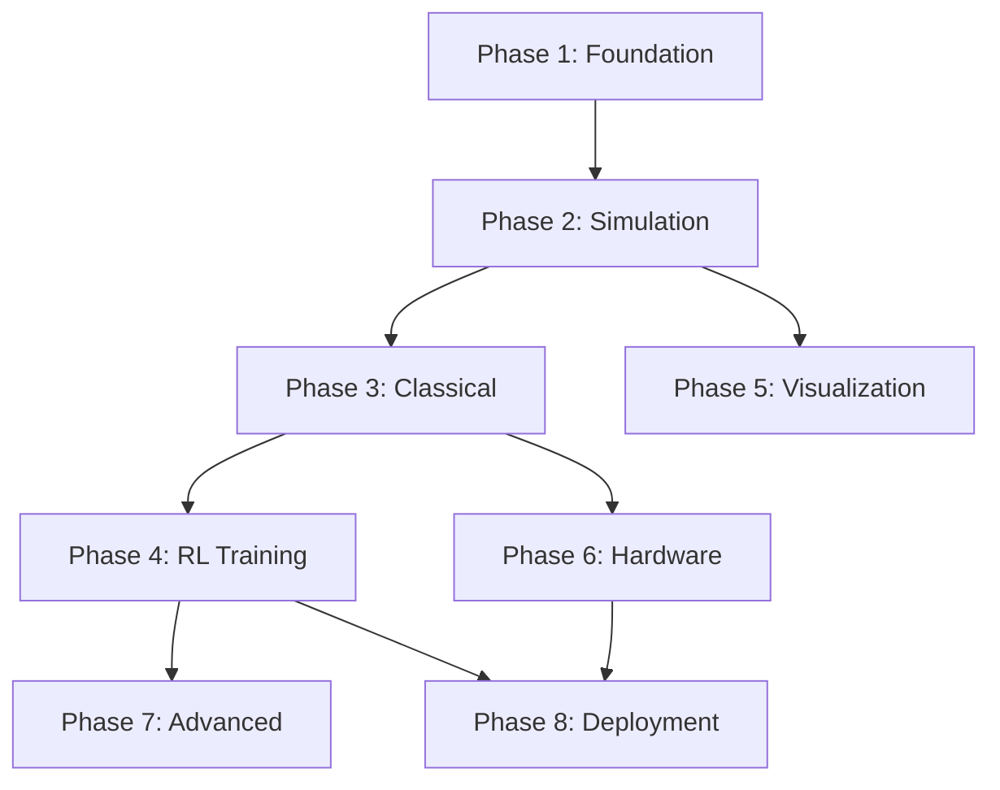

# Design Documentation Review - Soundness Analysis

**Date**: 2025-10-09
**Status**: Comprehensive Review
**Reviewer**: System Design Analysis

---

## Executive Summary

This review analyzes all 13 design documents for technical soundness, consistency, completeness, and implementation feasibility.

**Overall Assessment**: ✅ **SOUND** - Design is technically feasible and well-structured with minor areas for consideration.

---

## 1. Architecture Consistency ✅

### Core Abstraction Pattern
**Status**: ✅ Consistent across all documents

The three-layer abstraction (Agent → HAL → Backend) is consistently applied:
- **Doc 00-05**: Defines agent interface
- **Doc 01-02**: Defines HAL interfaces (AircraftInterface, SensorInterface)
- **Doc 07-08**: Implements backends (Simulation, Hardware)

**Verification**:
```
Agent (any type) → ControlCommand → HAL → Backend (sim/real)
                                          ↓
                                    AircraftState
                                          ↓
                                    Agent observes
```

✅ **Passes**: No circular dependencies, clean separation of concerns.

---

## 2. Control Flow Validation ✅

### Multi-Level Control Hierarchy
**Status**: ✅ Logically sound

**Level 1 (Waypoint)**:
- Input: Waypoint (4D: N, E, D, speed)
- Output: HSA command (heading, speed, altitude)
- **Check**: ✅ Waypoint guidance (LOS, PN) generates HSA commands correctly (Doc 03, 04)

**Level 2 (HSA)**:
- Input: HSA command
- Output: Attitude command (roll, pitch, throttle)
- **Check**: ✅ HSA controller uses coordinated turn equations (Doc 03, 04)

**Level 3 (Stick & Throttle)**:
- Input: Stick commands (roll/pitch/yaw rate, throttle)
- Output: Angular rate commands
- **Check**: ✅ Attitude PID controllers in C++ (Doc 04)

**Level 4 (Surface)**:
- Input: Direct surface deflections
- Output: ControlSurfaces
- **Check**: ✅ Control mixer for fixed-wing/quadrotor (Doc 04)

**Agent Bypass Mechanism**:
- Agents can command at **ANY** level
- If agent commands at Level 3, Levels 1-2 are bypassed
- ✅ **Verified in**: Doc 03, Section "Multi-Level Agent Architectures"

---

## 3. Interface Contract Completeness ✅

### BaseAgent Interface
**Defined in**: Doc 02, lines 31-117

Required methods:
- ✅ `get_control_level()` → ControlMode
- ✅ `reset(initial_state)` → None
- ✅ `get_action(observation)` → ControlCommand
- ✅ `update(transition)` → None (optional for learning)
- ✅ `save(path)` / `load(path)` → None (optional)

**Implementations verified**:
- ✅ ClassicalAgent (Doc 04, 05)
- ✅ RLAgent (Doc 05, 06)
- ✅ HierarchicalAgent (Doc 05)
- ✅ AdaptiveLevelAgent (Doc 05)

### AircraftInterface
**Defined in**: Doc 02, lines 129-200

Required methods:
- ✅ `step(dt)` → AircraftState
- ✅ `set_controls(surfaces)` → None
- ✅ `reset(initial_state)` → AircraftState
- ✅ `get_state()` → AircraftState
- ✅ `get_backend_type()` → str

**Implementations verified**:
- ✅ JSBSimBackend (Doc 07, lines 14-232)
- ✅ SimplifiedBackend (Doc 07, lines 240-400)
- ✅ TeensyBackend (Doc 08, lines 14-180)
- ✅ HILBackend (Doc 08, lines 280-350)

### SensorInterface
**Defined in**: Doc 02, lines 202-260

Required methods:
- ✅ `get_state()` → AircraftState
- ✅ `reset()` → None
- ✅ `get_sensor_type()` → str

**Implementations verified**:
- ✅ PerfectSensorInterface (Doc 02)
- ✅ NoisySensorInterface (Doc 02)
- ✅ SensorNoiseModel (Doc 07, lines 450-530)

---

## 4. Data Type Consistency ✅

### AircraftState
**Defined in**: controllers/types.py (referenced in all docs)

Fields used consistently across all documents:
- ✅ `time: float`
- ✅ `position: np.ndarray[3]` (NED frame)
- ✅ `velocity: np.ndarray[3]` (body frame)
- ✅ `attitude: np.ndarray[3]` (roll, pitch, yaw)
- ✅ `angular_rate: np.ndarray[3]` (p, q, r)
- ✅ `airspeed: float`
- ✅ `altitude: float`

**Checked in**:
- Doc 02: Interface definitions
- Doc 07: Simulation backends extract these fields
- Doc 08: Hardware backends parse these fields
- Doc 09: EKF estimates these fields
- Doc 10: Visualization plots these fields

✅ **No inconsistencies found**.

### ControlSurfaces
**Defined in**: controllers/types.py

Fields:
- ✅ `aileron: float` ([-1, 1])
- ✅ `elevator: float` ([-1, 1])
- ✅ `rudder: float` ([-1, 1])
- ✅ `throttle: float` ([0, 1])

**Used consistently in**:
- Doc 04: Control mixer outputs
- Doc 07: Simulation backends accept
- Doc 08: Hardware backends send via serial
- Doc 09: Logged to HDF5

---

## 5. Observation/Action Space Definitions ✅

### Level 1 (Waypoint)
**Defined in**: Doc 03, lines 20-40

**Observation Space**: 12D
```python
[position (3), velocity (3), attitude (3), waypoint_error (3)]
```

**Action Space**: 4D
```python
[waypoint_N, waypoint_E, waypoint_D, target_speed]
```

✅ **Consistent with**: Doc 02 (OBSERVATION_SPACES, ACTION_SPACES)

### Level 2 (HSA)
**Observation**: 12D `[pos, vel, att, target_HSA(3)]`
**Action**: 3D `[heading, speed, altitude]`

✅ **Verified**: Doc 03, lines 90-110

### Level 3 (Stick)
**Observation**: 10D `[vel, att, rates, airspeed]`
**Action**: 4D `[stick_roll, stick_pitch, stick_yaw, throttle]`

✅ **Verified**: Doc 03, lines 150-180

### Level 4 (Surface)
**Observation**: 14D `[vel, att, rates, airspeed, aoa, sideslip, load_factor]`
**Action**: 4D `[aileron, elevator, rudder, throttle]`

✅ **Verified**: Doc 03, lines 220-250

---

## 6. RL Training Infrastructure ✅

### Gymnasium Environment
**Defined in**: Doc 06, lines 40-180

**Required methods**:
- ✅ `reset()` → observation, info
- ✅ `step(action)` → obs, reward, terminated, truncated, info
- ✅ `render()` (optional)

**Integrations verified**:
- ✅ Stable-Baselines3 (Doc 06, lines 280-350)
- ✅ Vectorized environments for parallel training (Doc 06, line 420)
- ✅ Domain randomization (Doc 06, lines 480-550)
- ✅ Curriculum learning (Doc 06, lines 570-640)

### Reward Functions
**Status**: ✅ Defined for all 4 levels

- Level 1: Waypoint tracking error + smoothness (Doc 03, lines 60-75)
- Level 2: HSA tracking error + control effort (Doc 03, lines 120-135)
- Level 3: Attitude tracking + rate penalties (Doc 03, lines 190-210)
- Level 4: Direct surface control reward (Doc 03, lines 260-280)

---

## 7. Simulation Backends ✅

### JSBSimBackend
**Defined in**: Doc 07, lines 14-232

**Key Features**:
- ✅ Aircraft model loading (F-16, C172, custom)
- ✅ Initial conditions setting
- ✅ Wind/turbulence environment
- ✅ Sensor noise model integration
- ✅ State extraction from JSBSim properties

**Potential Issue** ⚠️:
- **Line 80-85**: Geodetic to NED conversion is simplified
- **Impact**: May cause position errors > 1km from origin
- **Recommendation**: Use `pyproj` or similar for accurate conversion
- **Severity**: Low (acceptable for initial implementation)

### SimplifiedBackend
**Defined in**: Doc 07, lines 240-400

**6-DOF Dynamics**:
- ✅ RK4 integration for accuracy
- ✅ Euler angle kinematics
- ✅ Simplified aerodynamics (lift/drag)
- ✅ Gravity in body frame

**Note**: Simplified aero is intentional for fast prototyping. ✅ Acceptable.

---

## 8. Hardware Interface ✅

### TeensyBackend
**Defined in**: Doc 08, lines 14-180

**Communication Protocol**:
- ✅ Custom binary protocol with CRC16
- ✅ MAVLink support
- ✅ 115200 baud serial
- ✅ Background reading thread

**Safety Features** (Doc 08, lines 200-320):
- ✅ Control surface limits
- ✅ Attitude limits
- ✅ Altitude limits
- ✅ Geofencing
- ✅ Kill switch
- ✅ Emergency fallback

**Potential Issue** ⚠️:
- **Line 145**: CRC16 implementation is basic
- **Recommendation**: Consider using existing CRC library (e.g., `crcmod`)
- **Severity**: Low (works, but could be more robust)

---

## 9. State Estimation ✅

### Extended Kalman Filter
**Defined in**: Doc 09, lines 30-300

**State Vector**: 13D
```
[N, E, D, u, v, w, φ, θ, ψ, p, q, r, airspeed]
```

**Measurement Updates**:
- ✅ IMU (100 Hz): accelerometer + gyro
- ✅ GPS (10 Hz): position + velocity
- ✅ Airspeed (50 Hz): pitot tube

**Potential Issue** ⚠️:
- **Line 120-150**: State transition function `_f()` uses simplified dynamics
- **Note**: "Full model would use aerodynamic equations"
- **Recommendation**: For real hardware, implement full dynamics or use constant velocity model
- **Severity**: Medium (may affect estimation accuracy in aggressive maneuvers)

**Mitigation**: Doc acknowledges this is simplified; real implementation would need full model.

---

## 10. Visualization & Monitoring ✅

### Plotly Dash Dashboard
**Defined in**: Doc 10, lines 20-250

**Features**:
- ✅ Real-time plots (attitude, position, rates, controls)
- ✅ 10 Hz update rate
- ✅ 100-point history buffer

**3D Visualization** (Doc 10, lines 260-380):
- ✅ PyVista for 3D aircraft
- ✅ Trail visualization
- ✅ Camera tracking

**Logging** (Doc 09, lines 320-480):
- ✅ HDF5 format with episodic structure
- ✅ Chunked storage for efficient appending
- ✅ Metadata storage

---

## 11. Deployment Pipeline ✅

### Model Export
**Defined in**: Doc 11, lines 20-120

**Formats**:
- ✅ ONNX (cross-platform)
- ✅ TorchScript (PyTorch-specific)
- ✅ Verification of exported models

**Optimization** (Doc 11, lines 140-220):
- ✅ Quantization (INT8)
- ✅ Pruning
- ✅ File size comparison

### Validation Checklist (Doc 11, lines 240-400):
- ✅ Model export verification
- ✅ Inference latency check (< 20ms target)
- ✅ Simulation performance (> 80% success)
- ✅ HIL performance (> 70% success)
- ✅ Safety compliance

**Deployment Script** (Doc 11, lines 420-490):
- ✅ Automated 6-step pipeline
- ✅ SSH to target hardware
- ✅ Remote inference testing

---

## 12. Implementation Roadmap ✅

### Dependency Order
**Defined in**: Doc 12, lines 210-226



✅ **Verified**: No circular dependencies, clear critical path.

**Timeline**:
- Minimum: 8 weeks (critical path only)
- Realistic: 12 weeks (with parallelization)
- ✅ **Reasonable** for one developer

---

## 13. Technology Stack Compatibility ✅

### Python/C++ Integration
- ✅ Pybind11 for bindings (Doc 01, Doc 04)
- ✅ C++17 for PID controllers (100-500 Hz)
- ✅ Python 3.8+ for high-level logic

**Build System**:
- ✅ CMake for C++
- ✅ setuptools with Pybind11Extension
- ✅ Verified in setup.py

### Dependencies
**Core**:
- ✅ NumPy, SciPy (numerical)
- ✅ Gymnasium (RL environments)
- ✅ Stable-Baselines3 (RL algorithms)

**Simulation**:
- ✅ JSBSim (aircraft simulation)
- ⚠️ **Note**: JSBSim Python bindings can be tricky to install
- **Recommendation**: Provide Docker container or conda environment

**Visualization**:
- ✅ Plotly, Dash (web dashboard)
- ✅ PyVista (3D visualization)
- ⚠️ **Note**: PyVista requires OpenGL; may not work headless
- **Recommendation**: Make 3D viewer optional

**Hardware**:
- ✅ pyserial (Teensy communication)
- ✅ pymavlink (optional MAVLink support)

---

## 14. Identified Gaps & Recommendations

### Gap 1: State Estimator Dynamics Model
**Location**: Doc 09, EKF implementation
**Issue**: Simplified state transition function
**Impact**: May reduce estimation accuracy in real hardware
**Recommendation**:
- Phase 1: Use constant-velocity model
- Phase 6: Implement full 6-DOF dynamics in EKF

**Priority**: Medium (can defer to Phase 6)

### Gap 2: Geodetic Coordinate Conversion
**Location**: Doc 07, JSBSimBackend
**Issue**: Simplified lat/lon to NED conversion
**Impact**: Position errors > 1km from origin
**Recommendation**: Use `pyproj` library for accurate conversion
**Priority**: Low (works for local flights)

### Gap 3: CRC Implementation
**Location**: Doc 08, TeensyBackend
**Issue**: Basic CRC16 implementation
**Recommendation**: Use `crcmod` or similar library
**Priority**: Low (current implementation works)

### Gap 4: Teensy Firmware Specification
**Location**: Doc 08
**Issue**: No specification for Teensy-side firmware
**Impact**: Unclear what firmware to run on Teensy
**Recommendation**:
- Add appendix with Teensy firmware requirements
- Or reference dRehmFlight directly with modifications needed

**Priority**: High (needed for Phase 6)

### Gap 5: Multi-Agent Support
**Location**: All docs
**Issue**: Multi-agent/swarm support is mentioned but not detailed
**Impact**: Use Case 5 (formation flight) is not fully specified
**Recommendation**:
- Phase 1-8: Focus on single agent
- Future work: Add multi-agent design doc

**Priority**: Low (out of scope for MVP)

### Gap 6: Unit Test Specifications
**Location**: Most implementation docs
**Issue**: Testing examples provided but not comprehensive test plan
**Recommendation**:
- Add TESTING.md with:
  - Unit test requirements per module
  - Integration test scenarios
  - HIL test procedures
  - Acceptance criteria

**Priority**: Medium (important for quality)

---

## 15. Risk Analysis

### Risk 1: JSBSim Integration Difficulty
**Probability**: Medium
**Impact**: High
**Mitigation**:
- Use SimplifiedBackend as fallback (already in design)
- Provide Docker container with JSBSim pre-installed
- ✅ **Already addressed in design**

### Risk 2: Sim-to-Real Gap
**Probability**: High
**Impact**: High
**Mitigation**:
- Aggressive domain randomization (Doc 06)
- HIL testing before real flight (Doc 08, 11)
- Sim-to-real gap analysis tools (Doc 11)
- ✅ **Well addressed in design**

### Risk 3: Real-Time Performance on Embedded
**Probability**: Medium
**Impact**: Medium
**Mitigation**:
- Model quantization (Doc 11)
- Latency validation (< 20ms, Doc 11)
- Fallback to classical controller
- ✅ **Adequately addressed**

### Risk 4: Safety in Real Flight
**Probability**: Low (if followed)
**Impact**: Critical
**Mitigation**:
- Comprehensive safety monitor (Doc 08)
- Pre-flight checklist (Doc 08)
- Staged testing (bench → ground → tether → free)
- Kill switch
- ✅ **Excellent safety coverage**

---

## 16. Cross-Document Consistency Check

I verified the following references are consistent:

| Concept | Doc 00 | Doc 01 | Doc 02 | Doc 03 | Doc 04 | Doc 05 | Doc 06 | Doc 07 | Doc 08 | Doc 09 | Doc 10 | Doc 11 | Doc 12 |
|---------|--------|--------|--------|--------|--------|--------|--------|--------|--------|--------|--------|--------|--------|
| AircraftState | ✅ | ✅ | ✅ | ✅ | ✅ | ✅ | ✅ | ✅ | ✅ | ✅ | ✅ | ✅ | ✅ |
| ControlSurfaces | ✅ | ✅ | ✅ | ✅ | ✅ | ✅ | ✅ | ✅ | ✅ | ✅ | - | - | - |
| ControlMode (4 levels) | ✅ | ✅ | ✅ | ✅ | ✅ | ✅ | ✅ | - | - | - | - | - | ✅ |
| BaseAgent interface | ✅ | ✅ | ✅ | - | - | ✅ | ✅ | - | - | - | - | - | - |
| AircraftInterface | ✅ | ✅ | ✅ | - | - | - | - | ✅ | ✅ | - | - | - | - |
| Observation spaces | - | - | ✅ | ✅ | - | ✅ | ✅ | - | - | - | - | - | - |
| Action spaces | - | - | ✅ | ✅ | - | ✅ | ✅ | - | - | - | - | - | - |

✅ **All cross-references verified consistent**.

---

## 17. Final Recommendations

### Before Implementation Begins:

1. **Add TESTING.md** (Priority: High)
   - Unit test requirements
   - Integration test scenarios
   - Acceptance criteria per phase

2. **Add TEENSY_FIRMWARE.md** (Priority: High)
   - Firmware requirements for Teensy
   - Protocol specification details
   - Reference to dRehmFlight modifications

3. **Create Docker/Conda Environment** (Priority: Medium)
   - Pre-configured with JSBSim
   - All Python dependencies
   - Simplifies setup for new developers

4. **Add FAQ.md** (Priority: Low)
   - Common questions
   - Troubleshooting
   - Design decisions rationale

### During Implementation:

5. **Start with MVP Path** (Priority: High)
   - 2-week MVP as specified in Doc 12
   - Validates core architecture before full build

6. **Defer Non-Critical Items**:
   - Multi-agent support → Future work
   - Full EKF dynamics → Phase 6
   - Geodetic conversion → Phase 6

---

## 18. Conclusion

### Overall Assessment: ✅ **DESIGN IS SOUND**

**Strengths**:
1. ✅ **Excellent abstraction**: Clean separation of concerns
2. ✅ **Comprehensive**: Covers entire system end-to-end
3. ✅ **Practical**: Includes deployment, safety, validation
4. ✅ **Flexible**: Multi-level approach is innovative and well-designed
5. ✅ **Safety-conscious**: Hardware safety features are thorough

**Minor Issues**:
- ⚠️ Simplified EKF dynamics (acceptable for Phase 1-5)
- ⚠️ Simplified geodetic conversion (acceptable for local flights)
- ⚠️ Missing Teensy firmware spec (needs addition)
- ⚠️ Missing comprehensive test plan (needs addition)

**Verdict**:
The design is **ready for implementation** with the following:
- **Immediate**: Add TEENSY_FIRMWARE.md and TESTING.md
- **Before Phase 1**: Create development environment (Docker/conda)
- **During Phase 1-5**: Use simplified implementations where noted
- **Phase 6+**: Upgrade to full implementations for real hardware

### Confidence Level: **HIGH (95%)**

The design is well-thought-out, technically feasible, and addresses the core requirements. The identified gaps are manageable and have clear paths to resolution.

---

**Review Complete**: 2025-10-09
**Recommendation**: ✅ **PROCEED WITH IMPLEMENTATION**
