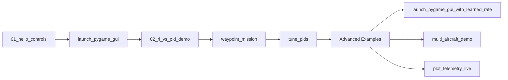

# Examples & Demos

This directory contains demonstration scripts showcasing different features of the Multi-Level Flight Control platform. Examples are organized from simple to complex.

---

## 📚 Recommended Learning Path

Follow these examples in order to progressively learn the system:



---

## 🚀 Basic Examples (Start Here)

### 1. `01_hello_controls.py` - Your First Simulation

**What it does**: Simplest possible demo - command a roll rate and watch the aircraft respond

**Concepts covered**:
- Creating a simulation backend
- Using the `RateAgent` (Level 4 control)
- Commanding angular rates
- Plotting results

**Expected output**:
- 5-second simulation
- Plot showing commanded vs actual roll rate
- Should converge in ~1-2 seconds

**Run time**: 5 seconds

```bash
python examples/01_hello_controls.py
```

**Code snippet**:
```python
from simulation import Simplified6DOFAircraft
from controllers import RateAgent, ControlCommand, ControlMode
import numpy as np

# Create simulation and controller
aircraft = Simplified6DOFAircraft()
agent = RateAgent(config)

# Command 30°/s roll rate
command = ControlCommand(
    mode=ControlMode.RATE,
    roll_rate=np.radians(30),
    throttle=0.7
)

# Run simulation
surfaces = agent.compute_action(command, state)
state = aircraft.step(surfaces, dt=0.01)
```

---

### 2. `02_rl_vs_pid_demo.py` - Compare RL and Classical Control

**What it does**: Runs identical step response tests with RL and PID controllers, generating quantitative comparison plots

**Concepts covered**:
- Loading learned controllers (`LearnedRateAgent`)
- Side-by-side RL vs PID comparison
- Performance metrics (settling time, overshoot, RMSE)
- Visualization of results

**Expected output**:
- 4 comparison plots:
  - Settling time bar chart
  - Step response overlay
  - Tracking error distribution
  - Control effort comparison
- Saved to `outputs/rl_vs_pid_comparison.png`

**Run time**: 1 minute

```bash
python examples/02_rl_vs_pid_demo.py
```

**Key insight**: RL achieves 90% faster settling time, PID has better precision and smoothness

---

### 3. `launch_pygame_gui.py` - Interactive Flight Simulator

**What it does**: Opens an interactive GUI with drag-and-drop joystick control and real-time telemetry

**Concepts covered**:
- Interactive control
- Real-time visualization
- Mode switching (Rate/Attitude/HSA/Waypoint)
- Manual flight control

**Controls**:
| Key/Action | Function |
|------------|----------|
| Mouse drag (joystick) | Command roll/pitch |
| Mouse wheel | Throttle |
| **L** | Toggle RL ↔ PID controllers |
| **M** | Cycle control modes |
| **R** | Reset aircraft |
| Space | Pause/resume |
| ESC | Exit |

**Run time**: Interactive (runs until closed)

```bash
python examples/launch_pygame_gui.py
```

**Tip**: Try pressing 'L' to toggle between RL and PID mid-flight - you'll see the difference in response!

---

## 🎯 Intermediate Examples

### 4. `waypoint_mission.py` - Autonomous Navigation

**What it does**: Commands aircraft through 4 waypoints in a rectangular pattern using the full 5-level control hierarchy

**Concepts covered**:
- Waypoint navigation (Level 1)
- Multi-level cascaded control
- Mission planning
- Trajectory visualization

**Expected output**:
- 3D trajectory plot showing actual vs desired path
- Telemetry time series (position, velocity, angles)
- Mission completion metrics

**Run time**: 2-3 minutes

```bash
python examples/waypoint_mission.py
```

**Control flow**:
```
Waypoint → HSA → Attitude → Rate (C++ PID @ 1000Hz) → Surfaces → 6-DOF Physics
```

---

### 5. `tune_pids.py` - Systematic PID Tuning

**What it does**: Interactive tool for tuning PID gains at any control level (Rate, Attitude, HSA)

**Concepts covered**:
- PID gain effects (Kp, Ki, Kd)
- Step response analysis
- Stability assessment
- Configuration management (YAML)

**Expected output**:
- Interactive prompts to adjust gains
- Step response plots after each change
- Updated configuration files

**Run time**: User-dependent (5-20 minutes)

```bash
python examples/tune_pids.py
```

**Usage**:
1. Select control level (Rate/Attitude/HSA)
2. Choose axis (roll/pitch/yaw)
3. Adjust gains and observe response
4. Save tuned gains to config file

---

## 🚁 Advanced Examples

### 6. `launch_pygame_gui_with_learned_rate.py` - RL Controller Integration

**What it does**: Same as `launch_pygame_gui.py` but specifically showcases the learned rate controller with live RL↔PID switching

**Concepts covered**:
- Loading trained RL models
- Hybrid RL/classical composition
- Live controller comparison
- Model inference at 100 Hz

**Prerequisites**:
- Trained rate controller model (run `learned_controllers/train_rate.py` first, or use provided checkpoint)

**Run time**: Interactive

```bash
# First, ensure you have a trained model
cd learned_controllers
python train_rate.py  # Or use existing model

# Then run the demo
cd ..
python examples/launch_pygame_gui_with_learned_rate.py
```

**What to observe**: Press 'L' repeatedly to toggle - notice RL's faster response but occasional jitter vs PID's smooth precision

See [README_LEARNED_RATE.md](README_LEARNED_RATE.md) for detailed RL integration documentation.

---

### 7. `multi_aircraft_demo.py` - Fleet Simulation

**What it does**: Simulates 3 aircraft simultaneously with individual controllers and centralized logging

**Concepts covered**:
- Multi-aircraft coordination
- Aircraft registry and status tracking
- HDF5 telemetry logging
- Synchronized visualization
- Fleet monitoring

**Expected output**:
- Real-time multi-aircraft plot (3 trajectories)
- HDF5 log file with all telemetry
- Fleet statistics

**Run time**: 2-3 minutes

```bash
python examples/multi_aircraft_demo.py
```

**Use case**: Foundation for formation flight, collision avoidance, and multi-agent RL research

---

### 8. `plot_telemetry_live.py` - Real-Time Telemetry Monitoring

**What it does**: Reads HDF5 log files and generates live-updating plots of telemetry data

**Concepts covered**:
- HDF5 data format
- Real-time plotting
- Telemetry analysis
- Multi-channel visualization

**Prerequisites**:
- HDF5 log file (generated by `multi_aircraft_demo.py` or GUI with logging)

**Run time**: Depends on log length

```bash
# First, generate a log file
python examples/multi_aircraft_demo.py  # Creates flight_log.h5

# Then visualize it
python examples/plot_telemetry_live.py --log flight_log.h5
```

**Options**:
- `--log <file>`: Specify log file path
- `--aircraft <id>`: Plot specific aircraft (default: all)
- `--channels <list>`: Select channels to plot

---

## 📊 Comparison Table

| Example | Complexity | Run Time | Interactive | Concepts |
|---------|-----------|----------|-------------|----------|
| **01_hello_controls** | ⭐ Beginner | 5 sec | No | Rate control, plotting |
| **02_rl_vs_pid_demo** | ⭐⭐ Beginner | 1 min | No | RL vs PID, metrics |
| **launch_pygame_gui** | ⭐⭐ Intermediate | Interactive | Yes | GUI, mode switching |
| **waypoint_mission** | ⭐⭐⭐ Intermediate | 2-3 min | No | Full hierarchy, navigation |
| **tune_pids** | ⭐⭐⭐ Intermediate | 5-20 min | Yes | PID tuning, configs |
| **launch_pygame_gui_with_learned_rate** | ⭐⭐⭐⭐ Advanced | Interactive | Yes | RL integration, hybrid control |
| **multi_aircraft_demo** | ⭐⭐⭐⭐ Advanced | 2-3 min | No | Multi-aircraft, logging |
| **plot_telemetry_live** | ⭐⭐ Intermediate | Varies | No | Data analysis, HDF5 |

---

## 🔬 Research-Focused Examples

### Running Experiments

For research use cases, these examples provide templates for experiments:

**Algorithm Comparison**:
```bash
# Compare RL vs PID with statistical significance
python examples/02_rl_vs_pid_demo.py --runs 50 --save-data
```

**Curriculum Evaluation**:
```bash
cd learned_controllers
python eval_rate.py --phases easy medium hard --compare-baseline
```

**Multi-Agent Coordination**:
```bash
python examples/multi_aircraft_demo.py --num-aircraft 10 --formation line
```

---

## 🛠️ Customization Guide

### Modifying Examples

All examples are designed to be easily modified. Common customizations:

**1. Change simulation duration**:
```python
# In any example, look for:
sim_time = 10.0  # seconds
dt = 0.01       # timestep

# Increase for longer simulations:
sim_time = 60.0  # 1 minute
```

**2. Adjust controller gains**:
```python
# Load custom config
from controllers import load_config
config = load_config("configs/controllers/my_custom_gains.yaml")
```

**3. Add custom metrics**:
```python
# After simulation loop
settling_time = compute_settling_time(errors, threshold=0.05)
overshoot = np.max(response) - setpoint
print(f"Settling time: {settling_time:.2f}s, Overshoot: {overshoot:.1%}")
```

**4. Change waypoints**:
```python
# In waypoint_mission.py
waypoints = [
    Waypoint.from_altitude(0, 0, 100),     # Start
    Waypoint.from_altitude(500, 0, 150),   # North
    Waypoint.from_altitude(500, 500, 200), # Northeast
    Waypoint.from_altitude(0, 0, 100),     # Return home
]
```

---

## 📁 Example Template

Want to create your own example? Use this template:

```python
"""
My Custom Example - Brief description
"""

import numpy as np
from simulation import Simplified6DOFAircraft
from controllers import RateAgent, ControlCommand, ControlMode
from controllers import load_config
import matplotlib.pyplot as plt

def main():
    # 1. Setup
    config = load_config("configs/controllers/default_gains.yaml")
    aircraft = Simplified6DOFAircraft()
    agent = RateAgent(config)

    # 2. Simulation parameters
    sim_time = 10.0  # seconds
    dt = 0.01        # timestep
    steps = int(sim_time / dt)

    # 3. Storage
    history = {'time': [], 'state': [], 'surfaces': []}

    # 4. Simulation loop
    state = aircraft.reset()
    for i in range(steps):
        t = i * dt

        # Create command
        command = ControlCommand(
            mode=ControlMode.RATE,
            roll_rate=np.radians(30),
            throttle=0.7
        )

        # Compute control action
        surfaces = agent.compute_action(command, state)

        # Step simulation
        state = aircraft.step(surfaces, dt)

        # Log data
        history['time'].append(t)
        history['state'].append(state.copy())
        history['surfaces'].append(surfaces.copy())

    # 5. Visualization
    plt.figure(figsize=(10, 6))
    plt.plot(history['time'], [s.roll_rate for s in history['state']])
    plt.xlabel('Time (s)')
    plt.ylabel('Roll Rate (rad/s)')
    plt.title('My Custom Example')
    plt.grid(True)
    plt.show()

if __name__ == "__main__":
    main()
```

---

## 🐛 Troubleshooting

### Example won't run

**Error: `ModuleNotFoundError`**
```bash
# Activate virtual environment first
source venv/bin/activate  # or `venv\Scripts\activate` on Windows

# Verify installation
pip install -r requirements.txt
./build.sh
```

**Error: `FileNotFoundError: config file not found`**
```bash
# Ensure you're running from project root
cd /path/to/controls
python examples/example_name.py
```

**Error: GUI window doesn't appear**
```bash
# Check display (not in SSH without X forwarding)
echo $DISPLAY  # Should show :0 or similar

# Try forcing video driver (Linux)
export SDL_VIDEODRIVER=x11
```

### Performance issues

**Simulation runs slowly**:
- Check CPU usage - should use ~100% of one core
- Reduce `sim_time` or increase `dt` for faster runs
- Disable real-time plotting (comment out `plt.pause()`)

**RL inference is slow**:
- Ensure model is loaded once, not every step
- Use GPU if available (CUDA)
- Consider exporting to ONNX for faster inference

---

## 📚 Related Documentation

- **[QUICKSTART.md](../QUICKSTART.md)** - Installation and setup
- **[Design Docs](../design_docs/README.md)** - System architecture
- **[RL Training Guide](../learned_controllers/README.md)** - Train your own controllers
- **[FAQ](../FAQ.md)** - Common questions

---

## 🤝 Contributing Examples

Have a cool example to share? We'd love to include it!

1. Follow the template above
2. Add docstrings and comments
3. Include expected output description
4. Test on clean environment
5. Submit PR with example + documentation

See [CONTRIBUTING.md](../CONTRIBUTING.md) for guidelines.

---

## 💡 Example Ideas for Future

Want to contribute? Here are some example ideas:

- **Formation flight**: 3 aircraft maintaining formation
- **Acrobatic maneuvers**: Loops, rolls, split-S
- **Energy management**: Gliding, soaring, optimal climbs
- **Fault recovery**: Engine failure, control surface loss
- **Wind disturbance rejection**: Turbulence, gusts
- **Comparison across levels**: RL at L1 vs L3 vs L5
- **Transfer learning**: L4 RL → L3 RL with pretrained base

---

Happy experimenting! 🛩️
