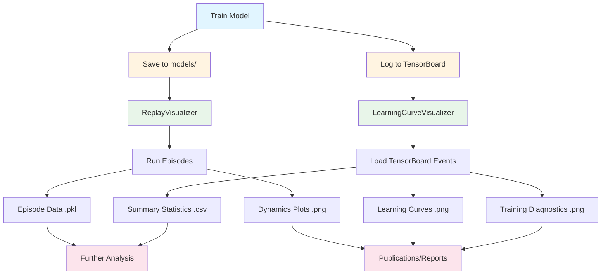

# Visualization Tools for Learned Controllers

This module provides comprehensive visualization tools for analyzing and understanding your learned rate controllers.

## Features

1. **Episode Replay Visualization** - Detailed dynamics plots for individual episodes
2. **Learning Curve Analysis** - Track training progress from TensorBoard logs
3. **Comparison Tools** - Compare multiple runs or episodes side-by-side

## Quick Start

### 1. Replay Episode Dynamics

Visualize the behavior of a trained model on test episodes:

```bash
python learned_controllers/visualize/replay.py \
    --model learned_controllers/models/best_rate_controller/best_model.zip \
    --difficulty medium \
    --command-type step \
    --n-episodes 5 \
    --save-dir learned_controllers/visualize/replays
```

**Options:**
- `--model`: Path to trained model (.zip file)
- `--difficulty`: Environment difficulty (easy/medium/hard)
- `--command-type`: Type of commands (step/ramp/sine/random)
- `--n-episodes`: Number of episodes to visualize
- `--save-dir`: Directory to save plots and data
- `--seed`: Random seed for reproducibility

**Output:**
- Detailed dynamics plots showing:
  - Rate tracking (p, q, r) vs commands
  - Control surface deflections
  - Rate tracking errors
  - Aircraft attitudes (roll, pitch, yaw)
  - Flight envelope (airspeed, altitude)
  - Rewards and components breakdown
  - Overall error magnitude
- Episode data saved as `.pkl` files for later analysis

### 2. Learning Curve Visualization

Analyze training progress from TensorBoard logs:

```bash
python learned_controllers/visualize/learning_curves.py \
    --log-dir learned_controllers/logs/tensorboard \
    --save-dir learned_controllers/visualize/learning_curves \
    --smooth-window 10
```

**Options:**
- `--log-dir`: Path to TensorBoard log directory
- `--save-dir`: Directory to save visualizations
- `--smooth-window`: Smoothing window for curves (default: 10)
- `--no-show`: Don't display plots, only save them

**Output:**
- All metrics plot (comprehensive overview)
- Reward curve with confidence intervals
- Training diagnostics dashboard:
  - Episode reward and length
  - Value loss and policy loss
  - Entropy loss
  - KL divergence
  - Clip fraction
  - Explained variance
- Summary statistics CSV file

### 3. Python API Usage

#### Replay Visualizer

```python
from learned_controllers.visualize import ReplayVisualizer

# Create visualizer
viz = ReplayVisualizer("path/to/model.zip")

# Run an episode
data = viz.run_episode(
    difficulty="medium",
    command_type="step",
    seed=42
)

# Plot detailed dynamics
viz.plot_episode(
    data,
    title="My Episode",
    save_path="episode_dynamics.png",
    show=True
)

# Save episode data for later
viz.save_episode_data(data, "episode_data.pkl")

# Load previously saved data
loaded_data = viz.load_episode_data("episode_data.pkl")

# Compare multiple episodes
episodes = [viz.run_episode(seed=i) for i in range(5)]
labels = [f"Episode {i+1}" for i in range(5)]
viz.compare_episodes(episodes, labels, save_path="comparison.png")
```

#### Learning Curve Visualizer

```python
from learned_controllers.visualize import LearningCurveVisualizer

# Create visualizer
viz = LearningCurveVisualizer("learned_controllers/logs/tensorboard")

# Load TensorBoard data
data = viz.load_tensorboard_data()

# Plot all learning curves
viz.plot_learning_curves(
    data=data,
    smooth_window=10,
    save_path="learning_curves.png"
)

# Plot just reward curve with confidence intervals
viz.plot_reward_curve(
    data=data,
    smooth_window=10,
    save_path="reward_curve.png"
)

# Plot comprehensive training diagnostics
viz.plot_training_diagnostics(
    data=data,
    smooth_window=10,
    save_path="diagnostics.png"
)

# Compare multiple training runs
viz.compare_runs(
    run_dirs=["logs/run1", "logs/run2", "logs/run3"],
    run_labels=["Baseline", "Tuned", "Curriculum"],
    metric="rollout/ep_rew_mean",
    save_path="comparison.png"
)

# Get summary statistics
summary = viz.get_summary_statistics(data)
print(summary)
summary.to_csv("summary.csv")
```

## Visualization Gallery

### Episode Dynamics Plot
```
┌─────────────────────────────────────────────────────────────────┐
│  Roll Rate (p)   │  Pitch Rate (q)  │   Yaw Rate (r)           │
│  [actual vs cmd] │  [actual vs cmd] │  [actual vs cmd]         │
├─────────────────────────────────────────────────────────────────┤
│    Aileron       │    Elevator      │     Rudder               │
│  [deflections]   │  [deflections]   │  [deflections]           │
├─────────────────────────────────────────────────────────────────┤
│  Rate Errors     │   Attitudes      │  Flight Envelope         │
│  [p, q, r err]   │  [roll/pitch/yaw]│  [airspeed/altitude]     │
├─────────────────────────────────────────────────────────────────┤
│ Cumulative       │ Reward           │  Error Magnitude         │
│ Reward           │ Components       │  [overall tracking]      │
└─────────────────────────────────────────────────────────────────┘
```

### Learning Curves Dashboard
```
┌─────────────────────────────────────────────────────────────────┐
│        Episode Reward (smoothed + raw)         │  Episode Length│
├─────────────────────────────────────────────────────────────────┤
│   Value Loss   │  Policy Loss   │   Entropy Loss               │
├─────────────────────────────────────────────────────────────────┤
│  KL Divergence │  Clip Fraction │  Explained Variance          │
└─────────────────────────────────────────────────────────────────┘
```

## Advanced Usage

### Custom Metric Plotting

```python
# Plot specific metrics
viz.plot_learning_curves(
    metrics=[
        "rollout/ep_rew_mean",
        "train/value_loss",
        "train/policy_gradient_loss"
    ],
    smooth_window=20
)
```

### Batch Processing

```python
# Analyze multiple models
models = [
    "models/checkpoint_100k.zip",
    "models/checkpoint_200k.zip",
    "models/checkpoint_300k.zip",
]

for i, model_path in enumerate(models):
    viz = ReplayVisualizer(model_path)
    data = viz.run_episode(difficulty="hard", seed=42)
    viz.plot_episode(
        data,
        title=f"Checkpoint {(i+1)*100}k",
        save_path=f"checkpoint_{(i+1)*100}k.png",
        show=False
    )
```

### Episode Data Analysis

Episode data dictionaries contain:
- `time`: Timestamps (seconds)
- `rates`: Angular rates [p, q, r] (rad/s)
- `commands`: Rate commands [p_cmd, q_cmd, r_cmd] (rad/s)
- `errors`: Rate errors [p_err, q_err, r_err] (rad/s)
- `actions`: Control actions [aileron, elevator, rudder, throttle]
- `attitudes`: Aircraft attitudes [roll, pitch, yaw] (rad)
- `airspeed`: Airspeed (m/s)
- `altitude`: Altitude (m)
- `rewards`: Step rewards
- `reward_components`: Breakdown of reward components

## Mermaid Workflow Diagram



## Tips for Best Results

1. **Replay Visualization:**
   - Use `deterministic=True` for consistent evaluation
   - Run multiple seeds to assess robustness
   - Try different command types to test generalization
   - Save episode data for reproducible analysis

2. **Learning Curves:**
   - Increase smoothing window for noisy metrics
   - Compare runs with same random seeds
   - Monitor explained variance (should approach 1.0)
   - Check clip fraction (0.1-0.3 is typical for healthy PPO)

3. **Analysis:**
   - Look for settling time in rate tracking plots
   - Check if control surfaces saturate (hit ±1.0)
   - Verify flight envelope stays safe (airspeed, altitude, attitudes)
   - Compare reward components to understand behavior

## Dependencies

- `matplotlib` - Plotting
- `numpy` - Numerical computation
- `pandas` - Data manipulation
- `tensorboard` - Reading TensorBoard logs
- `stable-baselines3` - Loading trained models
- `sb3-contrib` - RecurrentPPO support

## Troubleshooting

**Issue:** "No TensorBoard event files found"
- **Solution:** Check that training completed and logs were saved to the correct directory

**Issue:** Model loading fails
- **Solution:** Verify model path is correct and includes `.zip` extension

**Issue:** Plots look too noisy
- **Solution:** Increase `smooth_window` parameter

**Issue:** Missing metrics in plots
- **Solution:** Check which metrics are available with `viz.load_tensorboard_data().keys()`

## Examples

See `learned_controllers/example_usage.py` for complete training and evaluation examples.

## Contributing

To add new visualizations:
1. Add methods to `ReplayVisualizer` or `LearningCurveVisualizer`
2. Update this README with usage examples
3. Add command-line interface in `if __name__ == "__main__"` block
